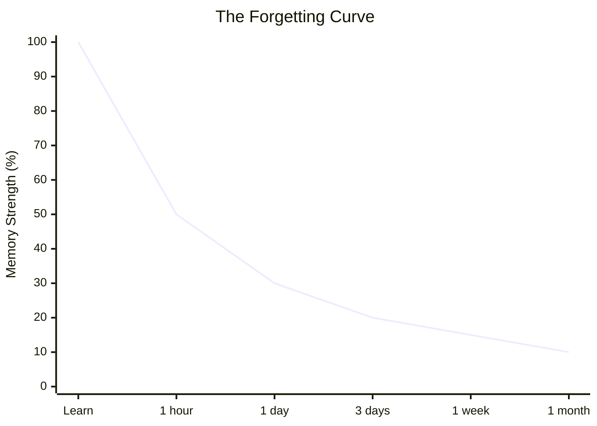
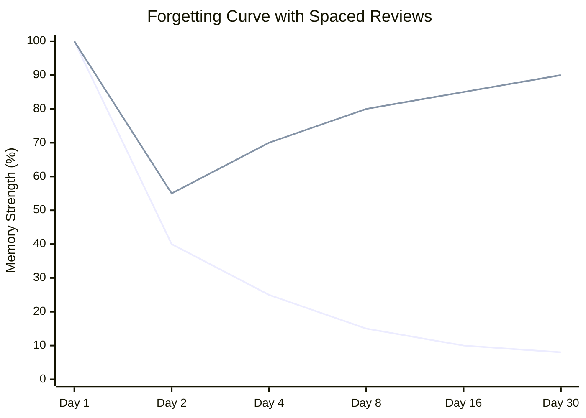
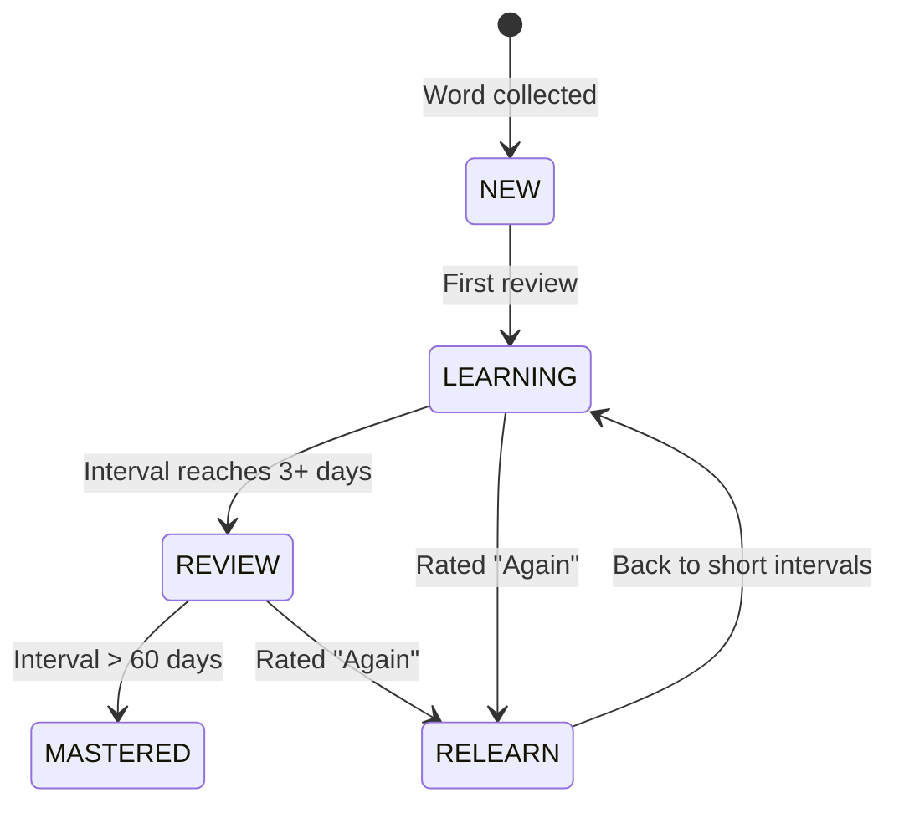
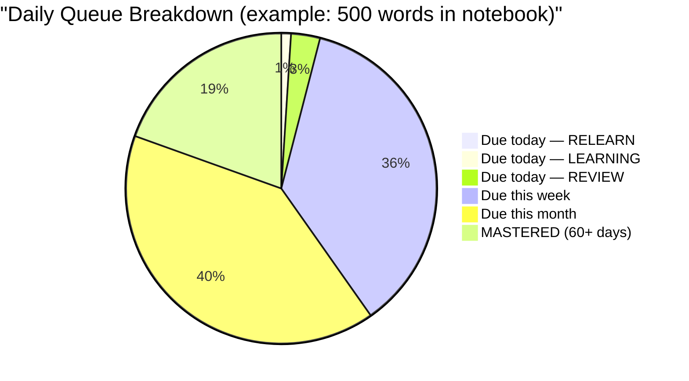

# Spaced Repetition System (SRS) — Concept Guide

> [!abstract] Summary
> How WordPower turns a growing word notebook into lasting knowledge.

Related: [[PROJECT#2.3 Spaced Repetition System (SRS)]] | [[PROJECT#2.2 Learning & Quiz Engine]]

---

## 1. The Problem: We Forget Fast

German psychologist ==Hermann Ebbinghaus== discovered in the 1880s that memory decays in a predictable curve — the **Forgetting Curve**. Without any review, we forget roughly:

- **50%** within 1 hour
- **70%** within 1 day
- **90%** within 1 week

> [!warning] What this means for WordPower
> If a user collects 100 words in their notebook and never reviews them, they'll remember fewer than 10 after a month.

## 2. The Solution: Review at the Right Moment

Ebbinghaus also discovered that each time you successfully recall something, the forgetting curve ==flattens== — you forget it slower the next time.

> [!tip] The key insight
> You don't need to review every day. You only need to review ==right before you would have forgotten==. Each successful review pushes the next review further into the future.
>
> This is spaced repetition: **increasing intervals between reviews, timed to catch you just before you forget.**

## 3. How Intervals Grow

Here's a simplified example of how review intervals grow for a single word:

| Review # | User recalls correctly? | Next review in... | Why |
|---|---|---|---|
| 1 | Yes | 1 day | First time — short interval to confirm |
| 2 | Yes | 3 days | Starting to stick |
| 3 | Yes | 7 days | Settling into memory |
| 4 | Yes | 16 days | Getting solid |
| 5 | Yes | 35 days | Well-learned |
| 6 | Yes | 75 days | Nearly permanent |
| — | No (forgot) | 1 day | Reset — needs relearning |

> [!success] Result
> After 6 successful reviews spread over ~4 months, a word is essentially in long-term memory. Without SRS, you'd need dozens of random reviews to achieve the same result.

## 4. What Makes It "Spaced"

Compare three study strategies for learning 50 words:

| Strategy | Total reviews | Time spent | Words retained after 3 months |
|---|---|---|---|
| **Cramming** (review all 50 words every day for a week, then stop) | 350 | ~7 hours | ~10% |
| **Regular review** (review all 50 words once a week forever) | 600+ | ~12+ hours | ~60% |
| **Spaced repetition** (review each word only when it's about to be forgotten) | ~150 | ~3 hours | ==~90%== |

> [!important]
> SRS is dramatically more efficient because it **doesn't waste time on words you already know** and **focuses time on words you're about to forget**.

## 5. The Rating System

After each review (flashcard, quiz, spelling drill, etc.), the user rates how easy the recall was. This tells the algorithm how to adjust:

| Rating | What it means | What happens |
|---|---|---|
| **Again** | "I had no idea" | Interval resets to 1 day. The word needs relearning |
| **Hard** | "I got it, but barely" | Interval grows slowly. The word needs more practice |
| **Good** | "I remembered it" | Interval grows normally. On track |
| **Easy** | "Instant recall, no effort" | Interval grows fast. Less review time needed for this word |

> [!note]
> This means two users who collect the same word will have different review schedules — the algorithm adapts to each person's actual memory.

## 6. Word Lifecycle

Every word in the user's notebook moves through four stages:

| Status | Description |
|---|---|
| **NEW** | Word just collected, never reviewed. Waiting in the queue |
| **LEARNING** | First encounters. Short intervals (minutes to days). Building initial familiarity |
| **REVIEW** | Known but needs periodic refreshing. Intervals grow with each success |
| **MASTERED** | Consistently recalled over 60+ days. Rarely appears in reviews |
| **RELEARN** | Previously known but forgotten. Returns to LEARNING intervals for reinforcement |

## 7. The SM-2 Algorithm

> [!info] Background
> ==SM-2 (SuperMemo 2)== is the most widely used SRS algorithm. Created by **Piotr Wozniak** in 1987, it's what powers Anki and many other apps.

### How it works

Each word stores three numbers:

| Field | Starting value | Purpose |
|---|---|---|
| **Ease Factor (EF)** | 2.5 | Multiplier for interval growth. Higher = easier word for this user |
| **Interval** | 0 | Days until next review |
| **Repetitions** | 0 | Consecutive successful recalls |

### The calculation (step by step)

When the user reviews a word and gives a quality rating `q` (0–5 scale, where 0 = complete blackout and 5 = instant recall):

> [!example]- Step 1: Update the ease factor
>
> $$EF' = EF + \bigl(0.1 - (5 - q) \times (0.08 + (5 - q) \times 0.02)\bigr)$$
>
> - If $q = 5$ (easy): EF increases by 0.10 → future intervals grow faster
> - If $q = 3$ (correct but hard): EF stays roughly the same
> - If $q = 2$ (barely recalled): EF decreases → future intervals grow slower
> - EF never drops below 1.3 (floor)

> [!example]- Step 2: Decide the next interval
>
> **If failed to recall** ($q < 3$):
> $$interval = 1\ day,\quad repetitions = 0$$
>
> **If successful recall** ($q \geq 3$):
> $$interval = \begin{cases} 1\ day & \text{if } repetitions = 0 \\ 6\ days & \text{if } repetitions = 1 \\ interval_{prev} \times EF & \text{if } repetitions \geq 2 \end{cases}$$
> $$repetitions = repetitions + 1$$

### Worked example

> [!example] User collects "ubiquitous" and reviews it over time
>
> | Review | Rating | EF | Interval | Next review | Notes |
> |---|---|---|---|---|---|
> | — | — | 2.5 | 0 | Now | Word just added (NEW) |
> | 1 | Good (4) | 2.5 | 1 day | Tomorrow | First review, minimum interval |
> | 2 | Good (4) | 2.5 | 6 days | +6 days | Second review, fixed at 6 |
> | 3 | Good (4) | 2.5 | 15 days | +15 days | $6 \times 2.5 = 15$ |
> | 4 | Hard (3) | 2.36 | 35 days | +35 days | $15 \times 2.36 = 35.4$. EF decreased slightly |
> | 5 | Easy (5) | 2.46 | 86 days | +86 days | $35 \times 2.46 = 86.1$. Word is basically mastered |
> | 6 | Again (1) | 2.06 | 1 day | Tomorrow | Forgot it — reset interval, EF drops |
>
> Notice how one "Again" rating resets the interval to 1 day but ==doesn't reset the ease factor== to 2.5. The algorithm remembers that this word is harder for this user.

### Mapping WordPower ratings to SM-2 quality scores

SM-2 uses a 0–5 scale internally. WordPower's four-button UI maps to it:

| WordPower button | SM-2 quality ($q$) | Meaning |
|---|---|---|
| **Again** | 1 | Complete failure to recall |
| **Hard** | 3 | Correct but with serious difficulty |
| **Good** | 4 | Correct with some hesitation |
| **Easy** | 5 | Instant, effortless recall |

## 8. FSRS — The Modern Alternative

> [!info] Background
> ==FSRS (Free Spaced Repetition Scheduler)== was created by **Jarrett Ye** in 2022. Anki adopted it as an option in 2023.

| Aspect | SM-2 | FSRS |
|---|---|---|
| **Created** | 1987 | 2022 |
| **Memory model** | Simple multiplier | Mathematical model of memory (DSR model) |
| **Personalization** | Same formula for everyone | Machine learning adapts to each user's forgetting patterns |
| **Accuracy** | Good enough | ~30% fewer unnecessary reviews than SM-2 |
| **Complexity** | Simple to implement | Requires ML training on user data |
| **Cold start** | Works immediately | Needs ~100 reviews before personalization kicks in |

### How FSRS differs

FSRS models memory with three concepts:

| Concept | Symbol | Description |
|---|---|---|
| **Difficulty** | $D$ | How inherently hard this word is (like SM-2's EF, but learned from data) |
| **Stability** | $S$ | How long before the memory drops to 90% recall probability — the "half-life" of the memory |
| **Retrievability** | $R$ | The current probability that the user can recall the word right now (decays over time since last review) |

Instead of a fixed formula, FSRS uses a trained model that learns:
- *"This user forgets new words faster than average, but retains well after 3 reviews"*
- *"Words rated 'Hard' on first review are 2× more likely to be forgotten than 'Good' words"*

### Which should WordPower use?

> [!tip] Recommendation: Hybrid approach
> 1. **Start with SM-2** — simple to implement, well-understood, works from day one with no training data
> 2. **Migrate to FSRS later** — once users have 100+ reviews, FSRS can train on their data for better scheduling
> 3. SM-2 provides a solid experience from launch, and FSRS can be added as a ==Phase 5+ enhancement== without changing the user-facing quiz experience

## 9. The Daily Review Queue

Each day, the app calculates which words are "due" — their scheduled review date is today or earlier.

### Review order priority

1. **RELEARN** words first (recently forgotten — most urgent)
2. **LEARNING** words next (building initial familiarity)
3. **REVIEW** words last (reinforcement)

### Overdue words

> [!warning] A forgiving SRS is critical for the notebook vision
> If the user misses a day (or several), overdue words pile up. The SRS must handle this gracefully:
>
> - **Don't punish** the user with a massive backlog
> - **Prioritize** the most overdue words first
> - **Spread** catch-up reviews across several days instead of dumping them all at once
> - **Don't reset** intervals just because a review is late — the word might still be remembered
>
> Users who collect words casually shouldn't feel punished for missing a review day. This is the #1 reason people abandon apps like Anki (see [[COMPETITIVE_ANALYSIS#Why Users Abandon Vocabulary Apps]]).

## 10. How Quiz Types Feed Into SRS

> [!note]
> Every quiz type produces a rating that feeds back into the SRS. The quiz type doesn't matter — what matters is whether the user recalled the word.

| Quiz type | How it generates a rating |
|---|---|
| **Flashcard** | User self-rates: Again / Hard / Good / Easy |
| **Multiple Choice** | Correct = Good, Wrong = Again. Response time can adjust (fast correct = Easy) |
| **Spelling** | Correct spelling = Good, Wrong = Again. Close misspelling = Hard |
| **Listening** | Correct identification = Good, Wrong = Again |
| **Matching** | Each matched pair is rated individually. Correct = Good, Missed = Again |
| **Fill-in-the-Blank** | Correct word = Good, Wrong = Again |

This means a user can practice the same word through different quiz types across different review sessions, and all results contribute to the same SRS schedule for that word.

## 11. Key Terminology Glossary

> [!abstract]- Expand glossary
>
> | Term | Definition |
> |---|---|
> | **SRS** | Spaced Repetition System — an algorithm that schedules reviews at increasing intervals |
> | **SM-2** | SuperMemo 2 — the classic SRS algorithm from 1987, used by Anki |
> | **FSRS** | Free Spaced Repetition Scheduler — a modern ML-based alternative to SM-2 |
> | **Ease Factor (EF)** | A per-word multiplier (1.3–2.5+) that controls how fast intervals grow. Higher = easier for this user |
> | **Interval** | The number of days between reviews for a specific word |
> | **Repetitions** | How many times a word has been successfully recalled in a row |
> | **Forgetting Curve** | The predictable rate at which memory decays without review |
> | **Retrievability** | The probability (0–100%) that the user can recall a word right now |
> | **Stability** | How long a memory lasts before retrievability drops below a threshold |
> | **Lapse** | When a user forgets a previously learned word (rates "Again" on a REVIEW word) |
> | **Leech** | A word that keeps getting forgotten despite many reviews — may need a different learning approach |

## 12. Further Reading

- [Wozniak, P. (1990). SM-2 Algorithm](https://super-memory.com/english/ol/sm2.htm) — The original SM-2 paper
- [Ye, J. (2023). FSRS Algorithm](https://github.com/open-spaced-repetition/fsrs4anki/wiki/The-Algorithm) — FSRS documentation and research
- [Ebbinghaus Forgetting Curve](https://en.wikipedia.org/wiki/Forgetting_curve) — The foundational research
- [Gwern — Spaced Repetition](https://gwern.net/spaced-repetition) — Comprehensive overview of the science
