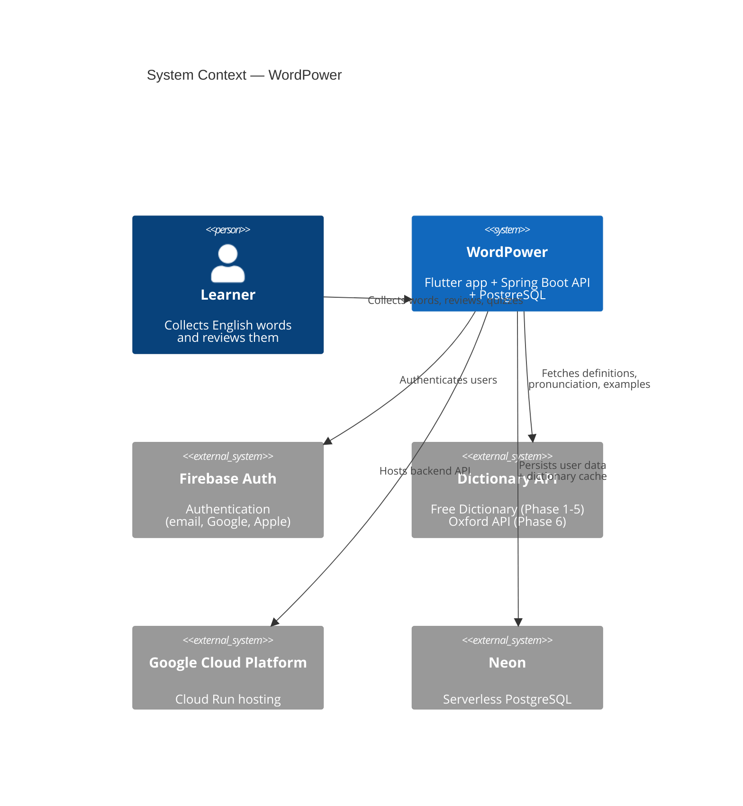
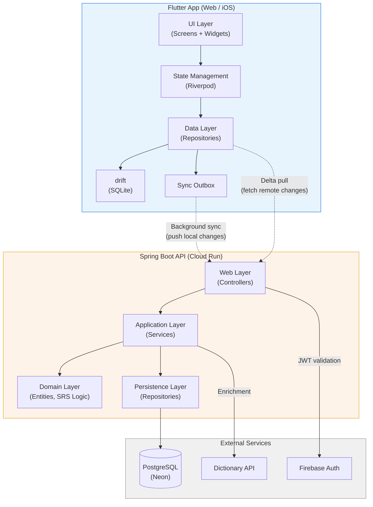
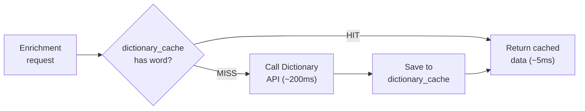
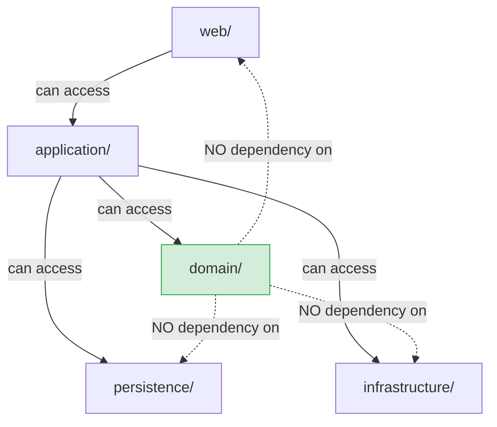
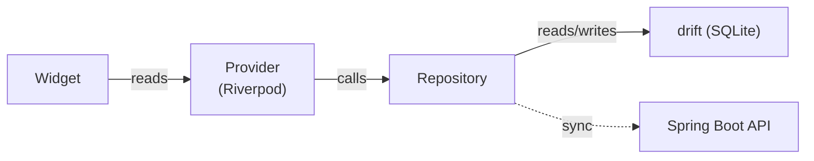
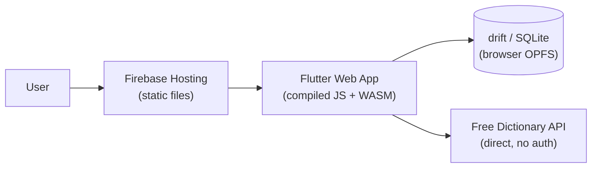
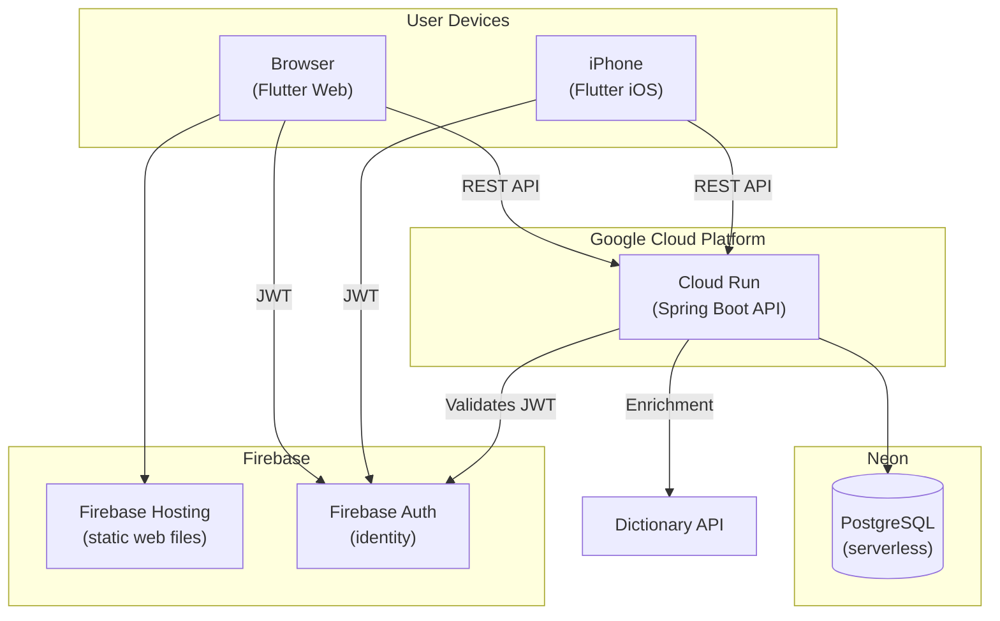
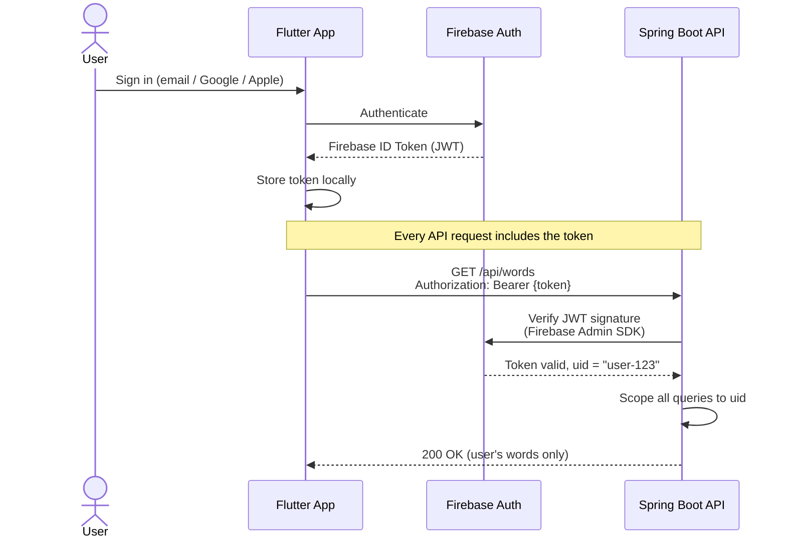

# Architecture — WordPower

> [!abstract] Summary
> WordPower is a local-first personal vocabulary app built with Flutter (frontend) and Spring Boot (backend). Users collect words on-device with zero latency, the backend enriches them via dictionary APIs and serves as the sync bridge between devices. This document is the single map of how the system fits together — component boundaries, data flow, deployment, security, and the key trade-offs behind each decision.

Related: [[LOCAL_FIRST_ARCHITECTURE]] | [[BROWSER_DATABASE_INTERNALS]] | [[TESTING_STRATEGY]] | [[PROJECT]]

---

## Table of Contents

1. [[#1. System Context]]
2. [[#2. High-Level Component Diagram]]
3. [[#3. Data Flow]]
4. [[#4. Backend Architecture]]
5. [[#5. Frontend Architecture]]
6. [[#6. Deployment Topology]]
7. [[#7. Security Model]]
8. [[#8. Cross-Cutting Concerns]]
9. [[#9. Key Technology Decisions]]
10. [[#10. Evolution Path]]

---

## 1. System Context

WordPower is a **local-first lite** vocabulary notebook. The user interacts with the Flutter app, which reads and writes locally first. The Spring Boot API acts as a sync bridge and enrichment engine — it is never on the critical path of a user action.



### System boundaries

| Inside WordPower | Outside WordPower (external dependencies) |
|---|---|
| Flutter web/iOS app | Firebase Auth (identity provider) |
| Spring Boot REST API | Neon (managed PostgreSQL) |
| drift/SQLite local database | Dictionary API (Free Dictionary / Oxford) |
| Sync engine (outbox + delta pull) | Google Cloud Platform (Cloud Run) |
| Enrichment pipeline | Apple App Store / Firebase Hosting (distribution) |
| SRS scheduling algorithm | |

**Design principle:** external dependencies are abstracted behind interfaces. The `DictionaryService` interface means swapping Free Dictionary for Oxford is a single implementation class change. Firebase Auth is consumed via a Spring Security filter — replacing it means swapping one filter, not rewriting auth logic.

---

## 2. High-Level Component Diagram



### Component responsibilities

| Component | Responsibility | Does NOT do |
|---|---|---|
| **UI Layer** | Renders screens, handles user input, animations | Business logic, direct DB access |
| **Riverpod** | State management, dependency injection, caching | Network calls directly (delegates to repositories) |
| **Data Layer** | Coordinates local reads/writes and sync | UI rendering, SRS calculation |
| **drift (SQLite)** | Local persistence, typed queries, migrations | Network, sync decisions |
| **Sync Outbox** | Queues unsynced writes, drains when online | Conflict resolution (server handles this) |
| **Web Layer** | HTTP routing, request/response mapping, validation | Business logic, direct DB queries |
| **Application Layer** | Orchestrates use cases, triggers enrichment | HTTP concerns, SQL |
| **Domain Layer** | SRS algorithm, CEFR assignment, domain tagging | Framework dependencies |
| **Persistence Layer** | PostgreSQL access via Spring Data JPA | Business rules |

---

## 3. Data Flow

### The core loop: Collect → Enrich → Learn → Review


### Request flow: saving a word (Phase 2+)

| Step | Where | What happens | Latency |
|---|---|---|---|
| 1 | Flutter app | User taps Save | 0ms |
| 2 | drift (SQLite) | `INSERT INTO user_words` | ~5ms |
| 3 | UI | "Saved!" shown to user | ~5ms total |
| 4 | Sync outbox | Write queued for background push | ~1ms |
| 5 | Spring Boot | `POST /api/words` (when online) | ~100ms |
| 6 | PostgreSQL | Word persisted server-side | ~10ms |
| 7 | Enrichment | Dictionary API lookup (or cache hit) | ~200ms (miss) / ~5ms (hit) |
| 8 | PostgreSQL | Enrichment data stored | ~10ms |
| 9 | Flutter app | Next delta pull picks up enrichment | Background |

**Key insight:** the user sees "Saved!" at step 3 (~5ms). Steps 5-9 happen invisibly in the background. The network is never on the critical path.

> [!info] Deep dive
> For the full sync protocol (outbox, delta sync, LWW conflict resolution), see [[LOCAL_FIRST_ARCHITECTURE#5. How the Sync Works]].

### Dictionary caching flow

The dictionary cache is **shared across all users**. Each English word is fetched from the external API exactly once.



After a few months, the cache covers nearly every word users will ever search. Dictionary API costs stay flat regardless of user count (particularly important once Oxford API replaces Free Dictionary in Phase 6).

---

## 4. Backend Architecture

The Spring Boot backend follows a **layered architecture** with strict dependency rules enforced by ArchUnit at build time.

### Package structure

```
com.wordpower.api
├── web/                  ← Controllers, DTOs, request/response mapping
│   ├── WordsController
│   ├── QuizController
│   └── dto/
├── application/          ← Services, use-case orchestration
│   ├── WordService
│   ├── EnrichmentService
│   ├── QuizService
│   └── SrsService
├── domain/               ← Entities, value objects, domain logic
│   ├── UserWord
│   ├── DictionaryEntry
│   ├── SrsCalculator
│   └── CefrAssigner
├── persistence/          ← Spring Data JPA repositories
│   ├── WordRepository
│   ├── DictionaryCacheRepository
│   └── UserRepository
├── infrastructure/       ← External integrations
│   ├── dictionary/       ← DictionaryService interface + implementations
│   ├── firebase/         ← Firebase Auth filter
│   └── config/           ← Spring configuration
└── gen/                  ← Generated OpenAPI stubs (excluded from analysis)
```

### Layer dependency rules



| Rule | Enforced by | Why |
|---|---|---|
| Controllers access services only (not repositories) | ArchUnit | Prevents bypassing business logic |
| Domain has no Spring/framework imports | ArchUnit | Domain stays portable and testable |
| No circular package dependencies | ArchUnit | Packages form a DAG |
| Services may access repositories and other services | Convention | Orchestration layer needs both |

> [!info] ArchUnit details
> See [[TESTING_STRATEGY#ArchUnit — Architectural boundary enforcement (Level 3: bytecode + structural analysis)]] for the test implementation and enforcement policy.

### Feature modules

The backend organizes around business capabilities:

| Module | Responsibility |
|---|---|
| **word** | CRUD for user words, personal notes, word lists |
| **dictionary** | Dictionary API integration, caching, enrichment pipeline |
| **auth** | Firebase JWT validation, user identity, security filter |
| **user** | User profile, preferences, subscription status |
| **quiz** | Quiz session management, question generation, answer scoring |
| **srs** | SM-2 scheduling, interval calculation, review queue generation |

### API design

- **Contract-first:** OpenAPI spec (`api/openapi.yaml`) is the source of truth
- **Code generation:** Spring controller interfaces and Dart client SDK generated from the spec
- **Validation:** Spectral lints the spec, oasdiff detects breaking changes, provider contract tests verify implementation matches spec
- **Versioning:** URL path versioning (`/api/v1/...`) when breaking changes are unavoidable

> [!info] Contract testing
> See [[TESTING_STRATEGY#4. Contract Testing]] for the three-layer contract testing approach (spec validation → provider tests → consumer tests).

---

## 5. Frontend Architecture

### Technology choices

| Concern | Technology | Why |
|---|---|---|
| **Framework** | Flutter (Dart) | Single codebase for web + iOS + Android |
| **State management** | Riverpod (with code generation) | Compile-safe, testable, supports async |
| **Local database** | drift (SQLite via WASM in browser) | Typed queries, migrations, mirrors PostgreSQL schema |
| **API client** | Generated Dart SDK from OpenAPI spec | Always in sync with backend contract |
| **Navigation** | go_router | Declarative, deep-linkable |

### Feature-based structure

```
lib/
├── features/
│   ├── capture/          ← Quick Capture screen + logic
│   │   ├── presentation/ ← Widgets, screens
│   │   ├── application/  ← Riverpod providers
│   │   └── data/         ← Repository (local + remote)
│   ├── notebook/         ← Word list, search, filter
│   ├── word_detail/      ← Full word card view
│   ├── flashcard/        ← Flashcard review
│   ├── quiz/             ← Quiz engine + types
│   ├── dashboard/        ← Home screen, stats
│   └── settings/         ← Profile, preferences
├── data/
│   ├── database/         ← drift database, DAOs, tables
│   └── sync/             ← Outbox, delta pull, sync engine
├── api/
│   └── generated/        ← OpenAPI-generated client (excluded from lint/coverage)
└── core/
    ├── router.dart       ← go_router configuration
    ├── theme.dart         ← Material 3 theme
    └── constants.dart
```

### State management pattern



Each feature follows the same pattern:

1. **Widget** reads state from a Riverpod provider (reactive rebuild on change)
2. **Provider** holds business logic, calls repository methods
3. **Repository** coordinates local persistence (drift) and remote sync (API client)
4. **drift** is the immediate source of truth — all reads come from local SQLite

### How the browser database works

On web, drift compiles SQLite to WebAssembly and runs it inside a Web Worker. The main thread (Flutter) communicates with the worker via `postMessage`. Data is persisted to the Origin Private File System (OPFS) for durability.

```
Main Thread (Flutter) → postMessage → Web Worker → WASM (SQLite) → OPFS
```

> [!info] Deep dive
> See [[BROWSER_DATABASE_INTERNALS]] for a full explanation of Web Workers, WASM compilation, OPFS vs IndexedDB, and performance characteristics.

---

## 6. Deployment Topology

### Phase 1 (current) — Web only, no backend



No backend, no auth, no database server. The Flutter app is a static site hosted on Firebase Hosting. All data lives in the browser's local storage via drift/SQLite/OPFS.

### Phase 2+ — Full stack



### Environments

| Environment | Cloud Run | PostgreSQL (Neon) | Firebase | Purpose |
|---|---|---|---|---|
| **DEV** | dev instance | dev branch/database | dev project | Local development, feature branches |
| **TEST** | test instance | test branch/database | test project | PR validation, staging |
| **PROD** | prod instance | prod database | prod project | Live users |

### Scaling characteristics

| Component | Scaling model | Limit before action needed |
|---|---|---|
| **Flutter web** | Static files on CDN (Firebase Hosting) | Effectively unlimited |
| **Flutter iOS** | Runs on user's device | N/A |
| **Cloud Run** | Auto-scales 0 → N containers | ~1000 concurrent users per instance |
| **Neon PostgreSQL** | Serverless auto-suspend, scales compute | Branch-level isolation; upgrade to Pro if >1GB |
| **Dictionary cache** | Grows once per unique English word | ~170K entries max (covers all common English) |

**Cost at rest:** Cloud Run scales to zero when idle. Neon auto-suspends after inactivity. During development, the only fixed cost is the Apple Developer Program ($99/yr).

---

## 7. Security Model

### Authentication flow



### Security layers

| Layer | Mechanism | What it protects |
|---|---|---|
| **Identity** | Firebase Auth (email, Google, Apple Sign-In) | Who the user is |
| **Transport** | HTTPS everywhere (Cloud Run enforces TLS) | Data in transit |
| **API authentication** | Firebase JWT validation via Spring Security filter | Unauthorized API access |
| **Data isolation** | Every query scoped by `user_id` from JWT | Users seeing each other's data |
| **API key protection** | Oxford API key stored in Cloud Run env vars, never sent to client | Key leakage |
| **CORS** | Allowlisted origins only | Cross-origin attacks |
| **Input validation** | Bean Validation (backend) + Dart types (frontend) | Injection, malformed data |
| **Static analysis** | Semgrep (OWASP top 10) + SpotBugs/FindSecBugs (CWE-mapped) | Code-level vulnerabilities |
| **Dependency scanning** | Dependabot (Gradle, pub, GitHub Actions) | Known CVEs in dependencies |

### Per-user data isolation

This is the most critical security property. Every database query includes the authenticated user's ID:

```java
// Repository — every query is scoped
@Query("SELECT w FROM UserWord w WHERE w.userId = :userId")
List<UserWord> findAllByUserId(@Param("userId") String userId);

// Service — userId comes from the authenticated principal, never from request body
public List<WordDto> getWords(String userId) {
    return wordRepository.findAllByUserId(userId);
}

// Controller — extracts userId from the validated Firebase JWT
@GetMapping("/api/words")
public List<WordDto> getWords(@AuthenticationPrincipal FirebaseToken token) {
    return wordService.getWords(token.getUid());
}
```

A user can never request another user's data because the `userId` is extracted from the JWT, not from query parameters or request bodies.

---

## 8. Cross-Cutting Concerns

### Error handling strategy

| Layer | Strategy |
|---|---|
| **Flutter UI** | Riverpod `AsyncValue` for loading/error/data states; user-friendly error messages |
| **Flutter data** | Repository catches exceptions, maps to domain error types |
| **Spring Boot controllers** | `@ControllerAdvice` with global exception handler; consistent `ErrorResponse` JSON shape |
| **Spring Boot services** | Custom exception hierarchy (`WordNotFoundException`, `EnrichmentFailedException`) |
| **External API calls** | Circuit breaker pattern for dictionary API; fallback to cached data or graceful degradation |
| **Sync failures** | Outbox retains failed writes; exponential backoff on retry; never blocks UI |

### Logging and observability

| Concern | Tool | Where |
|---|---|---|
| **Structured logging** | SLF4J + Logback (backend), `dart:developer` (frontend) | Both |
| **Request tracing** | Spring Boot request IDs in MDC | Backend |
| **Health check** | `/actuator/health` (Spring Boot Actuator) | Backend |
| **Uptime monitoring** | Cloud Run built-in metrics | GCP |
| **Error tracking** | Firebase Crashlytics (planned, Phase 6) | Frontend |
| **Performance metrics** | k6 nightly tests catch regressions | CI |

### Configuration management

| Environment variable | Where | Purpose |
|---|---|---|
| `SPRING_DATASOURCE_URL` | Cloud Run | Neon PostgreSQL connection |
| `FIREBASE_PROJECT_ID` | Cloud Run | JWT verification audience |
| `DICTIONARY_API_KEY` | Cloud Run (Phase 6) | Oxford API authentication |
| `SPRING_PROFILES_ACTIVE` | Cloud Run | `dev` / `test` / `prod` profile selection |

**Secrets** are stored in GCP Secret Manager and injected as environment variables into Cloud Run. They never appear in code, config files, or version control.

**Spring profiles** control environment-specific behavior:
- `dev` — verbose logging, relaxed CORS, local Firebase emulator
- `test` — Testcontainers PostgreSQL, mock dictionary service
- `prod` — strict CORS, production Firebase project, real dictionary API

---

## 9. Key Technology Decisions

Each decision below was made for a specific reason. Links point to the deep-dive documents where the full rationale is documented.

### Why Flutter (not React Native, not native)

| Factor | Decision |
|---|---|
| **Single codebase** | Web + iOS + Android from one Dart codebase |
| **Web-first** | Flutter web is a first-class target — critical for Phase 1 (zero friction, no app store) |
| **Performance** | Compiled to native ARM (iOS) and optimized JS + WASM (web) |
| **Ecosystem** | drift, Riverpod, go_router — mature packages for the architecture we need |

### Why Spring Boot (not serverless functions, not Node.js)

| Factor | Decision |
|---|---|
| **Java ecosystem** | Mature libraries for auth, ORM, testing, static analysis |
| **Testcontainers** | Integration tests against real PostgreSQL with zero CI config |
| **Type safety** | Java 21 + strong typing catches bugs at compile time |
| **Cloud Run** | Containerized Spring Boot on Cloud Run = auto-scaling with zero infrastructure management |
| **Team skill** | Backend expertise is in Java/Spring |

### Why drift + SQLite (not IndexedDB, not Hive)

| Factor | Decision |
|---|---|
| **SQL** | Full relational queries — joins, indexes, aggregations for SRS scheduling |
| **Schema mirrors PostgreSQL** | Same relational model locally and in the cloud — sync is field-level, not translation |
| **WASM in browser** | SQLite compiled to WebAssembly runs in a Web Worker — non-blocking, performant |
| **Typed queries** | drift generates Dart code from schema — compile-time query safety |
| **Migration support** | Versioned schema migrations, same model as Flyway on the backend |

> [!info] Deep dive
> See [[BROWSER_DATABASE_INTERNALS]] for how drift, Web Workers, WASM, and OPFS fit together.

### Why Neon PostgreSQL (not RDS, not Supabase)

| Factor | Decision |
|---|---|
| **Serverless** | Auto-suspends on inactivity — $0 cost during development |
| **Branch databases** | Neon branches = isolated database copies for test environments |
| **PostgreSQL native** | Full PostgreSQL feature set (JSONB, GIN indexes, `ON CONFLICT` upsert) |
| **Connection pooling** | Built-in pgbouncer — handles Cloud Run's bursty connection pattern |

### Why local-first lite (not cloud-first, not full CRDT)

| Factor | Decision |
|---|---|
| **Quick Capture < 200ms** | Local write is instant; cloud-first adds a network round trip |
| **Offline support** | Works on the train, in coffee shops, anywhere without internet |
| **No shared documents** | Every word belongs to one user — LWW conflict resolution is sufficient |
| **Engineering simplicity** | CRDTs add significant complexity for zero benefit in a single-user notebook |

> [!info] Deep dive
> See [[LOCAL_FIRST_ARCHITECTURE]] for the full local-first spectrum analysis and sync protocol.

---

## 10. Evolution Path

The architecture is designed to handle WordPower's growth without requiring a rewrite. Below are the known constraints and what triggers a change.

### Current constraints (acceptable today)

| Constraint | Why it's fine now | When it breaks |
|---|---|---|
| **LWW conflict resolution** | Single-user notebook — conflicts near zero | If collaborative word lists are added (multi-user editing) |
| **Full sync on cold start** | Users have < 500 words in early phases | When vocabularies exceed ~5,000 words on a new device |
| **Single Cloud Run instance** | < 100 concurrent users during development | Sustained > 1,000 concurrent users |
| **Free Dictionary API** | Sufficient quality for MVP | Phase 6 (Oxford API provides better data quality, pronunciation, CEFR hints) |
| **No CDN for audio** | Low user count, audio files served via dictionary API URLs | If audio playback latency becomes noticeable at scale |

### Graduation triggers

| Trigger | Current state | Graduates to | Documented in |
|---|---|---|---|
| **> 5,000 words per user** | Full sync on cold start | Progressive sync (paginated initial load) | [[LOCAL_FIRST_ARCHITECTURE#9. The Cold Start Problem: New Device, Lots of Data]] |
| **Collaborative features** | LWW (last-write-wins) | PowerSync or ElectricSQL (CRDT-based sync) | [[LOCAL_FIRST_ARCHITECTURE#10. Future Graduation Path]] |
| **> 1,000 concurrent users** | Single Cloud Run instance | Cloud Run auto-scaling (already supported, just costs more) | — |
| **Phase 6 launch** | Free Dictionary API | Oxford API behind server-side cache | [[PROJECT#Dictionary Caching Architecture]] |
| **Enrichment bottleneck** | Synchronous enrichment in API call | Async enrichment via message queue (Cloud Tasks / Pub/Sub) | — |
| **Complex quiz scheduling** | In-memory SRS calculation | Precomputed review queues, materialized views | — |

### What doesn't change

These architectural invariants hold regardless of scale:

- **Local-first reads** — the Flutter app always reads from drift, never waits for the network
- **Per-user data isolation** — `userId` from JWT scopes every query
- **Contract-first API** — OpenAPI spec remains the source of truth
- **Layered backend** — web → application → domain → persistence, enforced by ArchUnit
- **Static analysis pipeline** — Checkstyle, PMD, SpotBugs, ArchUnit, Semgrep gate every PR
