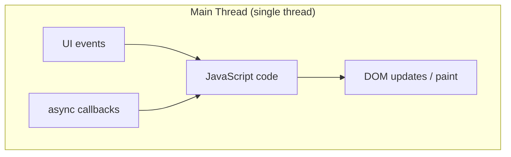
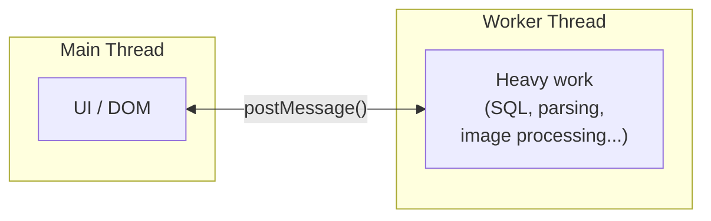
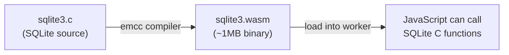
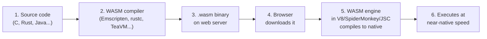
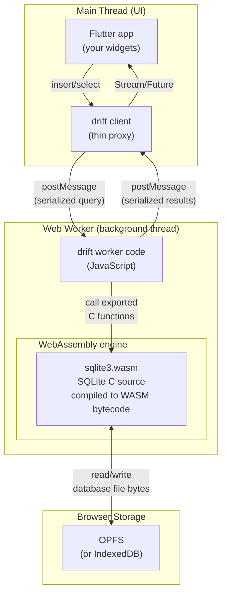
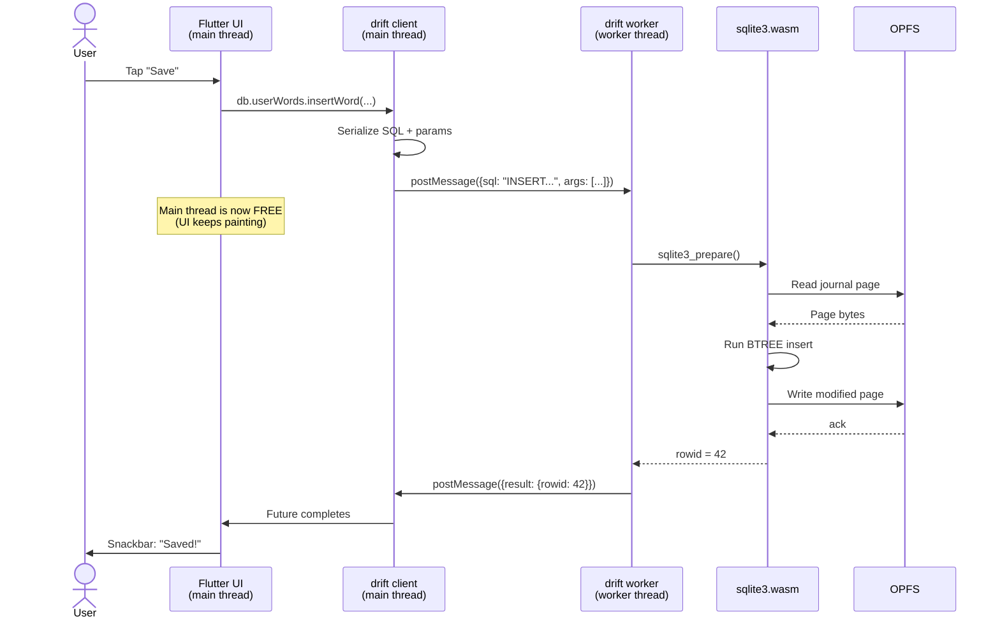
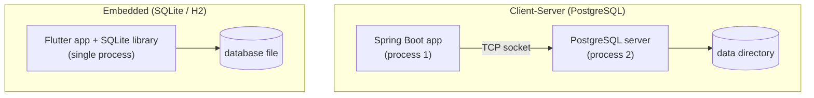

# Browser Database Internals — How drift Runs SQLite on the Web

> [!abstract] Summary
> JavaScript in the browser is single-threaded, yet WordPower runs a real SQLite database in the page. This guide explains the puzzle: how SQLite, web workers, and WebAssembly fit together to make `drift` work on the web without freezing the UI.

Related: [[LOCAL_FIRST_ARCHITECTURE]] | [[PROJECT#6. Technical Stack]]

---

## Table of Contents

1. [[#1. The Puzzle]]
2. [[#2. JavaScript's Single-Threaded Model]]
3. [[#3. Web Workers — Real Parallel Threads]]
4. [[#4. WebAssembly — Running C in the Browser]]
5. [[#5. Putting It Together: drift's Web Architecture]]
6. [[#6. Where the Bytes Actually Live]]
7. [[#7. A Query Walkthrough]]
8. [[#8. Why Workers Are Required, Not Optional]]
9. [[#9. Backend Analogy: Spring Boot + H2]]
10. [[#10. Performance Characteristics]]
11. [[#11. Edge Cases & Gotchas]]
12. [[#12. Glossary]]

---

## 1. The Puzzle

SQLite is a C library. It expects to:

- Run on real OS threads
- Read and write files on a filesystem
- Block the calling thread while it works on a query

The browser offers ==none== of those natively to JavaScript:

- JavaScript is single-threaded
- There is no filesystem (at least not a traditional one)
- Anything that blocks the main thread freezes the UI

So how does WordPower run real SQL queries against a real SQLite database — in Chrome — without the page going unresponsive every time you save a word?

> [!tip] The answer in one line
> drift puts SQLite (compiled to WebAssembly) inside a **web worker**, talks to it from the main thread via async messages, and persists the database bytes through a browser storage API like **OPFS** or **IndexedDB**.

The rest of this doc unpacks that sentence.

> [!info]- Quick clarification: drift is *not* SQLite — and SQLite is not drift
>
> Worth clearing up before going deeper, because the names get used interchangeably:
>
> | Layer | What it is | Who made it |
> |---|---|---|
> | **SQLite** | The actual database engine — a C library that stores SQL data in a file | D. Richard Hipp, 2000 |
> | **drift** | A Dart/Flutter library that wraps SQLite with a type-safe Dart API | Simon Binder (`simolus3`), 2018 |
>
> Same relationship you already know from the backend: **PostgreSQL** is the database, **JPA/Hibernate** is the ORM. drift is "JPA-for-SQLite-in-Dart".
>
> ```
> Your Flutter code
>        ↓
>   drift  (type-safe Dart API, code generation, reactive streams)
>        ↓
>   SQLite (the actual SQL engine, written in C, compiled to WASM on web)
>        ↓
>   Storage (OPFS / IndexedDB on web; native files on iOS / Android)
> ```
>
> Why use drift instead of calling SQLite directly? Type-safe queries, generated DAOs, reactive `Stream<List<Word>>` that auto-update with the data, one Dart API across all platforms, and a built-in migration system. The raw `sqlite3` Dart package exists too, but you'd be writing every query by hand and managing types yourself — like using JDBC directly instead of JPA.
>
> **Naming trivia:** drift was originally called **moor** (the wetland — fitting the water theme). It was renamed to drift in 2021. Same author, same library, friendlier name.

---

## 2. JavaScript's Single-Threaded Model

Every browser tab runs JavaScript on **one thread** — the main thread. That thread is responsible for:

- Running your JavaScript code
- Handling user input (clicks, typing, scrolling)
- Painting the page (DOM updates, animations)
- Running async callbacks from `setTimeout`, `fetch`, etc.



> [!warning] What happens if you block the main thread
> The browser stops painting. Animations freeze. Buttons stop responding. After a few seconds, Chrome shows the dreaded "Page unresponsive" dialog.
>
> A 100ms SQL query is enough to cause visible jank (dropped frames). A multi-second migration would freeze the tab.

The whole web platform is designed to keep the main thread fast. Every browser API that can take a long time is **async** — it returns a Promise instead of blocking.

But SQLite is **synchronous** by design. A `SELECT` blocks the calling thread until results are ready. This is fundamentally incompatible with the main thread.

---

## 3. Web Workers — Real Parallel Threads

Web Workers are the browser's escape hatch from single-threaded JavaScript.

A Web Worker runs on a **separate OS thread**, completely isolated from the main thread. It:

- Has its own JavaScript runtime
- Has its own memory
- Cannot touch the DOM
- Cannot share variables with the main thread
- Communicates with the main thread via `postMessage` (asynchronous)



> [!info] Three flavors of workers
>
> | Type | Lifetime | Shared across tabs? |
> |---|---|---|
> | **Dedicated Worker** | One page | No |
> | **Shared Worker** | Across same-origin pages | Yes |
> | **Service Worker** | Background, network proxy | Yes (different purpose) |
>
> drift can use either dedicated or shared workers. Shared workers let multiple tabs of WordPower talk to the same database without corrupting it.

> [!example]- Real-world apps that rely on Web Workers
>
> | App | What runs in a worker |
> |---|---|
> | **VS Code Web / CodeSandbox** | Language Servers — syntax highlighting, linting, autocomplete |
> | **Figma / Photopea** | Image processing — filters, blur, pixel transforms |
> | **Financial dashboards** | Sorting/filtering huge datasets (100K+ rows) |
> | **Browser games** | Physics, AI pathfinding, collision detection |
> | **WordPower (us)** | The SQLite query engine |
>
> Pattern: any CPU-heavy work that doesn't need to touch the DOM is a worker candidate.

> [!info]- Web Workers are not new — they're 15+ years old
> Web Workers shipped as part of the HTML5 spec. The first draft was 2009 and they had universal browser support by 2012. They predate Java 8's Streams API and most of modern Spring Boot. There's zero compatibility risk in using them in production today.

### How workers actually communicate

Workers do not share memory with the main thread. They pass messages — data is **copied** between threads via `postMessage`, and each side listens with an `onmessage` handler.

**Main thread:**

```javascript
// Spawn the worker by pointing to its script file
const worker = new Worker('worker.js');

// Send data into the worker (heavy task)
worker.postMessage([1000000000, 2000000000]);

// Receive results back
worker.onmessage = (event) => {
  console.log('Result from worker:', event.data);
};
```

**Worker thread (worker.js):**

```javascript
// Listen for messages from the main thread
self.onmessage = (event) => {
  const [a, b] = event.data;
  const result = a + b;          // heavy work would go here

  // Send the result back to main
  self.postMessage(result);
};
```

> [!info] Workers are isolated by design
>
> A worker has its own JavaScript runtime, its own memory, and its own global object (`self` instead of `window`). It **cannot**:
> - Read or modify the DOM
> - Access `window`, `document`, or most of the things you reach for on a normal page
> - Share variables or objects directly with the main thread
>
> This isolation is what makes worker concurrency safe — there's no shared mutable state for two threads to fight over. The trade-off is that every interaction is async and involves copying data across the thread boundary. (For huge buffers, `Transferable` objects let you *move* ownership instead of copying, but that's an optimization, not the default.)
>
> drift uses exactly this pattern: the Flutter UI runs on the main thread; `drift_worker.dart.js` (compiled from Dart) runs the SQLite engine in a worker; queries and results cross via `postMessage`.

Crucially: **a worker can run synchronous code without freezing the UI**. If you want to call a blocking C library (like SQLite), you put it in a worker.

---

## 4. WebAssembly — Running C in the Browser

SQLite is written in C. Browsers don't run C. The bridge is **WebAssembly (WASM)**.

WASM is a low-level binary format that browsers execute at near-native speed. You compile C, C++, Rust, or other languages to a `.wasm` file, then load it into a JavaScript context.

> [!info]- Why "WebAssembly"? The name in 30 seconds
>
> "Assembly" is the lowest human-readable programming language — a direct translation of the binary instructions a CPU understands. Each CPU architecture (Intel x86, Apple M1) has its own assembly, tightly bound to the hardware.
>
> ==WebAssembly is assembly for a *virtual* CPU inside the browser.== It's a universal low-level instruction set; the browser translates it to whatever real CPU the user has. The file extension `.wasm` is just shorthand for the same word.
>
> The full pipeline: high-level source code (Rust, C, Java, ...) → WASM compiler → `.wasm` binary → browser fetches it like any asset → browser's WASM engine compiles it on the fly to native machine code (ARM64, x86_64, ...) → executes at near-native speed.



> [!example]- Why WASM is fast
> WASM is not interpreted JavaScript. It's bytecode designed to be JIT-compiled to native CPU instructions. A SQL query against a 10,000-row table runs at roughly the same speed as native SQLite — maybe 1.5–2x slower at worst.

WASM has its own **linear memory** (a big resizable byte array). SQLite stores its in-memory database pages there. To talk to JavaScript, WASM exposes function exports; JavaScript calls them like normal functions.

The combination — SQLite compiled to WASM, loaded into a Web Worker — is what makes a real SQL database possible in the browser.

> [!example]- Production apps that ship WebAssembly
>
> | App | What WASM does for them |
> |---|---|
> | **Figma** | Renders the design canvas (originally C++, compiled to WASM) |
> | **AutoCAD Web** | Runs the full CAD engine in the browser |
> | **Google Earth** | 3D globe rendering |
> | **Disney+** | DRM and parts of the video pipeline |
> | **1Password** | Encryption primitives |
> | **WordPower (us)** | The SQLite engine |

> [!info]- WASM is multi-language and *complements* JavaScript
>
> Many languages compile to WASM:
> - **C / C++** (Emscripten) — most mature; SQLite uses this path
> - **Rust** — first-class WASM target; used by Figma, Cloudflare Workers
> - **Go**, **Swift**, **Kotlin/Native**, **AssemblyScript** — varying maturity
> - **Java** (TeaVM, JWebAssembly), **C#** (Blazor), **Dart** (early experimental)
>
> ==WASM is not a JavaScript replacement.== JS still owns the DOM, event handling, and most app glue. WASM handles the compute-heavy bits. They share the page and pass data via JS bindings.

> [!info]- WASM is mature, not experimental
> Announced 2015, MVP shipped in all major browsers by March 2017, became a W3C recommendation in 2019. It's been production-ready for years. Active recent additions are around the edges — **Wasm GC** (better support for garbage-collected languages like Java/Dart) and **WASI** (running WASM outside the browser, e.g., on servers and edge runtimes).

### How a `.wasm` file actually gets to your browser and runs



| Step | What happens |
|---|---|
| **1. Write** | Application logic in a high-level language (C, C++, Rust, Java, etc.) |
| **2. Compile** | A specialized compiler (Emscripten for C, `rustc --target=wasm32` for Rust, TeaVM for Java) emits a compact `.wasm` binary |
| **3. Host** | Drop the `.wasm` file on your web server alongside HTML and JS |
| **4. Fetch** | Browser downloads it like any other static asset (cached by the HTTP cache for free) |
| **5. Translate** | The browser's WASM engine — built into the same JS engine you already have (**V8** in Chrome, **SpiderMonkey** in Firefox, **JavaScriptCore** in Safari) — streams and JIT-compiles the bytecode into the user's actual CPU instructions (ARM64 on an M-series Mac, x86_64 on an Intel laptop, etc.) |
| **6. Execute** | Runs at near-native speed in the same secure sandbox as JavaScript — no OS access, same-origin enforced |

> [!info] WASM is sandboxed exactly like JavaScript
>
> WebAssembly does *not* give code more access to the user's machine than JS has. It runs inside the browser's security sandbox:
> - Cannot read or write the local filesystem (only what the browser exposes — e.g., OPFS)
> - Cannot make arbitrary network calls — same-origin and CORS still apply
> - Cannot escape into native OS APIs
> - Memory is bounded to the WASM module's own linear memory
>
> So while WASM is *fast like native*, it's *safe like JS*. That's the property that makes it viable to ship arbitrary compiled code (like SQLite) to a web page.

---

## 5. Putting It Together: drift's Web Architecture

Running a desktop-grade SQL database inside a browser is only possible because three modern web technologies cooperate. drift orchestrates all three for you.

### Three pillars

#### 1. The Engine — WebAssembly

SQLite is written in C; browsers cannot run C natively. The official SQLite C source is compiled to a WebAssembly (`.wasm`) binary. Your Flutter Web app downloads this `.wasm` file once; the browser's WASM engine JIT-compiles it to native CPU instructions and runs the SQL engine at near-native speed — ==bypassing JavaScript interpretation entirely==.

#### 2. The Storage — Origin Private File System (OPFS)

Earlier browser databases had to fall back to IndexedDB (slow for relational data) or LocalStorage (capped at ~5 MB and string-only). drift uses **OPFS** — a modern, sandboxed, high-performance virtual filesystem available to web workers. The WASM SQLite engine reads and writes raw bytes to a real `.db` file inside OPFS, exactly as it would on a Mac or Linux machine. ==No chunking, no emulation, no async detours.==

#### 3. The Concurrency — Dedicated Web Workers

Even with WASM and OPFS, a heavy query takes milliseconds — and any of those on the main thread would freeze the Flutter UI. drift spawns a Web Worker, moves the entire WASM SQLite engine and OPFS connection into it, and lets your UI talk to it via async `postMessage`. ==The main thread never touches the database directly, and therefore never blocks.==

> [!tip] How the three pillars combine
> WASM gives us **speed** (real SQLite, not a JavaScript reimplementation). OPFS gives us **proper persistence** (a real file, not key-value emulation). Workers give us **non-blocking concurrency** (queries off the UI thread). Take any one of these out and the architecture stops being viable.

### The diagram

Here's the complete picture for WordPower:



### Who lives where

| Component | Thread | Purpose |
|---|---|---|
| Flutter widgets | Main | The UI |
| drift client (`AppDatabase`) | Main | Type-safe Dart API; serializes queries |
| `drift_worker.dart.js` | Worker | Receives messages from main, drives the SQLite engine |
| **WebAssembly engine** | Worker (built into the browser's JS engine) | Hosts and JIT-compiles `.wasm` bytecode to native CPU instructions |
| `sqlite3.wasm` | Worker (loaded into the WASM engine) | The actual SQLite library — C compiled to WASM |
| OPFS / IndexedDB | Worker (filesystem-like) | Persists the database file |

> [!info] Where WebAssembly fits in this picture
>
> WebAssembly isn't a separate process or runtime you ship with your app. It's a **subsystem of the browser's existing JavaScript engine** — V8 in Chrome, SpiderMonkey in Firefox, JavaScriptCore in Safari. Each of those engines knows how to execute both JS and WASM in the same context.
>
> Inside the Web Worker, two things share the same runtime:
> 1. **Plain JavaScript** — `drift_worker.dart.js` (Dart compiled to JS) handles message routing, transactions, and bridging
> 2. **WebAssembly** — `sqlite3.wasm` (the SQLite C library compiled to WASM) does the actual query execution
>
> The drift worker code calls SQLite by invoking exported WASM functions like `sqlite3_prepare`, `sqlite3_step`, `sqlite3_column_text`, etc. — the same C API that native iOS and Android use. The WASM engine JIT-compiles those calls to native ARM64 or x86_64 instructions on the user's CPU at near-native speed.

Notice: the **Flutter widgets never touch SQLite directly**. They call typed Dart methods on `AppDatabase`, which sends messages to the worker, which calls into the WASM-hosted SQLite engine, which sends results back. Every step is async from the main thread's perspective.

---

## 6. Where the Bytes Actually Live

The SQLite engine in the worker needs to read and write the database file somewhere. Browsers offer several storage APIs; drift picks the best one available.

| Backend | What it is | Sync API? | Persistence | Reliability |
|---|---|---|---|---|
| **OPFS** | Origin Private File System — a sandboxed filesystem just for your origin | Yes (in workers) | Survives reload, browser restart | Best |
| **IndexedDB** | Async key-value store, splits the DB into chunks | No (async only) | Survives reload, browser restart | Good |
| **In-memory** | Just a buffer in WASM linear memory | Yes | ==Lost on reload== | None |

> [!info] Why drift prefers OPFS
> SQLite expects synchronous file I/O. OPFS — when accessed from a worker — provides a synchronous file API that maps almost 1:1 onto what SQLite wants. This means SQLite can run efficiently without weird async detours.
>
> IndexedDB is async only, so drift has to chunk the database file into IDB records and emulate sync access. It works, but it's slower and more complex.

> [!warning] OPFS sync API is worker-only
> The synchronous OPFS API (`getFileHandleSync`) is **only available in Web Workers**, not on the main thread. This is one of the reasons SQLite must live in a worker — the alternative storage path simply doesn't exist on the main thread.

### COOP/COEP headers

To get the fastest OPFS variant (`opfsLocks`), the page must be served with these HTTP headers:

```
Cross-Origin-Opener-Policy: same-origin
Cross-Origin-Embedder-Policy: require-corp
```

These enable `SharedArrayBuffer`, which OPFS sync access requires. **Firebase Hosting supports custom response headers (including COOP/COEP); GitHub Pages does not** — GitHub Pages is a static hosting service that does not allow setting custom HTTP response headers (verified April 2026). Without these headers we still work — drift falls back to a slower backend automatically.

---

## 7. A Query Walkthrough

Let's trace what actually happens when the user saves the word "ubiquitous". This is the in-browser flow — for the cross-device sync flow that follows the save, see [[LOCAL_FIRST_ARCHITECTURE#5. How the Sync Works]].

### Step by step

| # | Where | What happens |
|---|---|---|
| 1 | **Main thread** | User taps the Save button in the Flutter UI |
| 2 | **Main thread** | Flutter widget calls `db.userWords.insertWord(...)` on the drift client |
| 3 | **Main thread** | drift client serializes the call into a message: `{type: "exec", sql: "INSERT INTO user_words ...", args: ["ubiquitous", ...]}` |
| 4 | **Main thread** | drift client calls `worker.postMessage(message)` — the message is **copied** across the thread boundary |
| 5 | **Main thread is now FREE** ✨ | UI keeps painting at 60 fps; the snackbar can animate; the Flutter widget is `await`ing a `Future` |
| 6 | **Worker thread** | `drift_worker.dart.js` receives the message via its `onmessage` handler |
| 7 | **Worker thread** | Worker code parses the message, identifies it as an INSERT |
| 8 | **Worker → WASM** | Worker calls `sqlite3_prepare_v2()` — an *exported function* from `sqlite3.wasm`. The WebAssembly engine JIT-compiles this C function to native ARM64 / x86_64 the first time, then executes it |
| 9 | **Inside WASM** | SQLite parses the SQL and builds a prepared statement |
| 10 | **Worker → WASM** | Worker calls `sqlite3_bind_text()` etc. once per parameter |
| 11 | **Worker → WASM** | Worker calls `sqlite3_step()` to actually execute the INSERT |
| 12 | **WASM → OPFS** | SQLite writes the modified database page through file I/O hooks (`xWrite`, `xSync`) that drift wires up to OPFS |
| 13 | **OPFS → WASM** | File write completes; SQLite's transaction commits |
| 14 | **Worker → WASM** | Worker calls `sqlite3_finalize()` to clean up the prepared statement |
| 15 | **Worker thread** | Worker reads the new row's `rowid` (e.g., `42`) and the affected-rows count |
| 16 | **Worker thread** | Worker packages a response: `{type: "result", rowid: 42, rows: 1}` |
| 17 | **Worker → Main** | Worker calls `self.postMessage(response)` — message copied back across the thread boundary |
| 18 | **Main thread** | drift client's `onmessage` fires, completes the awaiting `Future` with the result |
| 19 | **Main thread** | Any active `Stream<List<Word>>` re-runs its query and emits the new list |
| 20 | **Main thread** | Flutter rebuilds the affected widgets — word now appears in the list |

### Mapped to the arrows in the Section 5 diagram

```
[Flutter app]    ──"insert/select"──>             [drift client]      (steps 1–2)
[drift client]   ──"postMessage (serialized)"──>  [drift worker]      (steps 3–4)
[drift worker]   ──"call exported C functions"──> [sqlite3.wasm]      (steps 8, 10, 11, 14)
[sqlite3.wasm]   ──"read/write file bytes"──>     [OPFS]              (steps 12–13)
[drift worker]   ──"postMessage (results)"──>     [drift client]      (steps 16–17)
[drift client]   ──"Stream/Future"──>             [Flutter app]       (steps 18–20)
```

### The same flow as a sequence diagram



### Key observations

- The main thread does almost no work — it serializes a message, hands it off, and is immediately free to paint frames.
- The worker does all the heavy lifting on a different OS thread.
- File I/O happens inside the worker via OPFS. The main thread never touches storage.
- Even if the query takes 50ms, the UI stays at a smooth 60fps because the main thread isn't blocked.

### What's *not* shown but worth knowing

- **WASM cold start:** the first time `sqlite3_prepare_v2()` is called, the WebAssembly engine takes a few extra ms to JIT-compile it to native code. After that, it's free.
- **Caching:** SQLite holds a page cache *inside its WASM linear memory*. Most reads don't touch OPFS at all — they hit the in-memory cache.
- **Transactions:** if you wrap multiple inserts in `db.transaction(...)`, drift batches them so OPFS only writes once at commit, not after every row.

---

## 8. Why Workers Are Required, Not Optional

You might ask: "Couldn't we just run SQLite WASM directly on the main thread and skip the worker complexity?" Technically yes, but there are three blocking problems:

> [!danger] Three reasons a main-thread SQLite would fail in production
>
> 1. **Blocking I/O freezes the UI.** A 100ms query drops 6 frames. A 1-second migration freezes the tab. Workers solve this for free.
> 2. **OPFS sync API doesn't exist on main thread.** Without OPFS sync, you can only use the async IndexedDB path, and SQLite expects sync I/O. Forcing async detours through callbacks is slow and brittle.
> 3. **Multi-tab corruption.** Two tabs writing to the same SQLite file simultaneously will corrupt it. Shared workers let drift centralize all access through one worker that all tabs talk to.

For a serious local database, workers aren't an optimization — they're a correctness requirement.

---

## 9. Backend Analogy: Spring Boot + H2

If you come from backend engineering, every concept in this doc has a direct equivalent you already know.

### The mapping

| Browser (drift on web) | Backend (Spring Boot) | Role |
|---|---|---|
| **Main thread** (Flutter UI) | **Tomcat request thread** | The thread the user is waiting on — must stay fast |
| **Web Worker** | **Thread from ExecutorService / `@Async`** | A separate thread that does the heavy database work |
| **postMessage()** | **Submit task to thread pool** | Hand off work to another thread without blocking |
| **drift** | **Spring Data JPA / Hibernate** | Type-safe ORM — your code talks to this, not raw SQL |
| **SQLite (via WASM)** | **H2 Database in embedded mode** | An ==embedded database library==, not a separate server |
| **sqlite3.wasm** | **`com.h2database:h2` JAR dependency** | A library loaded into your process at startup |
| **OPFS** | **`~/data/myapp.h2.db` file on disk** | Where the database bytes physically live |
| **PostgreSQL (Phase 2 cloud)** | **PostgreSQL** | The same — a real client-server database in the cloud |

### Embedded vs client-server: the key distinction

> [!warning] SQLite is NOT like PostgreSQL
>
> PostgreSQL is a **client-server** database — a separate process that your app talks to over a TCP socket. If PostgreSQL crashes, your app keeps running.
>
> SQLite is an **embedded** database — a library loaded *inside* your application. There is no separate process, no socket, no DBA. It's a `.c` file compiled into your app that reads and writes a file directly.
>
> The correct backend analogy for SQLite is **H2 in embedded mode**, not PostgreSQL.



When you add `implementation 'com.h2database:h2'` to `build.gradle`, you don't install a database server — you get a library inside your JVM that reads and writes a file. ==That's exactly what SQLite is==, except compiled to WASM instead of JVM bytecode.

### Saving a word: side by side

**Backend (Spring Boot + JPA + PostgreSQL):**

```
Controller receives POST /api/words
       ↓
JPA/Hibernate generates INSERT SQL
       ↓
JDBC sends SQL to PostgreSQL over a socket
       ↓  (controller thread BLOCKS here)
PostgreSQL executes INSERT, writes WAL, fsyncs
       ↓
JDBC receives result
       ↓
Controller returns 201 Created
```

**Browser (Flutter + drift + SQLite WASM):**

```
Flutter widget calls db.insertWord(...)
       ↓
drift serializes the query
       ↓
postMessage sends it to the worker
       ↓  (main thread is FREE — keeps painting UI)
Worker calls sqlite3_prepare → sqlite3_step
       ↓
SQLite (WASM) executes INSERT, writes to OPFS
       ↓
Worker sends result back via postMessage
       ↓
Flutter rebuilds with new data
```

> [!info] The one key difference
>
> In Spring Boot, the controller thread **blocks** while waiting for PostgreSQL. That's fine because Tomcat has a thread pool (~200 threads) — other requests are served by other threads.
>
> In the browser, **there is only one main thread.** Blocking it freezes the entire UI. That's why the `postMessage` handoff is async (non-blocking) — the main thread fires the message and goes back to painting frames immediately.
>
> If you've used Spring's `@Async` annotation, that's the closest backend equivalent to the worker pattern:
>
> ```java
> @Async
> public CompletableFuture<Word> saveWord(String word) {
>     return CompletableFuture.completedFuture(repository.save(word));
> }
> ```
>
> Same idea: delegate work to another thread, get a `Future` back, don't block the caller.

---

## 10. Performance Characteristics

| Operation | Approximate cost on web | Notes |
|---|---|---|
| Simple `SELECT * FROM user_words WHERE id = ?` | <5ms | Fast, includes worker round-trip |
| `INSERT` one row | 5–15ms | Includes OPFS write + fsync |
| `SELECT` with sort over 5000 rows | 20–50ms | SQLite is fast; serialization adds ~10ms |
| Schema migration (small) | 50–200ms | Runs once, in worker — no UI freeze |
| Database open (first time) | 100–500ms | WASM compile + storage init |
| Database open (cached) | <50ms | WASM is cached by the browser |

> [!tip] WordPower-specific implications
> A user with 5,000 collected words searches their notebook. The query runs in ~20ms inside the worker, serializes back in another ~10ms — the user perceives an instant response. Meanwhile, the UI stays buttery-smooth at 60fps because the main thread did nothing while the query ran.

### What's slower than native?

- **WASM startup** — first load needs to fetch + compile `sqlite3.wasm` (~1MB)
- **Cross-thread serialization** — every query crosses a thread boundary; each crossing copies the data
- **Persistence overhead** — OPFS is fast but not as fast as a raw filesystem

For a notebook app with thousands (not millions) of rows, none of these matter in practice.

---

## 11. Edge Cases & Gotchas

> [!warning] Things that can bite you
>
> | Issue | What happens | Mitigation |
> |---|---|---|
> | User opens app in private/incognito | Storage may be ephemeral; data lost on tab close | Detect via `WasmDatabaseResult.chosenImplementation` and warn user |
> | Browser doesn't support OPFS or workers | drift falls back to `unsafeIndexedDb` or `inMemory` | Show banner: "your browser doesn't support reliable storage" |
> | Tab quota exceeded | Writes start failing | Reserve space upfront via `navigator.storage.persist()` |
> | User clears site data | Local DB wiped | Cloud sync (Phase 2+) provides recovery |
> | Schema migration fails mid-flight | DB potentially corrupt | drift transactions wrap migrations; either fully applies or rolls back |
> | Two tabs without shared worker | Race conditions, possible corruption | Always use shared worker variant on production |
> | Forgot to copy `sqlite3.wasm` to `web/` | App crashes on database open | Build script or CI check |

---

## 12. Glossary

| Term | Definition |
|---|---|
| **Main thread** | The single thread in a browser tab that runs JS and updates the UI. Blocking it freezes everything. |
| **Web Worker** | A JavaScript context running on a separate OS thread, used to offload heavy work from the main thread. |
| **Dedicated Worker** | A worker scoped to a single page. |
| **Shared Worker** | A worker shared across all same-origin pages (e.g., all WordPower tabs). |
| **WebAssembly (WASM)** | A binary instruction format that runs in browsers at near-native speed; lets us compile C (like SQLite) for the web. |
| **Linear memory** | The contiguous byte array a WASM module uses as its memory. SQLite's in-memory pages live here. |
| **postMessage** | The async messaging API used to communicate between threads. Data is copied (structured clone), not shared. |
| **OPFS** | Origin Private File System — a sandboxed, browser-managed filesystem accessible from workers; the fastest persistence option for WASM SQLite. |
| **IndexedDB** | Browser's standard async key-value store. drift uses it as a fallback when OPFS isn't available, splitting the SQLite file into chunks. |
| **SharedArrayBuffer** | A memory region shared across threads (rare in JS world). Required for synchronous OPFS access; gated behind COOP/COEP headers. |
| **COOP/COEP** | HTTP headers (Cross-Origin Opener/Embedder Policy) that enable cross-origin isolation, unlocking `SharedArrayBuffer` and the fast OPFS path. |
| **Structured clone** | The serialization algorithm `postMessage` uses to copy data between threads. Handles most types except functions and DOM nodes. |
| **drift_worker.dart.js** | The compiled-to-JS Dart file that runs inside the worker, hosting SQLite and handling messages from the main thread. |
| **drift** | A Dart/Flutter library that wraps SQLite with a type-safe API, code generation, and reactive streams. drift is *not* the database itself — it's the friendly Dart layer on top. Originally called *moor*, renamed in 2021. |
| **SQLite** | The actual database engine. A self-contained C library that stores an SQL database in a single file. Used by virtually every iOS/Android app and now in browsers via WASM. |
| **sqlite3.wasm** | The SQLite library compiled to WebAssembly. drift loads this into the worker. |

---

## Further Reading

- [drift web platform docs](https://drift.simonbinder.eu/platforms/web/) — official setup guide
- [SQLite WASM project](https://sqlite.org/wasm/doc/trunk/index.md) — upstream WASM build of SQLite
- [Origin Private File System (MDN)](https://developer.mozilla.org/en-US/docs/Web/API/File_System_API/Origin_private_file_system) — the storage API drift prefers
- [Web Workers (MDN)](https://developer.mozilla.org/en-US/docs/Web/API/Web_Workers_API) — foundational worker docs
- [WebAssembly (MDN)](https://developer.mozilla.org/en-US/docs/WebAssembly) — what WASM actually is
