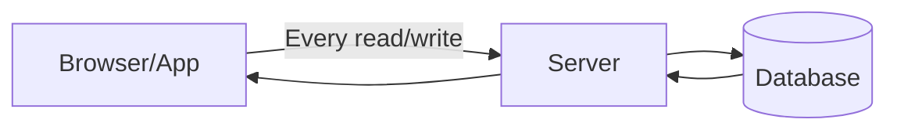
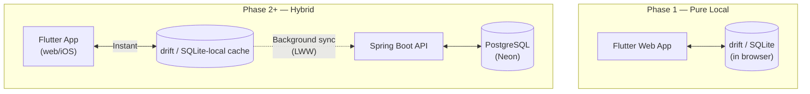
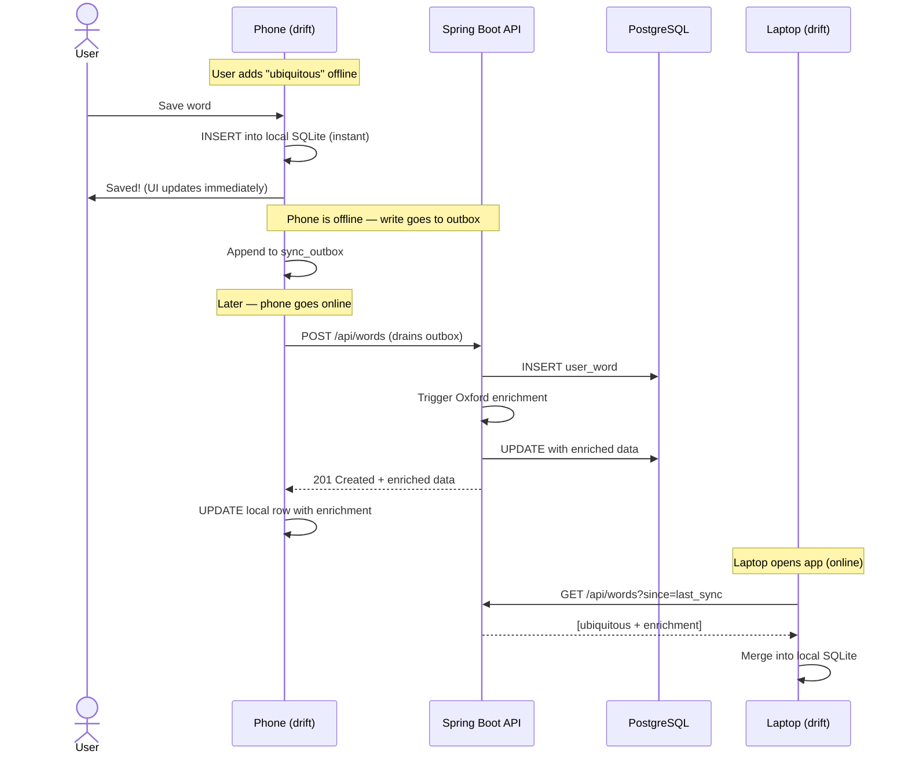
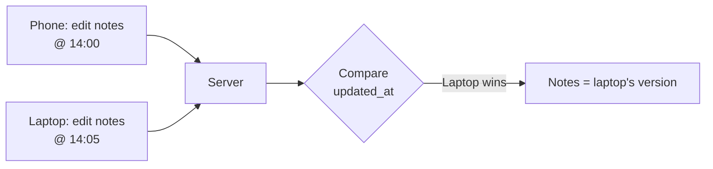
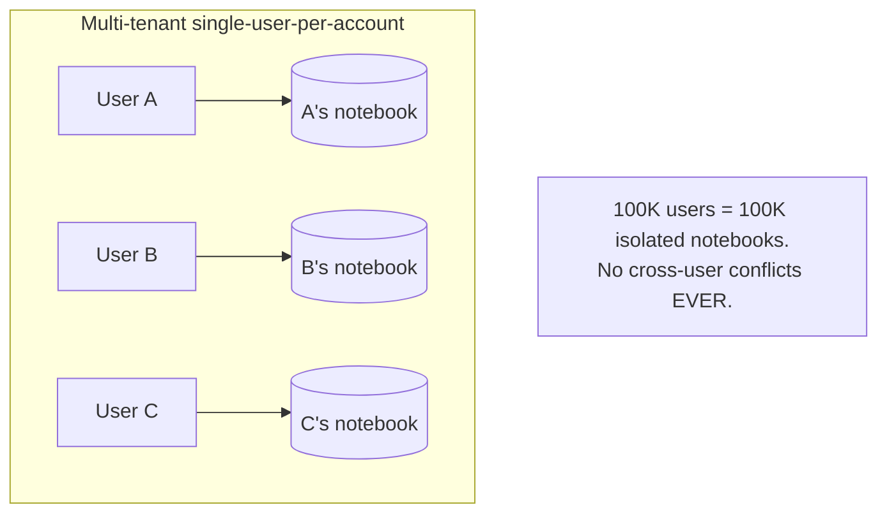
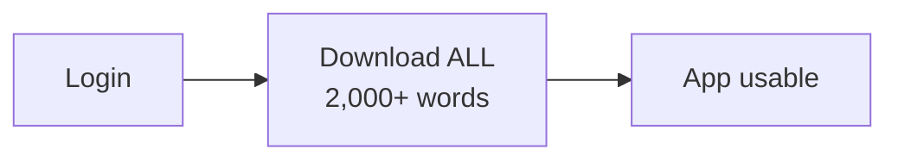
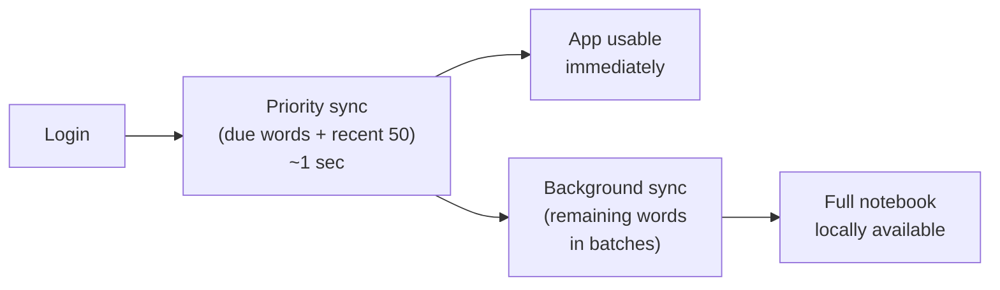
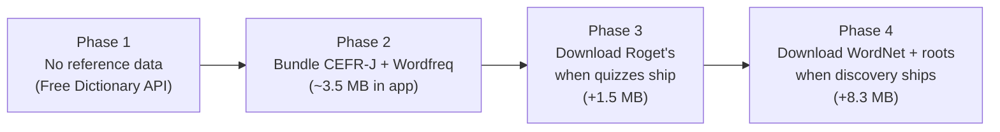

# Local-First Architecture — Concept Guide

> [!abstract] Summary
> What "local-first" means, why WordPower uses it, and where on the spectrum we sit between a thin cloud client and a full CRDT-powered system.

Related: [[PROJECT#6. Technical Stack]] | [[PROJECT#2.7 User Accounts & Cloud Sync]]

---

## Table of Contents

1. [[#1. The Problem with Cloud-First Apps]]
2. [[#2. What "Local-First" Actually Means]]
3. [[#3. The Spectrum]]
4. [[#4. Where WordPower Sits]]
5. [[#5. How the Sync Works]]
6. [[#6. Conflict Resolution: Last-Write-Wins]]
7. [[#7. Why "Many Users" Doesn't Break This]]
8. [[#8. The Honest Risks]]
9. [[#9. The Cold Start Problem: New Device, Lots of Data]]
10. [[#10. Future Graduation Path]]
11. [[#11. Glossary]]

---

## 1. The Problem with Cloud-First Apps

Most modern web apps are ==cloud-first==: the server is the source of truth, and the client is a thin window into it.

> [!warning] Symptoms of cloud-first
> - **Spinners everywhere** — every action waits for a network round trip
> - **Breaks offline** — no internet, no app
> - **Slow on bad networks** — your data lives in a datacenter, not on your device
> - **Vendor lock-in** — when the company shuts down, your data goes with it

For a vocabulary notebook used on the train, in coffee shops, or while reading a paper book, this is a poor fit. ==Quick Capture must work in 200ms, not 2 seconds.==

---

## 2. What "Local-First" Actually Means

==Local-first means your data lives on your device first and your devices reach **eventual consistency** through background sync — the cloud is just the bridge that ferries changes between them, not the source of truth your app depends on to function.==

The term was coined by **Martin Kleppmann** and the [Ink & Switch](https://www.inkandswitch.com/local-first/) lab in a 2019 essay. They proposed seven ideals:

| # | Ideal | What it means |
|---|---|---|
| 1 | **No spinners** | Every read and write is instant — local first, sync later |
| 2 | **Works on multiple devices** | Your data follows you across phone, laptop, tablet |
| 3 | **Network is optional** | Full app functionality offline |
| 4 | **Seamless collaboration** | Multiple people can edit without conflicts (CRDTs) |
| 5 | **The Long Now** | Your data outlives the app — no service shutdown takes it from you |
| 6 | **Security & privacy by default** | Data is yours, encrypted, not mined |
| 7 | **You retain ownership** | Export anytime, no lock-in |

> [!tip] The technical hallmark
> ==The local copy is the **primary** copy.== The cloud is a sync conduit, not the source of truth. Your app reads from local storage instantly, then quietly syncs in the background.

This flips the cloud-first model:

The dashed lines mean "happens when convenient" — not on the critical path of any user action.

---

## 3. The Spectrum

Local-first comes in degrees. Apps fall somewhere along a spectrum — from ones that can't work without a server, to ones that can run entirely on your device with no cloud at all:

| Approach                        | Source of truth          | Sync model                                     | Conflict resolution                      | Examples                                         |
| ------------------------------- | ------------------------ | ---------------------------------------------- | ---------------------------------------- | ------------------------------------------------ |
| **Cloud-first**                 | Server                   | Every action hits server                       | Server wins (no conflicts possible)      | Gmail web, Salesforce, Jira                      |
| **Cloud-first + offline cache** | Server                   | Server is canonical; client caches             | Server wins on reconnect                 | Many SaaS PWAs                                   |
| **Local-first lite**            | ==Tied: local + server== | Local writes queued; sync in background        | Last-write-wins (LWW), simple merge      | **WordPower**, Bear, many "offline-capable" apps |
| **Full local-first**            | Local                    | Local writes queued; CRDTs merge automatically | CRDTs (no winner — both edits preserved) | Linear, Figma, Automerge-based apps              |
| **Decentralized local-first**   | Local only               | P2P sync, no central server                    | CRDTs                                    | Local-first research apps, some Holochain apps   |

> [!info] CRDT
> Stands for **Conflict-free Replicated Data Type**. A clever data structure (like a special list, map, or counter) that lets two devices each make independent edits, then merge them automatically without losing anyone's work. The trade-off: more complexity, more storage overhead.

---

## 4. Where WordPower Sits

WordPower is ==**local-first lite**==. We get most of the UX wins of full local-first without the complexity of CRDTs.

> [!example]- Why we chose this spot on the spectrum
>
> | Need | Cloud-first? | Local-first lite? | Full CRDT? |
> |---|---|---|---|
> | Quick Capture in <200ms | ❌ network round trip | ✅ local write | ✅ |
> | Review on the train (offline) | ❌ broken | ✅ works | ✅ |
> | Multi-device sync (same user) | ✅ | ✅ via LWW | ✅ via CRDTs |
> | Two users editing same doc | N/A | N/A | ✅ |
> | Engineering complexity | Low | Medium | High |
> | Right fit for WordPower | No | **Yes** | Overkill |

WordPower has **no shared documents**. Every word belongs to one user. So we never need the truly hard part of local-first (multi-user merge).

---

## 5. How the Sync Works

Walking through what happens end-to-end when you save a word on your phone (offline) and later open the app on your laptop:

### Step 1 — The local write (zero latency)

You type "ubiquitous" on your phone and tap Save. The app does **not** wait for the internet. It immediately runs an `INSERT` against the local SQLite database (via drift), the row is persisted, and the UI updates instantly.

### Step 2 — Queue in the outbox

The same write is also appended to a local `sync_outbox` table. This queue holds writes that haven't been confirmed by the server yet. ==It survives app restart== — if you close the browser/app and reopen, pending changes are still queued.

### Step 3 — Background push (draining the outbox)

When the phone detects an active network connection, a background task sends `POST /api/words` to the Spring Boot API (one request per pending write, or batched). The server saves the word to PostgreSQL and triggers Oxford dictionary enrichment.

### Step 4 — Server acknowledgment and local update

The server returns `201 Created` along with the newly enriched data (definition, IPA, audio URL, examples, CEFR level, semantic domain). The phone applies that data to the original local row via a drift `UPDATE`, and removes the entry from the outbox.

### Step 5 — Delta sync (pulling on another device)

You open the app on your laptop. It calls `GET /api/words?since=last_sync_timestamp`. The server returns **only records changed since that timestamp** — not the whole database. The laptop merges these into its local drift SQLite.

### Step 6 — Conflict resolution (Last-Write-Wins)

If the same record was edited on both devices since the last sync (rare for a personal notebook), the merge compares `updated_at` timestamps and keeps the version with the latest one. See [[#6. Conflict Resolution: Last-Write-Wins]] for when this is safe and when it isn't.

---

Here's the same flow as a sequence diagram:

### Three sync primitives

| Primitive | What it does |
|---|---|
| **Outbox** | Queue of local writes that haven't synced yet. Drained when online. Survives app restart. |
| **Pull (delta sync)** | On app open / pull-to-refresh, fetch records changed since `last_sync_timestamp`. |
| **Last-write-wins** | If the same record was edited on two devices, keep the one with the latest `updated_at`. |

> [!info] Why this is "instant"
> Every UI read goes to drift. Every UI write goes to drift first, then to the outbox. The user **never waits for the network** to see their change. Sync is invisible background plumbing.

---

## 6. Conflict Resolution: Last-Write-Wins

LWW is the simplest conflict strategy. Each row has an `updated_at` timestamp. When syncing two divergent versions, the one with the later timestamp wins.

### When LWW is fine (our case)

> [!success] Realistic WordPower conflict scenarios
>
> | Scenario | Frequency | LWW outcome |
> |---|---|---|
> | Add same word on phone + laptop | Once a year? | Dedupe by `lower(word)` — only one row exists |
> | Edit personal notes simultaneously | Once a year? | Latest edit wins — one set of notes lost |
> | Rate flashcard "Good" on phone + "Hard" on laptop in same minute | Effectively never | Latest rating wins |
> | Delete a word on one device while editing on another | Rare | Tombstone wins (delete propagates) |

Total expected user-facing conflicts per year: **near zero**. LWW works.

### When LWW is NOT fine (not our case)

> [!warning] Where LWW falls apart
>
> - **Collaborative documents** (Notion, Google Docs) — two people editing the same paragraph, LWW loses one person's work entirely
> - **High-frequency concurrent edits** — gaming, financial systems, shared spreadsheets
> - **Offline collaboration** — long offline windows where many parties edit independently
>
> For these, you need CRDTs (Yjs, Automerge, etc.). WordPower has none of these traits.

---

## 7. Why "Many Users" Doesn't Break This

A common misconception: "if we scale to 100,000 users, won't conflicts explode?"

==No. Conflicts only happen when two writers edit the same data.==

WordPower is multi-tenant single-user-per-account. Each user has their own notebook. **Users never edit each other's words.** So having 1 user or 1 million users does not change the conflict surface.

What "many users" *does* require — and the plan already handles each:

| Requirement | How we handle it | Issue |
|---|---|---|
| Per-user data isolation | Backend filters every query by `user_id` from Firebase token | WP-11, WP-12 |
| Backend horizontal scaling | Spring Boot on Cloud Run is stateless | WP-9, WP-18 |
| Database scaling | Neon Postgres scales reads independently | WP-9 |
| Shared dictionary cache | One Oxford lookup per word ever, regardless of user count | [[PROJECT#Dictionary Caching Architecture]] |
| Auth at scale | Firebase Auth handles millions of accounts | WP-11 |
| Sync engine reliability at scale | ⚠️ This is the real risk — see Section 8 | WP-15 |

---

## 8. The Honest Risks

> [!danger] What can actually go wrong with hand-rolled local-first lite
>
> Hand-rolled LWW with offline queues is easy to get *subtly* wrong. Watch for:
>
> - **Clock skew** — if the user's phone clock is wrong, LWW can resurrect deleted words or lose recent edits. Mitigation: use server-assigned `updated_at` timestamps when possible.
> - **Lost updates** — if the outbox retry logic has a bug, writes silently disappear. Mitigation: explicit ACK from server, never delete an outbox entry until confirmed persisted.
> - **Tombstone leaks** — if a delete doesn't propagate, the word resurrects on the other device. Mitigation: soft deletes with `deleted_at` flag, garbage collected after sync confirmation.
> - **Migration drift** — local schema (drift) and remote schema (Postgres) get out of sync. Mitigation: shared schema definitions, version checks on sync.
> - **Observability** — when a user complains "I lost a word!", you have no logs. Mitigation: log every sync event to a `sync_events` table for debugging.

These aren't reasons to avoid local-first lite. They're reasons to **build the sync engine carefully** and ==test it relentlessly==.

---

## 9. The Cold Start Problem: New Device, Lots of Data

### The problem

Local-first means data lives on the device. But what happens when a user opens the app on a ==brand-new device== for the first time?

The local drift database is empty. All the user's words, SRS state, personal notes, and review history live on the server (synced from their other devices). Before the app is useful, the new device needs that data.

| User profile | Words | Approximate data size | Full download time (3G) |
|---|---|---|---|
| Casual (3 months) | 300 | ~0.5 MB | ~2 sec |
| Active (1 year) | 2,000 | ~3 MB | ~10 sec |
| Power user (2+ years) | 5,000+ | ~8 MB | ~25 sec |

A 25-second blank screen before you can review a single word is a terrible first impression.

> [!warning] This is a gap in the foundational literature
> Martin Kleppmann's original [Local-first software](https://www.inkandswitch.com/essay/local-first/) essay does not address the cold start problem. The prototypes (Trellis, Pixelpusher, PushPin) were small-team collaboration tools with tiny datasets. The "10,000-word vocabulary notebook on a new phone" scenario was not in scope. The solutions below come from production experience, not academic theory.

### Options we considered

#### Option 1: Full sync (naive)

Download all the user's data before the app becomes usable.

- **Pros:** Simplest to build. Full offline capability immediately after sync.
- **Cons:** Slow start (5–25 sec). Blank spinner screen. Breaks the "no spinners" ideal on the worst possible occasion — the first impression.
- **When it works:** Early users with small datasets (<500 words).

#### Option 2: Progressive sync (prioritized download)

Download the most important data first, then backfill the rest in the background while the user is already interacting.

**Priority queue — what loads first:**

| What                       | Why                             | Typical size               |
| -------------------------- | ------------------------------- | -------------------------- |
| Words due for review today | User's most likely first action | 20–50 words                |
| Most recent 50 words       | So the word list isn't empty    | 50 words                   |
| User stats (count, streak) | So the dashboard renders        | ~1 KB                      |
| **Total**                  |                                 | **~100–200 KB, <1 second** |

Everything else downloads in batches of 200, newest first, while the user is already reviewing.

- **Pros:** ~1 second to first interaction. User can review and capture immediately.
- **Cons:** Medium complexity. User might search for an old word that hasn't synced yet.
- **Mitigation for un-synced searches:** Show a hint: *"Some words are still downloading — results may be incomplete."*

> [!example]- Other options we evaluated and rejected
>
> **Lazy sync (on-demand):** Don't download anything upfront; each screen fetches only what it needs from the API. Fast initial load, but breaks offline entirely — if the user's commute starts before they've visited every screen, only visited screens work offline. Wrong for a "review on the train" use case.
>
> **Hybrid mode (cloud-first until synced):** Start in cloud-first mode (reads hit the API). Background-populate drift DB. Once full, flip to local-first. Elegant in theory, but requires maintaining two read paths (API vs drift), doubles bug surface, and losing network mid-session before sync completes = broken app.
>
> **Snapshot download:** Server pre-builds a compressed SQLite file per user. New device downloads and imports it in one operation. Good for large datasets, but expensive to generate server-side, stale by import time if user is active elsewhere, and overkill at WordPower's scale (most users <5,000 words).
>
> **Partial replication (shapes/buckets):** Only sync a permanent subset of data matching defined rules (e.g., "words from last 90 days"). Used by PowerSync and ElectricSQL. Great for collaborative tools, but wrong mental model for a personal notebook — the user thinks of it as "my complete collection" and would ask *"where are my words?"*

### Our decision: Option 1 now, Option 2 when needed

> [!tip] Phased approach
>
> **Phase 2 (Cloud & Enrichment): Ship with Option 1 — full sync.**
> It's simple, it works, and most early users won't have enough data for it to hurt. A 2-second sync for 300 words is fine.
>
> **When it becomes a problem (~1,000+ words per user): Upgrade to Option 2 — progressive sync.**
> This could land as a refinement in Phase 5 (WP-37: Offline support improvements) when we already have real usage data showing that cold start time is hurting retention.

The progression: ==simple first → proven problem → targeted fix==. Not speculative complexity upfront.

### The additional cold start problem: reference data

The user data cold start above is only half the picture. WordPower doesn't just store words the user typed — it also relies on ==linguistic reference data== to power its intelligent features. This data is shared across all users, static (changes maybe once a year), and potentially **much larger** than any user's personal collection.

#### Two categories of data

| Category | Examples | Size | Who creates it | Changes |
|---|---|---|---|---|
| **User data** | Collected words, SRS state, personal notes, word lists | 1–10 MB per user | Each user | Constantly |
| **Reference data** | WordNet, CEFR-J, Wordfreq, Roget's, root families | ~48 MB raw, ~13 MB compressed | Us (at build time) | Rarely (yearly) |

#### What reference data powers

| Feature | Data it needs | Without it offline |
|---|---|---|
| CEFR level assignment | CEFR-J + Wordfreq | Every word defaults to B2 |
| Domain auto-tagging | WordNet hierarchy | No domains assigned |
| Quiz distractors | Roget's + WordNet siblings | Can't generate wrong answers |
| Synonym/antonym quizzes | WordNet synsets | Quiz type unavailable |
| Word discovery | WordNet + CEFR + domains | No suggestions |
| Root family exploration | Curated root families | Feature unavailable |

> [!warning] Why this matters for local-first
> If quizzes need a server call to generate distractors, they break offline. Reviewing flashcards on the train — a core use case — requires quiz distractors to be available locally. The reference data **must** live on the device for the learning features to be truly local-first.

#### Estimated sizes per dataset

| Dataset | Raw | Compressed | Needed from |
|---|---|---|---|
| CEFR-J (7,600 words → levels) | ~2 MB | ~0.5 MB | Phase 2 |
| Wordfreq (400K word frequencies) | ~10 MB | ~3 MB | Phase 2 |
| Roget's (1,022 thematic categories) | ~5 MB | ~1.5 MB | Phase 3 |
| Root families (200 curated roots) | ~1 MB | ~0.3 MB | Phase 4 |
| WordNet (117K synsets + relationships) | ~30 MB | ~8 MB | Phase 4 |
| **Total** | **~48 MB** | **~13 MB** | |

#### Options for shipping reference data

> [!example]- Option A: Bundle everything with the app binary
>
> Ship all reference data as a read-only SQLite file inside the Flutter app's assets.
>
> - **Pros:** Available from first launch. No download step. Always works offline.
> - **Cons:** App download size grows by ~13 MB (compressed). Updates require an app update.
> - **Verdict:** Acceptable for iOS (users expect 50–100 MB apps). Heavy for a web app loaded in a browser tab.

> [!example]- Option B: Download everything on first launch
>
> App ships lean. On first launch: *"Downloading language database..."*
>
> - **Pros:** Small initial app binary.
> - **Cons:** 13 MB mandatory download before the app is fully functional. Bad for "zero friction" Quick Capture on first visit.
> - **Verdict:** Adds friction exactly where the app should be frictionless — the first impression.

> [!example]- Option C: Server-side only, cache grows organically
>
> Server does all enrichment, quiz generation, and discovery. Client caches API responses locally.
>
> - **Pros:** No upfront download. Grows naturally over time.
> - **Cons:** Features don't work offline until the cache warms up. Discovery can't suggest words the user hasn't looked up. Quiz distractors unavailable offline.
> - **Verdict:** Breaks the local-first promise for learning features.

#### Our decision: progressive bundling by phase

Ship reference data incrementally — essential data bundled with the app, heavier data downloaded when the features that need it actually arrive.

| Phase | What ships | How it ships | Size |
|---|---|---|---|
| **Phase 1** | Nothing | Free Dictionary API handles enrichment | 0 MB |
| **Phase 2** | CEFR-J + Wordfreq | ==Bundled in the app binary== (small enough to include) | ~3.5 MB |
| **Phase 3** | + Roget's | Background download on first quiz session, non-blocking | +1.5 MB |
| **Phase 4** | + WordNet + root families | Background download when discovery feature first opened | +8.3 MB |

> [!tip] Why this works
>
> - Phase 2's 3.5 MB is small enough to bundle — no download step, CEFR assignment works offline from day one.
> - Phase 3–4 downloads are triggered by feature use, not app launch. The user is already engaged. A non-blocking progress bar (*"Downloading language data for offline quizzes... 8.3 MB"*) is acceptable because the user chose to open that feature.
> - Quick Capture and flashcards — the core Phase 1–2 loop — never depend on reference data, so they stay ==zero-friction== regardless.

---

## 10. Future Graduation Path

If sync becomes a recurring source of bugs, or we cross ~10K active users, evaluate dedicated sync engines:

| Tool | What it does | Why it might fit WordPower |
|---|---|---|
| **PowerSync** | Postgres ↔ SQLite sync engine | First-class Flutter support, exactly our stack |
| **ElectricSQL** | Postgres ↔ SQLite with CRDTs | Per-user "shapes" model fits our data |
| **Replicache / Zero** | Sync engine from Rocicorp | Used by Linear; well-engineered |
| **Triplit** | Local-first DB with sync | TypeScript-first; less Flutter-native |

> [!tip] When to switch
> Don't pre-commit. Ship Phase 2 with hand-rolled LWW. If we observe:
> - More than 1 sync-related bug report per month at meaningful user scale
> - Multi-device users reporting "lost word" incidents
> - Engineering time spent on sync exceeds time on features
>
> ...then evaluate PowerSync first (lowest migration cost given Flutter + Postgres).

---

## 11. Glossary

| Term | Definition |
|---|---|
| **Local-first** | Architecture where the local device holds the primary copy of data; cloud is for sync, not for serving reads |
| **Cloud-first** | Traditional architecture where the server holds the source of truth and the client is a thin window |
| **CRDT** | Conflict-free Replicated Data Type — a data structure that merges concurrent edits without losing data |
| **Eventual consistency** | A guarantee that, given enough time and no new edits, all replicas (devices) will converge to the same state. Contrast with "strong consistency" where every read sees the latest write immediately. |
| **LWW** | Last-Write-Wins — simple conflict resolution where the most recent edit (by timestamp) wins |
| **Outbox** | A local queue of writes waiting to be synced to the server |
| **Cold start** | The problem of a new device having an empty local database while the user's data exists on the server. How fast can the user start interacting? |
| **Progressive sync** | A cold-start strategy where the most important data (e.g., due words, recent words) downloads first, and the rest backfills in the background |
| **Reference data** | Static linguistic datasets (WordNet, CEFR-J, Wordfreq, Roget's, root families) that power the app's intelligent features. Shared across all users, changes rarely, potentially much larger than user data |
| **Progressive bundling** | Shipping reference data incrementally — essential datasets bundled in the app binary, heavier datasets downloaded when the features that need them first activate |
| **Delta sync** | Fetching only records changed since `last_sync_timestamp`, instead of pulling everything |
| **Tombstone** | A marker indicating a record was deleted, so the deletion can propagate via sync |
| **OPFS** | Origin Private File System — a fast, sandboxed browser file API that drift can use for SQLite storage |
| **drift** | Dart/Flutter persistence library that wraps SQLite with type-safe queries — our local DB |
| **Firebase Auth** | Google's hosted authentication service — handles user identity at scale |
| **Multi-tenant single-user-per-account** | Architecture where many users share infrastructure but each has their own isolated data |

---

## Further Reading

- [Ink & Switch — Local-first software (2019 essay)](https://www.inkandswitch.com/local-first/) — The foundational text
- [PowerSync docs](https://docs.powersync.com/) — Closest commercial fit if we ever graduate
- [Riffle](https://riffle.systems/essays/prelude/) — A philosophical take on local-first reactivity
- [Kyle Mathews — A Quick Survey of Local-First](https://bytesauna.com/post/local-first) — Newer survey of the ecosystem
