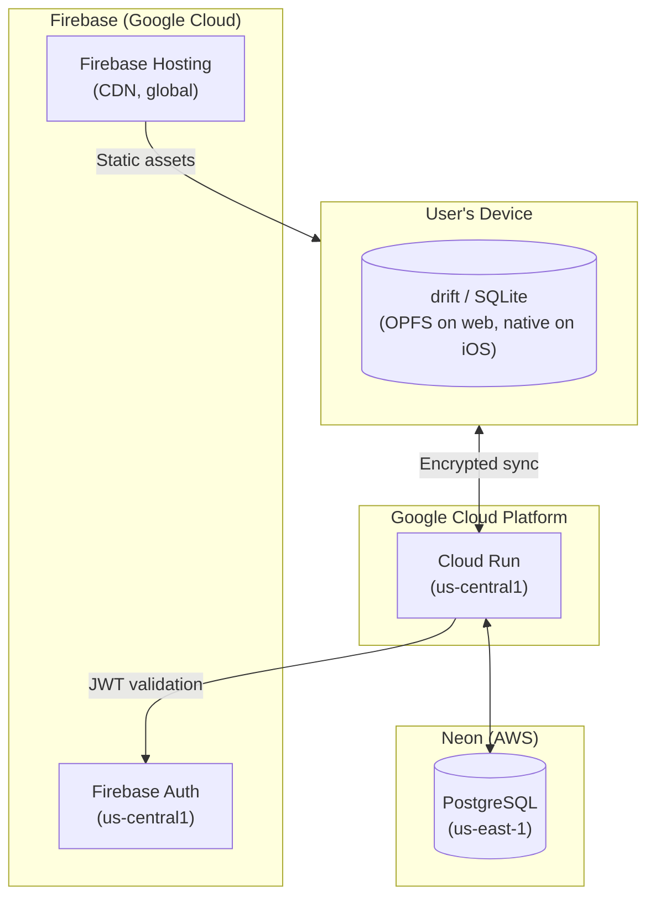
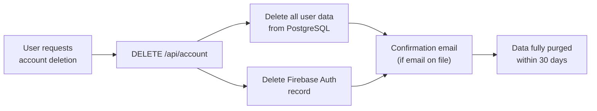

# Privacy & Data Protection Strategy — WordPower

> [!abstract] Summary
> WordPower collects personal vocabulary data, learning telemetry, and account information. This document defines what data is collected, why, where it's stored, how long it's kept, and what rights users have over it. It serves as the engineering specification behind the user-facing privacy policy.

Related: [[ARCHITECTURE#7. Security Model]] | [[PROJECT#2.7 User Accounts & Cloud Sync]]

---

## Table of Contents

1. [[#1. Data Inventory]]
2. [[#2. Legal Basis]]
3. [[#3. Data Storage Locations]]
4. [[#4. Third-Party Data Sharing]]
5. [[#5. Data Retention]]
6. [[#6. User Rights]]
7. [[#7. Cookie & Tracking Policy]]
8. [[#8. Security Measures]]
9. [[#9. Children's Privacy]]
10. [[#10. Implementation Checklist]]
11. [[#11. Glossary]]

---

## 1. Data Inventory

### What we collect

| Data category | Examples | Source | Required? | Stored where |
|---|---|---|---|---|
| **Account identity** | Email, display name, Firebase UID | User input + Firebase Auth | Yes (for cloud sync) | Firebase Auth + PostgreSQL |
| **Collected words** | "ubiquitous", "prognosis" | User input | Yes (core feature) | drift (local) + PostgreSQL |
| **Personal notes** | "Heard this at the doctor's office" | User input | No (optional) | drift (local) + PostgreSQL |
| **Native translations** | "Her yerde bulunan" | User input | No (optional) | drift (local) + PostgreSQL |
| **SRS state** | Ease factor, interval, next review date, repetitions | Algorithm output | Yes (auto-generated) | drift (local) + PostgreSQL |
| **Review telemetry** | Quiz type, response time, outcome, timestamp | App instrumentation | Yes (feeds FSRS) | drift (local) + PostgreSQL |
| **Word lists** | "IELTS Prep", "Words from Breaking Bad" | User input | No (optional) | drift (local) + PostgreSQL |
| **Dictionary enrichment** | Definitions, IPA, audio URL, CEFR level, domain | Dictionary API (shared cache) | Yes (auto-fetched) | PostgreSQL (shared `dictionary_cache`) |
| **Authentication tokens** | Firebase JWT | Firebase Auth | Yes (session) | Device memory only (not persisted) |
| **Device metadata** | Browser user-agent, platform (web/iOS) | Automatic | No (not collected in Phase 2) | — |

### What we do NOT collect

- Location data
- Contacts or address book
- Photos, camera, or microphone access
- Browsing history outside the app
- Financial/payment data (handled entirely by Apple/Google)
- Social media accounts
- Biometric data

---

## 2. Legal Basis

WordPower processes personal data under these GDPR legal bases:

| Data | Legal basis | Justification |
|---|---|---|
| **Account identity** | Contract (Art. 6(1)(b)) | Necessary to provide the cloud sync service the user signed up for |
| **Collected words, notes, translations** | Contract (Art. 6(1)(b)) | Core service — the user's word notebook |
| **SRS state** | Contract (Art. 6(1)(b)) | Necessary for the spaced repetition learning feature |
| **Review telemetry** | Legitimate interest (Art. 6(1)(f)) | Improves learning accuracy (FSRS training); user can opt out |
| **Dictionary enrichment** | Contract (Art. 6(1)(b)) | Auto-enrichment is a core feature; cached data is not personal (shared across all users) |
| **Crash reporting** (Phase 6) | Legitimate interest (Art. 6(1)(f)) | Maintaining service quality; anonymized where possible |

> [!info] No consent-based processing
> WordPower does not rely on consent (Art. 6(1)(a)) as a legal basis for any core feature. This avoids the complexity of consent withdrawal affecting core functionality. Telemetry opt-out is handled via legitimate interest balancing, not consent.

---

## 3. Data Storage Locations

### Per-environment data flow



### Data residency

| Data | Location | Provider | Region |
|---|---|---|---|
| Local database | User's device | Browser OPFS / iOS file system | User's physical location |
| User accounts | Firebase Auth | Google Cloud | us-central1 |
| Cloud database | Neon PostgreSQL | AWS | us-east-1 |
| Backend API | Cloud Run | Google Cloud | us-central1 |
| Static web assets | Firebase Hosting CDN | Google Cloud | Global (edge-cached) |

> [!warning] EU data residency
> User data is stored in US regions. For EU users, this requires appropriate safeguards under GDPR Chapter V (international transfers). Google Cloud and AWS both offer Standard Contractual Clauses (SCCs) as the transfer mechanism. If EU-specific hosting becomes necessary, Neon supports `eu-central-1` (Frankfurt) and Cloud Run supports `europe-west1` (Belgium).

---

## 4. Third-Party Data Sharing

### Sub-processors

| Third party | Data shared | Purpose | DPA available? |
|---|---|---|---|
| **Firebase Auth (Google)** | Email, display name, auth tokens | User authentication | Yes (Google Cloud DPA) |
| **Neon** | All synced user data (words, notes, SRS state) | Cloud database hosting | Yes (Neon DPA) |
| **Google Cloud (Cloud Run)** | All API request/response data (in transit) | Backend hosting | Yes (Google Cloud DPA) |
| **Free Dictionary API** | Searched words (not user-identifiable) | Word enrichment | No (public API, no user data sent) |
| **Oxford Dictionaries API** (Phase 6) | Searched words (not user-identifiable) | Word enrichment | Yes (Oxford API terms) |
| **Apple App Store** | Purchase data, Apple ID (for subscriptions) | Payment processing | Yes (Apple DPA) |

### What is NOT shared

- Personal notes and native translations are **never** sent to dictionary APIs
- User vocabulary lists are **never** shared with other users
- No data is sold to advertisers or data brokers
- No data is used for cross-app profiling

> [!tip] Dictionary API privacy
> Dictionary lookups are made server-side via the Spring Boot API, not from the user's device. The dictionary API only sees the English word being looked up — it never receives user IDs, device info, or personal context. Additionally, the server-side cache means each word is looked up at most once, regardless of how many users search for it.

---

## 5. Data Retention

| Data | Retention period | Deletion trigger |
|---|---|---|
| **Active account data** | As long as account is active | User deletes account |
| **Soft-deleted words** | 30 days after deletion | Sync garbage collection |
| **Review telemetry** | 2 years from event date | Automated cleanup job |
| **Dictionary cache** | Indefinite (shared, non-personal) | Manual refresh if data quality degrades |
| **Firebase Auth record** | As long as account is active | Account deletion via Firebase Admin SDK |
| **Sync event logs** | 90 days | Automated cleanup job |
| **Server access logs** | 30 days | Cloud Run default retention |

### Account deletion flow



The 30-day window accounts for:
- Backup retention cycles
- Sync propagation to all devices
- Neon point-in-time recovery window

Local data (drift/SQLite) is deleted immediately on the device that initiates deletion. Other devices clear local data on next sync attempt when they receive a 401 (account no longer exists).

---

## 6. User Rights

### GDPR rights implementation

| Right | Article | How the user exercises it | Implementation |
|---|---|---|---|
| **Access** (right to know) | Art. 15 | Settings → "Download my data" | `GET /api/account/export` returns JSON archive |
| **Portability** | Art. 20 | Settings → "Export my words" | CSV/JSON export of all words, notes, SRS state |
| **Rectification** | Art. 16 | Edit any word, note, or profile field in the app | Standard CRUD operations |
| **Erasure** (right to be forgotten) | Art. 17 | Settings → "Delete my account" | Full account deletion (see flow above) |
| **Restriction** | Art. 18 | Contact support | Manual process: flag account, stop processing, retain data |
| **Objection to processing** | Art. 21 | Settings → "Disable telemetry" | Stops review telemetry collection; SRS continues with SM-2 (no FSRS personalization) |

### Data export format

```json
{
  "account": {
    "email": "user@example.com",
    "displayName": "Mert",
    "createdAt": "2026-04-15T12:00:00Z"
  },
  "words": [
    {
      "word": "ubiquitous",
      "personalNotes": "Heard in a podcast about technology",
      "nativeTranslation": "her yerde bulunan",
      "status": "REVIEW",
      "easeFactor": 2.5,
      "interval": 15,
      "nextReviewDate": "2026-05-10",
      "createdAt": "2026-04-20T09:30:00Z"
    }
  ],
  "wordLists": [
    {
      "name": "IELTS Prep",
      "wordCount": 42
    }
  ],
  "reviewHistory": [
    {
      "wordId": "ubiquitous",
      "quizType": "SPELLING",
      "outcome": "CORRECT",
      "timestamp": "2026-04-25T14:30:00Z"
    }
  ],
  "exportedAt": "2026-05-01T12:00:00Z"
}
```

---

## 7. Cookie & Tracking Policy

### What WordPower uses

| Technology | Purpose | Personal data? | Opt-out? |
|---|---|---|---|
| **Firebase Auth token** | Session authentication (stored in memory/localStorage) | Yes (contains UID) | No (required for login) |
| **drift/SQLite (OPFS)** | Local database persistence | Yes (user's words) | No (core feature) |
| **Firebase Hosting cookies** | CDN cache control (set by Firebase) | No | N/A |

### What WordPower does NOT use

- No third-party analytics (Google Analytics, Mixpanel, Amplitude)
- No advertising trackers or pixels
- No cross-site tracking cookies
- No fingerprinting
- No social media widgets or embeds

> [!info] Phase 6 analytics
> When analytics are added in Phase 6, they will be first-party only (Firebase Crashlytics for crash reporting). No third-party analytics platforms. Crashlytics data is anonymized and used solely for bug fixing.

---

## 8. Security Measures

| Measure | Implementation | Protects |
|---|---|---|
| **Encryption in transit** | HTTPS everywhere (Cloud Run enforces TLS) | Data between device and server |
| **Encryption at rest** | Neon PostgreSQL (AES-256), Firebase Auth (Google-managed) | Cloud-stored data |
| **Local encryption** | OPFS/iOS file system encryption (device-level) | Local database |
| **Per-user isolation** | Every query scoped by `userId` from JWT | Users seeing each other's data |
| **API key protection** | Dictionary API keys stored in GCP Secret Manager | Key leakage |
| **Input validation** | Bean Validation (backend) + Dart types (frontend) | Injection attacks |
| **Dependency scanning** | Dependabot (weekly) | Known CVEs |
| **Static analysis** | Semgrep OWASP top 10 + SpotBugs/FindSecBugs | Code-level vulnerabilities |

See [[ARCHITECTURE#7. Security Model]] for the full security architecture.

---

## 9. Children's Privacy

WordPower is not directed at children under 13 (or 16 in the EU under GDPR). The app does not knowingly collect data from children. If we discover that a child under the applicable age has created an account, we will delete it promptly.

The App Store listing will indicate the appropriate age rating (4+ for content, but account creation requires age verification via Apple/Google account policies).

---

## 10. Implementation Checklist

Tasks required before production launch (Phase 6):

| Task | Phase | Status | Notes |
|---|---|---|---|
| `DELETE /api/account` endpoint | Phase 2+ | ⬜ Pending | Full account deletion including Firebase Auth |
| `GET /api/account/export` endpoint | Phase 2+ | ⬜ Pending | JSON export of all user data |
| CSV/JSON word export in app | Phase 5 | ⬜ Pending | Part of CSV import/export feature |
| Telemetry opt-out toggle in Settings | Phase 3 | ⬜ Pending | Stops review telemetry; SRS falls back to SM-2 |
| Privacy policy page (user-facing) | Phase 6 | ⬜ Pending | Plain-language version of this document |
| App Store privacy nutrition label | Phase 6 | ⬜ Pending | Apple requires data collection disclosure |
| Data retention cleanup jobs | Phase 2+ | ⬜ Pending | Cron: telemetry (2yr), sync logs (90d), soft deletes (30d) |
| DPA agreements with sub-processors | Phase 6 | ⬜ Pending | Google Cloud, Neon, Apple |
| Cookie/storage consent banner (web) | Phase 6 | ⬜ Pending | Required for EU users; localStorage is covered by ePrivacy |
| DPIA (Data Protection Impact Assessment) | Phase 6 | ⬜ Pending | Required when processing at scale; template from ICO |

---

## 11. Glossary

| Term | Definition |
|---|---|
| **GDPR** | General Data Protection Regulation — EU law governing personal data processing (effective May 2018) |
| **CCPA** | California Consumer Privacy Act — California state law giving consumers rights over their personal data |
| **DPA** | Data Processing Agreement — contract between a data controller and processor defining data handling obligations |
| **DPIA** | Data Protection Impact Assessment — required analysis when processing is likely to result in high risk to individuals |
| **Data controller** | The entity that determines the purposes and means of processing personal data (WordPower) |
| **Data processor** | The entity that processes personal data on behalf of the controller (Firebase, Neon, etc.) |
| **Sub-processor** | A third party engaged by the processor to assist with data processing |
| **SCC** | Standard Contractual Clauses — EU-approved contract terms for international data transfers |
| **Right to erasure** | GDPR Art. 17 — the right to have personal data deleted ("right to be forgotten") |
| **Data portability** | GDPR Art. 20 — the right to receive personal data in a structured, machine-readable format |
| **Legitimate interest** | GDPR Art. 6(1)(f) — legal basis for processing when necessary for a legitimate purpose, balanced against individual rights |
