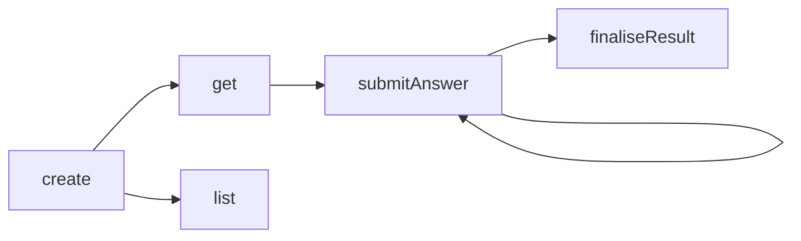
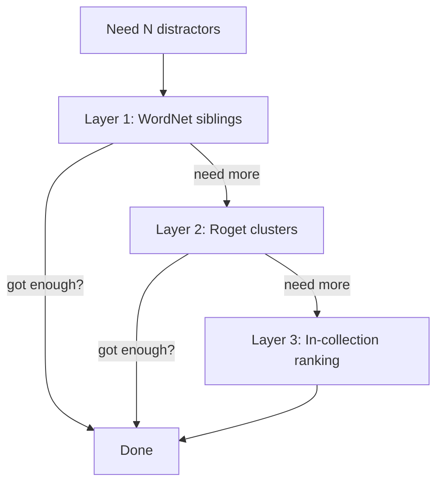
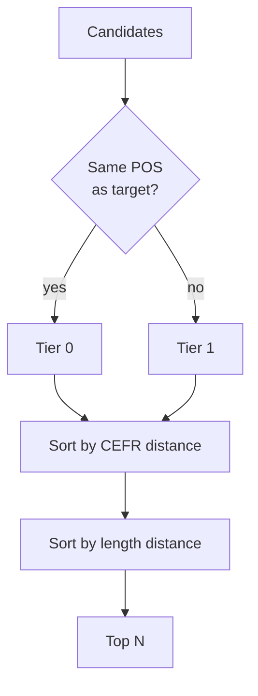
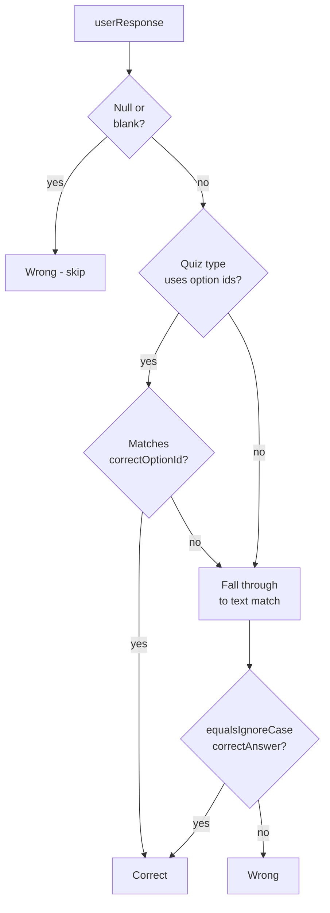

# Quiz Engine — Concept Guide

> [!abstract] Summary
> How WordPower turns a user's collected words into quiz questions — the candidate-pool rules, per-type generation logic, distractor selection, and grading model.

Related: [[PROJECT#2.2 Learning & Quiz Engine]] | [[SPACED_REPETITION#10. How Quiz Types Feed Into SRS — Rating Inference Model]]

---

## 1. What the Engine Does

Given a user, a quiz type, and a word source (e.g. *all my words* or *just my "business" domain*), the engine produces a **session** containing N persisted **questions**, each tied to one of the user's words.

The engine is responsible for:

- Picking which words become questions (==candidate pool==)
- Filtering out words that can't form a question of the requested type (==eligibility==)
- Building each question's prompt and (where applicable) options
- Selecting high-quality wrong answers (==distractors==)
- Storing the canonical correct answer for grading later

It is **not** responsible for scheduling reviews — that's the [[SPACED_REPETITION|SRS]] layer, which consumes the *outcome* of a quiz session.

## 2. Session Lifecycle

A quiz session goes through five operations, all enforced per-user (cross-user reads return 404):



| Operation          | What it does                                                                                                                                                            |
| ------------------ | ----------------------------------------------------------------------------------------------------------------------------------------------------------------------- |
| **create**         | Pulls candidates from the user's notebook, dispatches to a generator, persists session + questions.                                                                     |
| **get**            | Loads a session with its questions in `ordinal` order.                                                                                                                  |
| **list**           | Paginated, newest-first feed of past sessions, decorated with score when available.                                                                                     |
| **submitAnswer**   | Records one answer; computes `isCorrect` against the stored canonical answer. **Idempotent up to first submission** — a second submit for the same question raises 409. |
| **finaliseResult** | Lazily creates the `QuizResult` row and stamps `finishedAt`. Idempotent — repeat calls return the same row.                                                             |

> [!info] Concurrency safety
> Both `submitAnswer` and `finaliseResult` defend against races: a UNIQUE constraint catches concurrent inserts and the loser is mapped back to the same outcome the pre-check would have produced. The public contract is *"answers are immutable"* and *"finalise is idempotent"* — full stop, not *"…except under contention"*.

## 3. Candidate Pool

Before any generator runs, the service pulls a pool of the user's `UserWord` rows:

| Rule | Value | Why |
|---|---|---|
| **Source** | The user's own collection only | All quiz types draw from the personal notebook |
| **Active only** | Soft-deleted (tombstoned) words excluded | Tombstones exist for sync, not for review |
| **Hard cap** | ==500 words== | Big enough for distractor headroom on a 50-question MCQ; small enough that the in-memory shuffle stays cheap |
| **Order** | Random within the active set (`ORDER BY random() LIMIT 500`) | Guarantees every word can be selected regardless of collection size — a 1000-word user must not have their oldest 500 words permanently locked out of every quiz |
| **Domain filter** | Optional, when `wordSourceType = DOMAIN_FILTER` | Lets the user quiz themselves on, e.g., just their "law" words |

> [!note] Source type validation
> `wordSourceType = DOMAIN_FILTER` requires a non-blank filter. `wordSourceType = ALL_WORDS` forbids one. Mismatches raise 400 — the API contract is strict so the FE can't accidentally request a filtered quiz with no filter.

## 4. Per-Type Generation Rules

Every generator follows the same shape:


The differences live in **what makes a word eligible** and **what the question payload looks like**.

> [!tip] Silent-skip principle
> If a candidate word can't form a valid question of the requested type, the generator **silently drops it**. The session ends up with fewer questions than requested rather than failing loudly. Only when **zero** questions can be formed does `create` raise 400 — an empty session is never persisted.

> [!note] Why type variety carries the depth load
> The four types aren't four flavours of the same test — each taps a different cognitive task: MCQ is **recognition** (match a word to one of four phrasings of its meaning), FITB is **contextual recognition** (does this word fit a sentence whose meaning was written by the user, not Free Dictionary), Flashcard is **bidirectional recall**, Spelling is **production with semantic scaffolding**. A user practising one word across all four modes meets its meaning in four different framings — no single type carries the depth load alone. This is why proposals to harden any one type (paraphrase rotation, semantic distractors, harder phrasings) sit in [[#10. Deferred / Future Work|§10]] as deferrals: the *system* defeats string-pairing through variety, so adding depth means adding a new framing or improving the mix, not stiffening an existing type.

### 4.1 Multiple Choice

| Field | Rule |
|---|---|
| **Eligible** | Word has a non-blank ==definition== |
| **Distractors** | 3, drawn from the same pool via [[#5. Distractor Selection\|DistractorService]] |
| **Skip condition** | Fewer than 3 distractors available — can't form a 4-option question |
| **Mode** (current) | `WORD_TO_DEFINITION` — stem is the word, options are definitions |
| **Mode** (alt) | `DEFINITION_TO_WORD` — stem is the definition, options are words |

The four option texts (1 correct + 3 distractors) are shuffled and labelled `A`–`D`. The ==correct option's id varies== across questions so a user can't pattern-match on position.

```json
{
  "mode":            "word_to_definition",
  "stem":            "ephemeral",
  "options": [
    {"id": "A", "text": "lasting forever"},
    {"id": "B", "text": "lasting a very short time"},
    {"id": "C", "text": "easily broken"},
    {"id": "D", "text": "deeply hidden"}
  ],
  "correctOptionId": "B"
}
```

### 4.2 Fill in the Blank

| Field | Rule |
|---|---|
| **Eligible** | Word has a cache row with `isEnrichable = true` AND ≥1 example sentence containing a whole-word match for the surface form |
| **Stem source** | First cached `exampleSentence` with a Unicode-aware whole-word match (`\b…\b` with `CASE_INSENSITIVE \| UNICODE_CASE \| UNICODE_CHARACTER_CLASS`) |
| **Blank** | Only the **first** occurrence is replaced with `___` — later occurrences stay as same-word hints |
| **Distractors** | 3 other user words (no example-sentence requirement on distractors — they only contribute their `word` to the bank) |
| **Skip condition** | No usable sentence, or fewer than 3 distractors |

> [!info] Performance — batch prefetch
> Dictionary cache rows for every candidate are loaded in a **single `findAllById`** at the start of `generate`. The earlier shape did one `findById` per target inside the loop, which scaled as one DB round-trip per candidate (up to 500). One indexed query up front beats 500 latency exposures even when most candidates get trimmed.

```json
{
  "stem":            "Her interest in chess proved ___ — within a month she'd moved on.",
  "options": [
    {"id": "A", "text": "ephemeral"},
    {"id": "B", "text": "perpetual"},
    {"id": "C", "text": "ancient"},
    {"id": "D", "text": "thorough"}
  ],
  "correctOptionId": "A"
}
```

### 4.3 Flashcard

| Field | Rule |
|---|---|
| **Eligible** | Word has a non-blank definition |
| **Direction** (default) | `BIDIRECTIONAL` — coin-flip per card between word→def and def→word |
| **Direction** (alt) | `WORD_TO_DEFINITION`, `DEFINITION_TO_WORD` |
| **Skip condition** | None beyond eligibility — every eligible word becomes a card |

Phonetic, part-of-speech, and example sentence are emitted on the payload **only if non-blank**, so the FE can render them without null-checks beyond *"is the field present?"*.

```json
{
  "direction":       "word_to_definition",
  "front":           "ephemeral",
  "back":            "lasting a very short time",
  "phonetic":        "/ɪˈfɛm(ə)rəl/",
  "partOfSpeech":    "adjective",
  "exampleSentence": "Her interest in chess proved ephemeral."
}
```

### 4.4 Spelling

> [!info] Status
> This section describes the **target design** being tracked under [issue #237](https://github.com/AnunnakiCosmoCrew/WordPower-app/issues/237). The current shipped implementation only emits `audioUrl` and `phonetic` and is being rebuilt to match what's documented here.

| Field                  | Rule                                                                                                                                                                              |
| ---------------------- | --------------------------------------------------------------------------------------------------------------------------------------------------------------------------------- |
| **Eligible**           | Non-blank surface form AND ≥1 pronunciation hint (`audioUrl` or `phonetic`) AND ≥1 semantic hint (definition or a usable example sentence)                                       |
| **Pronunciation hint** | At least one of `audioUrl` / `phonetic`; both included on the payload when present                                                                                                |
| **Definition**         | Emitted verbatim from `UserWord` when present                                                                                                                                     |
| **Blanked example**    | First cached example sentence with a whole-word match for the target, with that occurrence replaced by `___` (same Unicode regex as [[#4.2 Fill in the Blank\|FITB]])             |
| **Skip condition**     | No pronunciation hint, or no semantic hint (no definition AND no usable example)                                                                                                  |

> [!info] Cognitive-tier consequence
> Adding a definition + blanked example shifts spelling from pure **production** (generate from sound alone) toward **assisted production**. [[SPACED_REPETITION#10. How Quiz Types Feed Into SRS — Rating Inference Model]] needs a matching adjustment so a "spelling with help" correct answer doesn't push intervals as aggressively as the unscaffolded version would have.

> [!warning] Cheat prevention
> The canonical spelling lives only on `QuizQuestion.correctAnswer`, which `QuizMapper.toQuestionResponse` keeps off the wire. The blanked example reuses the FITB regex so the target word is removed from the visible context too — inspecting the API response can't reveal the answer from either field.

```json
{
  "audioUrl":       "https://example.com/ephemeral.mp3",
  "phonetic":       "/ɪˈfɛm(ə)rəl/",
  "definition":     "lasting a very short time",
  "blankedExample": "Her interest in chess proved ___ — within a month she'd moved on."
}
```

#### 4.4.1 Progressive Hints

The user can press a **hint** button to reveal letters of the answer one at a time, left-to-right. Hints aren't free — each press is recorded on `QuizAnswer.hintsUsed` and feeds the SRS rating model.

| Rule                 | Detail                                                                                                                                                                       |
| -------------------- | ---------------------------------------------------------------------------------------------------------------------------------------------------------------------------- |
| **Reveal direction** | Left-to-right, one letter per press                                                                                                                                          |
| **Hard cap**         | ⌈length / 2⌉ letters — the answer is never auto-completed; the user must produce at least half the spelling themselves                                                       |
| **Storage**          | `QuizAnswer.hintsUsed` (integer, defaults to 0)                                                                                                                              |
| **Telemetry**        | Each press emits its own event so we can analyse hint timing later (time-to-first-hint, gaps between hints). Only the count is stored on the answer row                      |
| **Grading**          | Hints don't affect `isCorrect` — a correct spelling is correct regardless. They only shift the inferred SRS quality                                                          |

The hint count combines with the correct/incorrect outcome to produce the SRS rating. The full table lives at [[SPACED_REPETITION#Assisted Production quizzes (Spelling, Fill-in-the-Blank)]] and is mirrored here for convenience:

| Outcome                                | SRS quality                                                                                                  |
| -------------------------------------- | ------------------------------------------------------------------------------------------------------------ |
| Correct, no hints                      | 4 Good                                                                                                       |
| Correct, no hints, slow (> 15s)        | 3 Hard *(time-downgrade rule shared with pure production)*                                                   |
| Correct, 1 hint                        | 3 Hard                                                                                                       |
| Correct, 2+ hints                      | 1 Again — heavy scaffolding indicates the word isn't actually retained, so treat it as relearning            |
| Close misspelling, no hints            | 3 Hard                                                                                                       |
| Wrong (any hint count)                 | 1 Again                                                                                                      |

> [!note] No upgrade from low hint count
> "Used zero hints" doesn't earn 5 Easy. Hint count can downgrade quality, never upgrade it — same shape as the existing time-threshold rule. Easy emerges over multiple successful reps via the SRS scheduler, not from a single answer.

> [!note] Why hints aren't free
> If pressing hint had no cost, every user would tap it on every question and the SRS would never see honest signal. Tying hint count to a downgraded quality preserves the rating-inference accuracy that [[SPACED_REPETITION#10. How Quiz Types Feed Into SRS — Rating Inference Model]] depends on.

### 4.5 Not Yet Implemented

`LISTENING` and `MATCHING` quiz types are listed in the enum but the dispatcher raises a 400 — they're Phase 3 follow-ups (issues TBD). Requesting them returns *"Quiz type X is not yet implemented."*

## 5. Distractor Selection

For MCQ and FITB, distractor *quality* is what makes the engine feel intelligent versus random. The live implementation is `LayeredDistractorService` (WP-282) — a three-layer chain that asks lexical-knowledge sources first and falls back to the user's own collection only when those run dry.

### 5.1 The Layered Chain

`LayeredDistractorService` walks three strategies in priority order, asking each for as many distractors as still need to be collected, and stops as soon as `count` unique options have been gathered:



| Layer | Source | Strength |
|---|---|---|
| 1 | **WordNet sibling synsets** | Tight conceptual neighbours under a shared hypernym (`cat ↔ dog ↔ horse` are all mammals). Genuinely confusable, never synonymous. |
| 2 | **Roget's 1911 thematic clusters** | Loose thematic neighbours sharing a head category (`joy / delight / sorrow` all live under emotion-themed heads). Captures associations WordNet's IS-A hierarchy misses. |
| 3 | **In-collection quality-rule ranking** | The user's other collected words, ranked by POS / CEFR / length. Used as the final fallback when both lexical sources come up short. |

**Cross-cutting contracts**, applied at every layer:

- **Synonym hard exclusion.** Any candidate whose surface word appears in the target's cached `synonyms` list (from `DictionaryEntry.synonyms`, looked up case-insensitively) is dropped outright. A synonym would be a *legitimate alternative answer*, not a wrong one. Cache misses degrade to a no-op — the filter is best-effort, not load-bearing.
- **Cached definitions only.** Distractor option text comes from `dictionary_cache` (`DictionaryEntry.definitions`), never live API lookups. Candidates without a cached enrichable row are skipped at the layer level. The shipped option shape is `DistractorOption(word, definition)` — both fields non-null and non-blank by record-constructor invariant.
- **Dedup by lower-cased word.** The composite seeds its dedup set with the target word (defensive — layers also exclude it), then keeps only the first surviving occurrence of each word across layers. Earlier layer's `(word, definition)` pair wins on collisions.

> [!important] What this means for the personal-notebook contract
> The user is still **only quizzed on words they collected** — targets always come from `UserWord`. But the *distractor* pool is no longer drawn from the notebook in the common case; it's drawn from WordNet/Roget. The notebook stays theirs; the wrong answers just got smarter.

### 5.2 Layer 1 — WordNet Sibling Synsets

`WordNetSiblingDistractorService` pulls candidates from the lemmas of synsets that share a hypernym with the target's synset. The bundle is **Open English WordNet** (~20k lemma/POS pairs after filtering through `cefr/word-frequency.tsv`), preprocessed into a gzipped TSV and loaded at startup the same way `LeveledLexicon` is.

**Filters applied in order:**

| Filter | Detail |
|---|---|
| **Same POS as target** | Enforced at lookup time by `WordNetSiblings.siblingsOf(word, pos)`. |
| **Not the target itself** | Defensive — covers self-referential synsets. |
| **Not a synonym** | Cross-cutting rule from §5.1. |
| **CEFR within ±1 band** | Siblings further than one band away are dropped. CEFR resolved via `LeveledLexicon.classify` (same chain as enrichment). |
| **Cached definition exists** | Single batched `findAllById` against `DictionaryEntry`; siblings without an enrichable cached row are skipped. No live API lookups. |

**Definition picking** prefers a cached definition tagged with the target's POS, falling back to the first non-blank definition string when no POS-match exists.

**Falls through** when the WordNet bundle has no row for the target — small lemma coverage outside the most common ~20k forms is expected, especially for technical or modern vocabulary.

**In-memory structure (`WordNetSiblings`):**

The bundle (`distractors/wordnet-siblings.tsv.gz`) is loaded once at startup into a two-level `HashMap`:

```
index: Map<word, Map<pos_code, List<sibling_lemmas>>>
```

- Outer key: lemma (`"cat"`)
- Inner key: WordNet POS short code — `n` (noun), `v` (verb), `a` (adjective), `r` (adverb)
- Value: pre-built `List<String>` of sibling lemmas

The same word can have different sibling sets per POS (`"run"` as verb ≠ `"run"` as noun), which is why the inner key exists. Synonyms are stripped at **preprocessing time** (Python build script), so the lists contain only true siblings with no runtime filtering needed.

A lookup (`siblingsOf("run", "verb")`) maps `"verb"` → `"v"`, then does two `HashMap.get()` calls. **O(1)**.

The file is gzip-compressed to keep JAR size down; it's decompressed once during load and irrelevant to runtime performance after that. If the file is missing or fails to parse, the index is left empty and the strategy returns an empty list — the chain falls through to Roget with no crash.

### 5.3 Layer 2 — Roget Thematic Clusters

`RogetsClusterDistractorService` pulls candidates from the words sharing a Roget's 1911 head category with the target. The bundle is **Project Gutenberg #10681** (Roget's Thesaurus, 1911 edition) — 822 thematic clusters, ~17.5k words after frequency filtering.

**Filters applied in order:**

| Filter | Detail |
|---|---|
| **Not the target itself** | Defensive. |
| **Not a synonym** | Cross-cutting rule from §5.1. |
| **Cached definition exists** | Single batched `findAllById` against `DictionaryEntry`. |
| **POS preference** (sort, not filter) | Same-POS cluster-mates rank ahead of mismatched POS. Roget's clusters are POS-agnostic, so mismatches still rank — just lower. Implemented as a stable sort on a POS-tier key (same shuffle-then-stable-sort pattern as Layer 3). |

**Falls through** when the target isn't in any cluster. The 1911 corpus skews toward older common vocabulary; modern technical terms won't hit. When this happens the chain falls through to Layer 3.

> [!note] Why two lexical sources, not one
> WordNet and Roget capture different kinds of "near":
>
> - **WordNet** is a strict IS-A hierarchy. Siblings share a parent — perfect for taxonomic distractors (`oak / elm / maple`), but blind to non-hierarchical associations.
> - **Roget** is thematic. Cluster-mates share a topic without being co-hyponyms (`anchor / harbor / voyage` all evoke sea travel even though they're not siblings under any single hypernym).
>
> Running them in series catches both shapes of plausibility.

### 5.4 Layer 3 — In-Collection Quality-Rule Ranking

`QualityRuleDistractorService` is the original Phase A strategy, now positioned as the final fallback. It picks distractors from the **user's own collected words** (`UserWord` rows) plus a small-collection cache supplement, ranked by three sort keys.

#### The Ranking Keys



| # | Signal | What it does |
|---|---|---|
| 1 | **Same part of speech** | Same-POS candidates always rank ahead of other-POS. Mismatch is only used as a last-resort fallback when the same-POS pool runs dry. |
| 2 | **CEFR distance** | Candidates at the target's CEFR band beat ±1 band, beat ±2, etc. Resolved via the same `LeveledLexicon.classify` chain used by enrichment, so what the user sees as "level" matches what the engine reasons about. |
| 3 | **Length distance** (tiebreak) | Closer character-length wins. Stops "horse / fence / table" from sitting next to "kaleidoscopically". |

**What these signals mean:**

- **POS (part of speech)** — the word's grammatical category: *noun, verb, adjective, adverb*, etc.
    - **Source**: Free Dictionary API's `meanings[].partOfSpeech` field at enrichment time.
    - **Storage**: stored verbatim as a string on `UserWord.part_of_speech`.
    - **Multi-sense words** (e.g. "run" = verb + noun): only the *first* meaning's POS is persisted on the user's notebook entry. The full list is retained on the shared `DictionaryEntry` cache.
    - **Why it matters**: mixing POS across options turns a vocabulary question into a grammar question — the user picks the odd-class word without knowing the meaning.
- **CEFR level** — the Common European Framework reference band (A1 → C2) describing word difficulty.
    - **Source**: `LeveledLexicon.classify`, resolved from bundled wordlists.
    - **Why it matters**: distractors at the target's band force the user to discriminate on meaning, not on "that word looks too easy/hard."
- **Length** — literal character count of the word string (`word.length()`).
    - **Source**: computed on the fly, no storage.
    - **Why it matters**: closer-length distractors prevent the visual outlier giveaway where a uniquely long or short option stands out before the user has read it.

> [!note] Reference
> The "match POS, match difficulty, avoid length cues" rubric is standard practice in multiple-choice item construction. The guidance comes from:
>
> - Haladyna, *Developing and Validating Multiple-Choice Test Items* (3rd ed., Routledge, 2004)
> - Haladyna, Downing & Rodriguez, *A Review of Multiple-Choice Item-Writing Guidelines for Classroom Assessment* (Applied Measurement in Education, 2002)
>
> Both cover:
>
> - grammatical parallelism (the POS rule)
> - homogeneity of difficulty (the CEFR rule)
> - avoiding length as a discriminator (the length-distance rule)
>
> The CEFR-band metric is specific to this codebase; the rest of the rubric is decades-old psychometric guidance.

> [!note] Why stable-sort + pre-shuffle
> The flow:
>
> - Shuffle the candidate list with the supplied `Random`.
> - Stable-sort on the three ranking keys.
> - TimSort preserves order within equal-key groups, so the up-front shuffle becomes the random tiebreak *inside* each quality tier.
>
> The `Random` source decides the behaviour:
>
> - **Tests** → seeded `Random` → deterministic, reproducible question order.
> - **Production** → `ThreadLocalRandom` → varied across sessions.
>
> Layer 2 (Roget) uses the same pattern for its POS-tier sort.

#### Small-Collection Cache Supplement (WP-338)

When the user's in-collection pool is too small to yield three same-POS distractors, the service supplements from the **dictionary cache** — `DictionaryEntry` rows the user hasn't collected.

| Rule | Detail |
|---|---|
| **Trigger** | In-collection ranked pool yields fewer than `DISTRACTOR_COUNT` after synonym filtering. |
| **Source** | `DictionaryEntry` where `isEnrichable = true`. |
| **Same-POS first** | Falls back to other POS only when the same-POS cache pool is also too small. |
| **CEFR proximity** | Same band → ±1 → ±2 (mirrors the in-collection ranking). |
| **Exclusions** | Words already in the user's collection (would otherwise be valid targets) and the target's synonyms. |
| **In-collection wins ties** | Cache hits land *behind* in-collection same-POS hits in the unified ranking. |

> [!important] Targets are always the user's own words
> The cache supplement augments only the **distractor** pool. Target words are still drawn exclusively from `UserWord`. Same contract applies to Layers 1 and 2 — only wrong answers come from outside the notebook.

#### Implementation note: decorate-sort-undecorate

The ranking keys are computed once per candidate and stashed on a `Ranked` wrapper before sorting (the **Schwartzian transform**), rather than recomputed inside every comparator call. The expensive key is **CEFR distance**, which calls `LeveledLexicon.classify` — at `n × log n` comparator calls per sort, doing the lookup inline scaled poorly. The wrapper pattern keeps lexicon hits at exactly `n` per call.

> [!warning] Known redundancy — scheduled for cleanup
> The CEFR lookup itself is *redundant*: `DictionaryEntry.cefr_level` already holds the value as a stored column (set during enrichment). The service re-derives it via `LeveledLexicon.classify` only because candidates arrive as `UserWord` objects, which don't carry CEFR.
>
> Once the joined-CEFR refactor lands, the wrapper's performance justification disappears (all three keys become cheap field reads) and this note can be deleted.
>
> Tracked in [WordPower-app#369](https://github.com/AnunnakiCosmoCrew/WordPower-app/issues/369).

## 6. Storage Model

Each generated question is one `QuizQuestion` row:

| Column | Purpose |
|---|---|
| `id` | UUID primary key |
| `sessionId` | FK to the session |
| `userWordId` | The word this question is about — preserved even if the user later deletes the word |
| `quizType` | Enum: `MULTIPLE_CHOICE`, `FILL_IN_THE_BLANK`, `FLASHCARD`, `SPELLING` |
| `ordinal` | 0-indexed position within the session, used to render order |
| `questionData` | JSONB payload — type-specific shape (see §4) |
| `correctAnswer` | Canonical text for fast grading without re-parsing JSONB |
| `createdAt` | Audit timestamp — when the question was generated |

> [!info] Why both `correctAnswer` and `correctOptionId`?
> For MCQ and FITB, the correct answer can be referenced two ways: by **option id** (`"B"`) or by **canonical text** (`"lasting a very short time"`). The FE is free to send either form. Storing both means grading is O(1) without parsing the JSONB on the hot path.

## 7. Grading

`QuizSessionService.isCorrect(question, userResponse)` is intentionally minimal:



| Rule | Detail |
|---|---|
| Null / blank input | Always wrong, recorded as a ==skip== |
| Whitespace handling | `trim` before comparison |
| Case sensitivity | `equalsIgnoreCase` for canonical text |
| Option id check | Only for `MULTIPLE_CHOICE` and `FILL_IN_THE_BLANK`; falls through to text match if absent |

> [!note] Why blank ≡ skip
> `isCorrect` returns false for blank input, and `countOutcomes` keys off `userResponse == null` to bucket skips. To keep "user submitted an empty box" and "user explicitly skipped" in the *same* bucket at storage time, blank strings are stored as null in `QuizAnswer.userResponse`. Otherwise the result row would split them into "incorrect" vs "skipped".

## 8. Result Computation

`finaliseResult` aggregates outcomes:

| Counter | How it's computed |
|---|---|
| `correctCount` | Answers where `isCorrect = true` |
| `incorrectCount` | Answers with non-null response and `isCorrect = false` |
| `skippedCount` | Explicit skips (null response) **plus** unanswered questions (`totalQuestions - answers.size()`) |
| `scorePercentage` | `correctCount / totalQuestions × 100`, two-decimal precision, half-up rounding |
| `averageResponseTimeMs` | Mean of non-null `responseTimeMs` across answers; null when no timed answers |

> [!warning] `responseTimeMs` is INTEGER, not BIGINT
>
> **The problem:** a malicious client could send a tampered value like `9999999999999`. The DB column is `INTEGER` (32-bit, max ~2.1 billion ms), so anything larger than `Integer.MAX_VALUE` overflows, the DB rejects it, and the server throws a `DataIntegrityViolationException` — a **500** that looks like a server crash.
>
> **The fix:** the service clamps before saving:
> ```java
> Math.min(responseTimeMs, Integer.MAX_VALUE)
> ```
> So `9999999999999` becomes `2,147,483,647` and saves cleanly. The server returns **200** instead of crashing with a **500**.
>
> **Known limitation:** the clamp is silent — a client sending a nonsensical value gets a 200 as if nothing happened. A cleaner design would reject values above a sane threshold (e.g. 1 hour = 3,600,000 ms) with a 400. Not yet tracked.

## 9. Open Questions for Discussion

> [!question] Things worth deciding now or revisiting
> - Should `MultipleChoiceQuestionGenerator` allow the user to choose `WORD_TO_DEFINITION` vs `DEFINITION_TO_WORD`, or stay opinionated? (Currently hard-wired to W→D.)
> - Should FITB fall back to a **pre-blanked** sentence when the user's word has no cached examples? (Currently silent-skips.)
> - What's the right hint cap for spelling? Currently ⌈length / 2⌉, but a flat *"max 3 letters"* might feel more predictable. Worth A/B-testing once telemetry is in.

## 10. Deferred / Future Work

Things we've decided to defer rather than re-litigate. Each entry has a short rationale, the phase it's queued for, and any follow-up tickets where applicable.

> [!success] Phase 3 — Example-sentence content safety ✓ shipped ([#348](https://github.com/AnunnakiCosmoCrew/WordPower-app/issues/348))
> `DictionaryEntry.exampleSentences` flows from Free Dictionary into FITB, Spelling, and Flashcard payloads. Free Dictionary aggregates Wiktionary, whose sources include unmoderated Usenet/newsgroup citations — meaning cached examples can contain content unsuitable for under-18 users. Mitigation was implemented at the **ingest pipeline** (source-citation blocklist, profanity wordlist, cache-purge backfill), not the quiz engine — generators read the cache as-is. The Phase 4 switch to Cambridge as primary source (see next entry) sharply reduces unsafe input rate through curation alone, but the filter remains required as defense-in-depth.

> [!info] Phase 4 — Cambridge primary + Free Dictionary fallback (multi-source dictionary) — actively in-flight ([epic #350](https://github.com/AnunnakiCosmoCrew/WordPower-app/issues/350))
> Today `dictionary_cache` is single-source (Free Dictionary, see `DictionaryEntry.SOURCE_FREE_DICTIONARY`). The redesign promotes **Cambridge** to primary — lexicographer-curated, ESL-tuned, with built-in CEFR tagging and a usable free tier (3,000 calls/mo, comfortable at indie scale given the existing cache-aside + negative-caching already short-circuit repeated lookups for the same word). Free Dictionary remains as a coverage fallback for words Cambridge doesn't have (slang, technical, regional, internet vocabulary). Schema work: composite `(word, source)` key on `dictionary_cache`, service-level aggregator with per-field source priority, two-pass async enrichment (Cambridge synchronous on word add; Free Dictionary async only when Cambridge returns 404 or null fields). Per-field priority chain: definitions / examples / phonetics → Cambridge first; CEFR level → Cambridge authoritative; audio URL → Free Dictionary primary until Cambridge audio support is verified; synonyms → Cambridge first, verify coverage.
>
> Sub-issues: [#353](https://github.com/AnunnakiCosmoCrew/WordPower-app/issues/353) Spike/API research · [#354](https://github.com/AnunnakiCosmoCrew/WordPower-app/issues/354) Schema migration · [#355](https://github.com/AnunnakiCosmoCrew/WordPower-app/issues/355) Cambridge API client · [#356](https://github.com/AnunnakiCosmoCrew/WordPower-app/issues/356) DictionaryAggregator · [#357](https://github.com/AnunnakiCosmoCrew/WordPower-app/issues/357) Two-pass async enrichment · [#358](https://github.com/AnunnakiCosmoCrew/WordPower-app/issues/358) Cache-miss instrumentation

> [!info] Phase 4 — Least-recently-quizzed candidate ordering
> Upgrade candidate ordering from random sampling (Phase 3 fix, [issue #335](https://github.com/AnunnakiCosmoCrew/WordPower-app/issues/335)) to *least-recently-quizzed first*. Requires a `UserWord.lastQuizzedAt` column updated each time a question is generated. The 500-cap then means *"the 500 most-overdue words"* — much closer to SRS semantics. Optionally fold in SRS-driven prioritisation (due-or-soon words first), which would merge the ad-hoc-quiz and review-queue flows where they overlap. Tracked in [[PROJECT#Phase 4 — Vocabulary System: "Organized Learning"]].

> [!info] Phase 4+ — Mixed quiz-type sessions
> The engine currently produces single-type sessions. A future enhancement would let one session mix question types — e.g. 3 MCQ + 3 flashcards + 3 spelling on the same word set. Two motivations: (1) variety on small collections (same words, six framings feels much fresher than the same words drilled MCQ × 6); (2) a richer practice mode in its own right. Implementation would extend `QuizSessionService.create` to accept a list of types or a "mixed" flag. Tracked in [[PROJECT#Phase 4 — Vocabulary System: "Organized Learning"]].

> [!info] Phase 4 — Definition-sense rotation in MCQ
> MCQ `WORD_TO_DEFINITION` currently always pairs each word with the same canonical definition, which lets a user memorise the (word, definition-string) pair as a string-to-string match without internalising the meaning — they may then fail to recognise the word in the wild when it appears with different phrasing (the *encoding-specificity* problem). Free Dictionary typically returns multiple senses per word; rotating which sense becomes the correct option across attempts forces semantic recognition rather than string-matching. Caveat: polysemous entries have *distinct* meanings per sense (*bank* the institution vs. *bank* of a river), so rotation needs a primary-sense filter — or restriction to senses sharing the target's part-of-speech — to avoid quizzing on a sense the user hasn't actually encountered. Distractors should be drawn from the matching-sense pool so stylistic register stays consistent across the four options. Tracked in [[PROJECT#Phase 4 — Vocabulary System: "Organized Learning"]].

> [!info] Phase 4 — FITB stem rotation
> FITB currently picks the *first* cached example sentence with a whole-word match (see [[#4.2 Fill in the Blank|§4.2]]), so a word always presents the same stem and the user can memorise the (stem-fragment, word) pair as a string match — same encoding-specificity problem as the MCQ entry above. `DictionaryEntry.exampleSentences` already stores multiple sentences per word, so the fix is a random pick from matching candidates per question rather than a schema change. Tracked in [[PROJECT#Phase 4 — Vocabulary System: "Organized Learning"]].

> [!info] Phase 4+ — LLM-inflected FITB option text
> FITB option text is currently **lemmas** ([[#4.2 Fill in the Blank|§4.2]]). Once the Phase 3 morphological-matching work ([issue #362](https://github.com/AnunnakiCosmoCrew/WordPower-app/issues/362)) lands inflected-form sentences in production, the user will sometimes see a slot like *"She wandered ___"* (blanking `ephemerally`) paired with options `[ephemeral, perpetual, ancient, thorough]` — the four lemmas cue meaning correctly but don't read naturally in an adverb slot. Inflecting all four options to match the slot (`[ephemerally, perpetually, anciently, thoroughly]`) is **UX polish, not a pedagogical change** — both shapes test recognition; the inflected version just reads more smoothly. The implementation path is an LLM call keyed by `(lemma, target_form)` with aggressive caching — single-word inflection is one of the most reliable LLM tasks, and `(lemma, form)` pairs are stable so the cache hit rate climbs fast. **Gated on two questions before pulling the trigger**: (1) does the app already have a server-side LLM call layer for other features? Adding one *just* for FITB option polish is a poor first reason. (2) once #362 ships, does telemetry show the lemma-only options actually hurt completion rates or generate user complaints? If neither gate flips, this stays deferred indefinitely. Tracked in [[PROJECT#Phase 4 — Vocabulary System: "Organized Learning"]].

> [!info] Phase 4 — Post-quiz discovery prompts
> After a quiz session, surface a soft prompt suggesting related words for the user to *opt into* adding (*"You're working on `transitory`. Words like `fleeting`, `ephemeral`, `momentary` might interest you — add to your notebook?"*). Critically, words only enter the candidate pool if the user explicitly taps to add — preserving the personal-notebook contract. Aligns with the existing Word Discovery deliverable in [[PROJECT#Phase 4 — Vocabulary System: "Organized Learning"]].

> [!info] Phase 4+ — Reduce capture friction for retention
> A user persistently stuck at a small notebook is an onboarding/UX failure, not a quiz-engine problem. Quick Capture, browser extension, share-sheet on iOS, OCR-from-screenshot — all the collection paths should make it trivial to keep the notebook growing. Quiz-side variety mechanisms (the layered chain in §5, the deferrals above) help around the edges, but the deeper fix is upstream. Tracked in [[PROJECT#Phase 4 — Vocabulary System: "Organized Learning"]].

> [!info] Phase 5+ — Sentence-audio dictation mode for spelling
> Synthesised audio of the example sentence ("hear the sentence, spell the word") is strictly better pedagogy than blanked text but is its own epic — TTS provider, caching, object-storage layout, offline pre-download, voice/accent UX, billing model. Revisit once v1 spelling completion-rate data is in. Originally noted under [issue #237](https://github.com/AnunnakiCosmoCrew/WordPower-app/issues/237).

## Glossary

> [!abstract] Terms
> | Term | Meaning |
> |---|---|
> | **Candidate pool** | The bounded list of `UserWord` rows the engine considers for a session (≤ 500, randomly sampled within the active set) |
> | **Eligible** | A candidate that can form a valid question of the requested type (per §4 rules) |
> | **Distractor** | A wrong answer presented alongside the correct one in a multi-option question |
> | **Stem** | The prompt portion of a question (the word, the definition, or the sentence-with-blank) |
> | **Ordinal** | 0-indexed position of a question within its session |
> | **Canonical answer** | The stored correct-answer text used for grading, kept off the wire for spelling quizzes |
> | **Hint** | A user-triggered letter reveal in spelling quizzes. Capped at ⌈length / 2⌉. Recorded count downgrades SRS quality |
> | **Production / assisted production** | Cognitive demand tiers — production = generate from memory cold; assisted production = generate with semantic scaffolding (definition, blanked example) |
