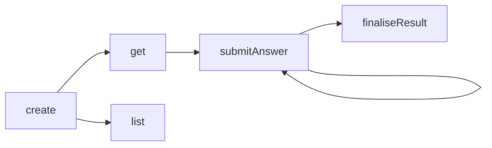
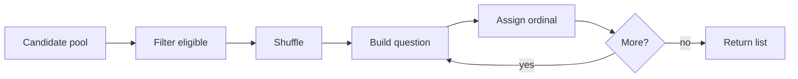
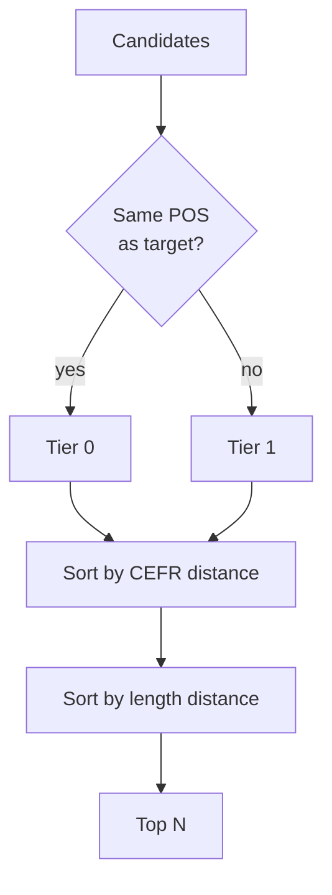
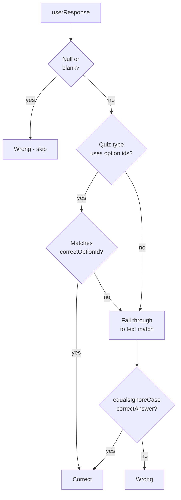

# Quiz Engine — Concept Guide

> [!abstract] Summary
> How WordPower turns a user's collected words into quiz questions — the candidate-pool rules, per-type generation logic, distractor selection, and grading model.

Related: [[PROJECT#2.2 Learning & Quiz Engine]] | [[SPACED_REPETITION#10. How Quiz Types Feed Into SRS — Rating Inference Model]]

---

## 1. What the Engine Does

Given a user, a quiz type, and a word source (e.g. *all my words* or *just my "business" domain*), the engine produces a **session** containing N persisted **questions**, each tied to one of the user's words.

The engine is responsible for:

- Picking which words become questions (==candidate pool==)
- Filtering out words that can't form a question of the requested type (==eligibility==)
- Building each question's prompt and (where applicable) options
- Selecting high-quality wrong answers (==distractors==)
- Storing the canonical correct answer for grading later

It is **not** responsible for scheduling reviews — that's the [[SPACED_REPETITION|SRS]] layer, which consumes the *outcome* of a quiz session.

## 2. Session Lifecycle

A quiz session goes through five operations, all enforced per-user (cross-user reads return 404):



| Operation          | What it does                                                                                                                                                            |
| ------------------ | ----------------------------------------------------------------------------------------------------------------------------------------------------------------------- |
| **create**         | Pulls candidates from the user's notebook, dispatches to a generator, persists session + questions.                                                                     |
| **get**            | Loads a session with its questions in `ordinal` order.                                                                                                                  |
| **list**           | Paginated, newest-first feed of past sessions, decorated with score when available.                                                                                     |
| **submitAnswer**   | Records one answer; computes `isCorrect` against the stored canonical answer. **Idempotent up to first submission** — a second submit for the same question raises 409. |
| **finaliseResult** | Lazily creates the `QuizResult` row and stamps `finishedAt`. Idempotent — repeat calls return the same row.                                                             |

> [!info] Concurrency safety
> Both `submitAnswer` and `finaliseResult` defend against races: a UNIQUE constraint catches concurrent inserts and the loser is mapped back to the same outcome the pre-check would have produced. The public contract is *"answers are immutable"* and *"finalise is idempotent"* — full stop, not *"…except under contention"*.

## 3. Candidate Pool

Before any generator runs, the service pulls a pool of the user's `UserWord` rows:

| Rule | Value | Why |
|---|---|---|
| **Source** | The user's own collection only | All quiz types draw from the personal notebook |
| **Active only** | Soft-deleted (tombstoned) words excluded | Tombstones exist for sync, not for review |
| **Hard cap** | ==500 words== | Big enough for distractor headroom on a 50-question MCQ; small enough that the in-memory shuffle stays cheap |
| **Order** | Random within the active set (`ORDER BY random() LIMIT 500`) | Guarantees every word can be selected regardless of collection size — a 1000-word user must not have their oldest 500 words permanently locked out of every quiz |
| **Domain filter** | Optional, when `wordSourceType = DOMAIN_FILTER` | Lets the user quiz themselves on, e.g., just their "law" words |

> [!note] Source type validation
> `wordSourceType = DOMAIN_FILTER` requires a non-blank filter. `wordSourceType = ALL_WORDS` forbids one. Mismatches raise 400 — the API contract is strict so the FE can't accidentally request a filtered quiz with no filter.

## 4. Per-Type Generation Rules

Every generator follows the same shape:



The differences live in **what makes a word eligible** and **what the question payload looks like**.

> [!tip] Silent-skip principle
> If a candidate word can't form a valid question of the requested type, the generator **silently drops it**. The session ends up with fewer questions than requested rather than failing loudly. Only when **zero** questions can be formed does `create` raise 400 — an empty session is never persisted.

### 4.1 Multiple Choice

| Field | Rule |
|---|---|
| **Eligible** | Word has a non-blank ==definition== |
| **Distractors** | 3, drawn from the same pool via [[#5. Distractor Selection\|DistractorService]] |
| **Skip condition** | Fewer than 3 distractors available — can't form a 4-option question |
| **Mode** (current) | `WORD_TO_DEFINITION` — stem is the word, options are definitions |
| **Mode** (alt) | `DEFINITION_TO_WORD` — stem is the definition, options are words |

The four option texts (1 correct + 3 distractors) are shuffled and labelled `A`–`D`. The ==correct option's id varies== across questions so a user can't pattern-match on position.

```json
{
  "mode":            "word_to_definition",
  "stem":            "ephemeral",
  "options": [
    {"id": "A", "text": "lasting forever"},
    {"id": "B", "text": "lasting a very short time"},
    {"id": "C", "text": "easily broken"},
    {"id": "D", "text": "deeply hidden"}
  ],
  "correctOptionId": "B"
}
```

### 4.2 Fill in the Blank

| Field | Rule |
|---|---|
| **Eligible** | Word has a cache row with `isEnrichable = true` AND ≥1 example sentence containing a whole-word match for the surface form |
| **Stem source** | First cached `exampleSentence` with a Unicode-aware whole-word match (`\b…\b` with `CASE_INSENSITIVE \| UNICODE_CASE \| UNICODE_CHARACTER_CLASS`) |
| **Blank** | Only the **first** occurrence is replaced with `___` — later occurrences stay as same-word hints |
| **Distractors** | 3 other user words (no example-sentence requirement on distractors — they only contribute their `word` to the bank) |
| **Skip condition** | No usable sentence, or fewer than 3 distractors |

> [!info] Performance — batch prefetch
> Dictionary cache rows for every candidate are loaded in a **single `findAllById`** at the start of `generate`. The earlier shape did one `findById` per target inside the loop, which scaled as one DB round-trip per candidate (up to 500). One indexed query up front beats 500 latency exposures even when most candidates get trimmed.

```json
{
  "stem":            "Her interest in chess proved ___ — within a month she'd moved on.",
  "options": [
    {"id": "A", "text": "ephemeral"},
    {"id": "B", "text": "perpetual"},
    {"id": "C", "text": "ancient"},
    {"id": "D", "text": "thorough"}
  ],
  "correctOptionId": "A"
}
```

### 4.3 Flashcard

| Field | Rule |
|---|---|
| **Eligible** | Word has a non-blank definition |
| **Direction** (default) | `BIDIRECTIONAL` — coin-flip per card between word→def and def→word |
| **Direction** (alt) | `WORD_TO_DEFINITION`, `DEFINITION_TO_WORD` |
| **Skip condition** | None beyond eligibility — every eligible word becomes a card |

Phonetic, part-of-speech, and example sentence are emitted on the payload **only if non-blank**, so the FE can render them without null-checks beyond *"is the field present?"*.

```json
{
  "direction":       "word_to_definition",
  "front":           "ephemeral",
  "back":            "lasting a very short time",
  "phonetic":        "/ɪˈfɛm(ə)rəl/",
  "partOfSpeech":    "adjective",
  "exampleSentence": "Her interest in chess proved ephemeral."
}
```

### 4.4 Spelling

> [!info] Status
> This section describes the **target design** being tracked under [issue #237](https://github.com/AnunnakiCosmoCrew/WordPower-app/issues/237). The current shipped implementation only emits `audioUrl` and `phonetic` and is being rebuilt to match what's documented here.

| Field                  | Rule                                                                                                                                                                              |
| ---------------------- | --------------------------------------------------------------------------------------------------------------------------------------------------------------------------------- |
| **Eligible**           | Non-blank surface form AND ≥1 pronunciation hint (`audioUrl` or `phonetic`) AND ≥1 semantic hint (definition or a usable example sentence)                                       |
| **Pronunciation hint** | At least one of `audioUrl` / `phonetic`; both included on the payload when present                                                                                                |
| **Definition**         | Emitted verbatim from `UserWord` when present                                                                                                                                     |
| **Blanked example**    | First cached example sentence with a whole-word match for the target, with that occurrence replaced by `___` (same Unicode regex as [[#4.2 Fill in the Blank\|FITB]])             |
| **Skip condition**     | No pronunciation hint, or no semantic hint (no definition AND no usable example)                                                                                                  |

> [!info] Cognitive-tier consequence
> Adding a definition + blanked example shifts spelling from pure **production** (generate from sound alone) toward **assisted production**. [[SPACED_REPETITION#10. How Quiz Types Feed Into SRS — Rating Inference Model]] needs a matching adjustment so a "spelling with help" correct answer doesn't push intervals as aggressively as the unscaffolded version would have.

> [!warning] Cheat prevention
> The canonical spelling lives only on `QuizQuestion.correctAnswer`, which `QuizMapper.toQuestionResponse` keeps off the wire. The blanked example reuses the FITB regex so the target word is removed from the visible context too — inspecting the API response can't reveal the answer from either field.

```json
{
  "audioUrl":       "https://example.com/ephemeral.mp3",
  "phonetic":       "/ɪˈfɛm(ə)rəl/",
  "definition":     "lasting a very short time",
  "blankedExample": "Her interest in chess proved ___ — within a month she'd moved on."
}
```

#### 4.4.1 Progressive Hints

The user can press a **hint** button to reveal letters of the answer one at a time, left-to-right. Hints aren't free — each press is recorded on `QuizAnswer.hintsUsed` and feeds the SRS rating model.

| Rule                 | Detail                                                                                                                                                                       |
| -------------------- | ---------------------------------------------------------------------------------------------------------------------------------------------------------------------------- |
| **Reveal direction** | Left-to-right, one letter per press                                                                                                                                          |
| **Hard cap**         | ⌈length / 2⌉ letters — the answer is never auto-completed; the user must produce at least half the spelling themselves                                                       |
| **Storage**          | `QuizAnswer.hintsUsed` (integer, defaults to 0)                                                                                                                              |
| **Telemetry**        | Each press emits its own event so we can analyse hint timing later (time-to-first-hint, gaps between hints). Only the count is stored on the answer row                      |
| **Grading**          | Hints don't affect `isCorrect` — a correct spelling is correct regardless. They only shift the inferred SRS quality                                                          |

The hint count combines with the correct/incorrect outcome to produce the SRS rating. The full table lives at [[SPACED_REPETITION#Assisted Production quizzes (Spelling, Fill-in-the-Blank)]] and is mirrored here for convenience:

| Outcome                                | SRS quality                                                                                                  |
| -------------------------------------- | ------------------------------------------------------------------------------------------------------------ |
| Correct, no hints                      | 4 Good                                                                                                       |
| Correct, no hints, slow (> 15s)        | 3 Hard *(time-downgrade rule shared with pure production)*                                                   |
| Correct, 1 hint                        | 3 Hard                                                                                                       |
| Correct, 2+ hints                      | 1 Again — heavy scaffolding indicates the word isn't actually retained, so treat it as relearning            |
| Close misspelling, no hints            | 3 Hard                                                                                                       |
| Wrong (any hint count)                 | 1 Again                                                                                                      |

> [!note] No upgrade from low hint count
> "Used zero hints" doesn't earn 5 Easy. Hint count can downgrade quality, never upgrade it — same shape as the existing time-threshold rule. Easy emerges over multiple successful reps via the SRS scheduler, not from a single answer.

> [!note] Why hints aren't free
> If pressing hint had no cost, every user would tap it on every question and the SRS would never see honest signal. Tying hint count to a downgraded quality preserves the rating-inference accuracy that [[SPACED_REPETITION#10. How Quiz Types Feed Into SRS — Rating Inference Model]] depends on.

### 4.5 Not Yet Implemented

`LISTENING` and `MATCHING` quiz types are listed in the enum but the dispatcher raises a 400 — they're Phase 3 follow-ups (issues TBD). Requesting them returns *"Quiz type X is not yet implemented."*

## 5. Distractor Selection

For MCQ and FITB, distractor *quality* is what makes the engine feel intelligent versus random. The current implementation — `QualityRuleDistractorService` (Phase A: in-collection) — ranks the user's other words by three signals plus one hard exclusion.

### 5.1 The Hard Exclusion

> [!important] Synonyms are not distractors
> Any candidate whose surface word appears in the target's cached `synonyms` list is excluded outright. A synonym would be a *legitimate alternative answer*, not a wrong one — using it as a distractor is a bug, not a difficulty knob.

The synonym list comes from the dictionary cache, looked up case-insensitively. Cache misses (no row, no synonyms, blank target) degrade gracefully — the filter becomes a no-op and ranking still works.

### 5.2 The Ranking Keys

Within the surviving candidates, distractors are picked using three sort keys, in order:



| # | Signal | What it does |
|---|---|---|
| 1 | **Same part of speech** | Same-POS candidates always rank ahead of other-POS. Mismatch is only used as a last-resort fallback when the same-POS pool runs dry. |
| 2 | **CEFR distance** | Candidates at the target's CEFR band beat ±1 band, beat ±2, etc. Resolved via the same `LeveledLexicon.classify` chain used by enrichment, so what the user sees as "level" matches what the engine reasons about. |
| 3 | **Length distance** (tiebreak) | Closer character-length wins. Stops "horse / fence / table" from sitting next to "kaleidoscopically". |

> [!note] Why stable-sort + pre-shuffle
> The list is shuffled with the supplied `Random`, then stable-sorted on the three keys. TimSort preserves order within equal-key groups, so the up-front shuffle becomes the random tiebreak inside each quality tier. Seeded `Random` in tests → deterministic. `ThreadLocalRandom` in prod → varied across sessions.

### 5.3 Decorate-Sort-Undecorate

Each candidate's three sort keys are computed **once** when the wrapper is built, not per comparator call. The earlier shape recomputed `cefrRank` (a lexicon lookup) on every compare, scaling as O(n log n) lexicon lookups. The wrapper shape is O(n).

### 5.4 What's Deferred (Phase B)

The current strategy only uses the user's own collection. Two richer sources are planned for later (issue [[#282]]):

- ==WordNet sibling synsets== — sibling concepts under the same parent ("oak" → "elm", "maple"). Tighter semantic distractors than CEFR-banding alone.
- ==Roget thematic clusters== — same thematic category, different concept. Useful when the user's collection is too small or too varied to yield good in-collection distractors.

Both require bundled lexical-data files on-device — see [[LOCAL_FIRST_ARCHITECTURE#Reference Data]] for the rollout plan.

## 6. Storage Model

Each generated question is one `QuizQuestion` row:

| Column | Purpose |
|---|---|
| `sessionId` | FK to the session |
| `userWordId` | The word this question is about — preserved even if the user later deletes the word |
| `quizType` | Enum: `MULTIPLE_CHOICE`, `FILL_IN_THE_BLANK`, `FLASHCARD`, `SPELLING` |
| `ordinal` | 0-indexed position within the session, used to render order |
| `questionData` | JSONB payload — type-specific shape (see §4) |
| `correctAnswer` | Canonical text for fast grading without re-parsing JSONB |

> [!info] Why both `correctAnswer` and `correctOptionId`?
> For MCQ and FITB, the correct answer can be referenced two ways: by **option id** (`"B"`) or by **canonical text** (`"lasting a very short time"`). The FE is free to send either form. Storing both means grading is O(1) without parsing the JSONB on the hot path.

## 7. Grading

`QuizSessionService.isCorrect(question, userResponse)` is intentionally minimal:



| Rule | Detail |
|---|---|
| Null / blank input | Always wrong, recorded as a ==skip== |
| Whitespace handling | `trim` before comparison |
| Case sensitivity | `equalsIgnoreCase` for canonical text |
| Option id check | Only for `MULTIPLE_CHOICE` and `FILL_IN_THE_BLANK`; falls through to text match if absent |

> [!note] Why blank ≡ skip
> `isCorrect` returns false for blank input, and `countOutcomes` keys off `userResponse == null` to bucket skips. To keep "user submitted an empty box" and "user explicitly skipped" in the *same* bucket at storage time, blank strings are stored as null in `QuizAnswer.userResponse`. Otherwise the result row would split them into "incorrect" vs "skipped".

## 8. Result Computation

`finaliseResult` aggregates outcomes:

| Counter | How it's computed |
|---|---|
| `correctCount` | Answers where `isCorrect = true` |
| `incorrectCount` | Answers with non-null response and `isCorrect = false` |
| `skippedCount` | Explicit skips (null response) **plus** unanswered questions (`totalQuestions - answers.size()`) |
| `scorePercentage` | `correctCount / totalQuestions × 100`, two-decimal precision, half-up rounding |
| `averageResponseTimeMs` | Mean of non-null `responseTimeMs` across answers; null when no timed answers |

> [!warning] `responseTimeMs` is INTEGER, not BIGINT
> The DB column is INTEGER. The OpenAPI spec types it as `format: int64, minimum: 0`. The service rejects negatives as 400 and clamps the upper bound to `Integer.MAX_VALUE` so a malicious client can't trigger a `DataIntegrityViolation 500`.

## 9. Open Questions for Discussion

> [!question] Things worth deciding now or revisiting
> - Should `MultipleChoiceQuestionGenerator` allow the user to choose `WORD_TO_DEFINITION` vs `DEFINITION_TO_WORD`, or stay opinionated? (Currently hard-wired to W→D.)
> - Should FITB fall back to a **pre-blanked** sentence when the user's word has no cached examples? (Currently silent-skips.)
> - **Phase 4:** upgrade candidate ordering from random sampling to *least-recently-quizzed first*. Requires a `lastQuizzedAt` column on `UserWord`, updated each time a question is generated. The pool cap (500) then means *"the 500 most-overdue words"* rather than a random slice — much closer to SRS semantics. Tracked in [[PROJECT#Phase 4 — Vocabulary System: "Organized Learning"]].
> - Should distractor selection ever look outside the user's collection, or wait for the Phase B WordNet/Roget rollout?
> - What's the right hint cap for spelling? Currently ⌈length / 2⌉, but a flat *"max 3 letters"* might feel more predictable. Worth A/B-testing once telemetry is in.

> [!info] Deferred — sentence-audio dictation mode
> Synthesised audio of the example sentence ("hear the sentence, spell the word") is strictly better pedagogy than blanked text but is its own epic — TTS provider, caching, object-storage layout, offline pre-download, voice/accent UX, billing model. Revisit once v1 spelling completion-rate data is in. Tracked under [issue #237](https://github.com/AnunnakiCosmoCrew/WordPower-app/issues/237).

## Glossary

> [!abstract] Terms
> | Term | Meaning |
> |---|---|
> | **Candidate pool** | The bounded list of `UserWord` rows the engine considers for a session (≤ 500, newest-first) |
> | **Eligible** | A candidate that can form a valid question of the requested type (per §4 rules) |
> | **Distractor** | A wrong answer presented alongside the correct one in a multi-option question |
> | **Stem** | The prompt portion of a question (the word, the definition, or the sentence-with-blank) |
> | **Ordinal** | 0-indexed position of a question within its session |
> | **Canonical answer** | The stored correct-answer text used for grading, kept off the wire for spelling quizzes |
> | **Hint** | A user-triggered letter reveal in spelling quizzes. Capped at ⌈length / 2⌉. Recorded count downgrades SRS quality |
> | **Production / assisted production** | Cognitive demand tiers — production = generate from memory cold; assisted production = generate with semantic scaffolding (definition, blanked example) |
