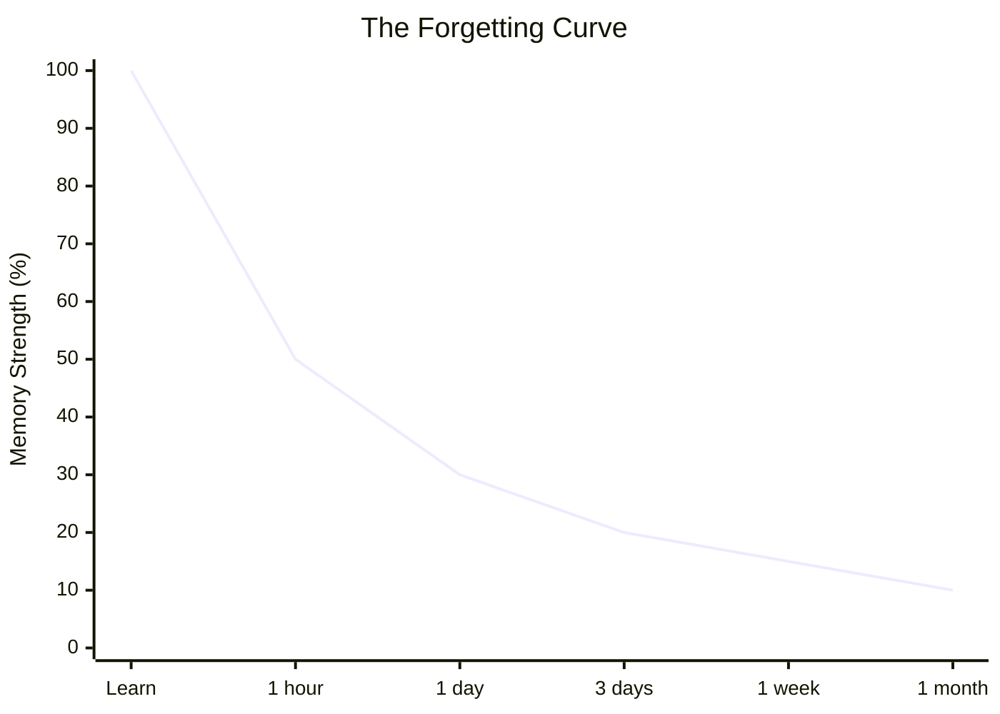
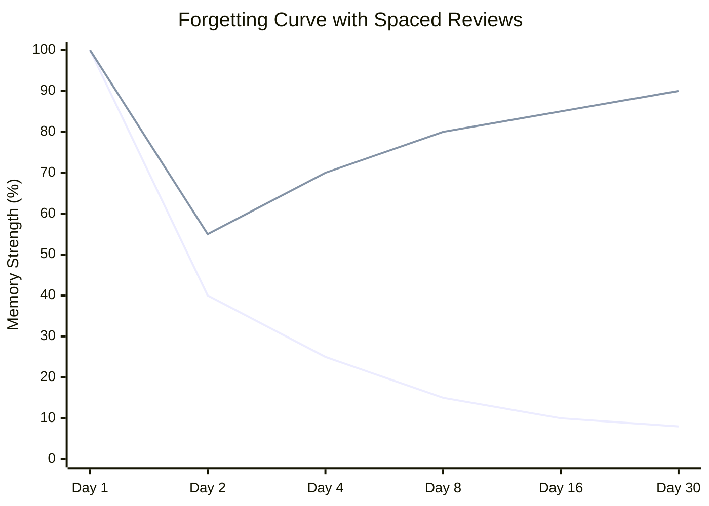
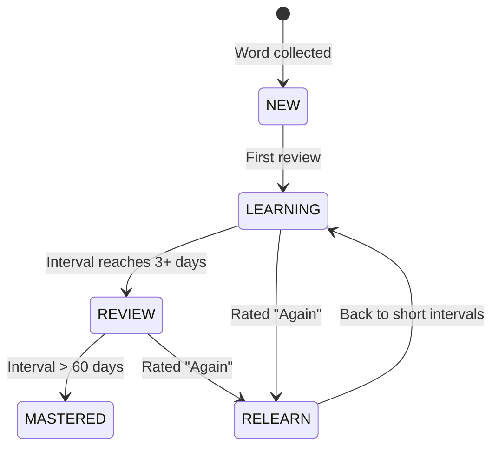
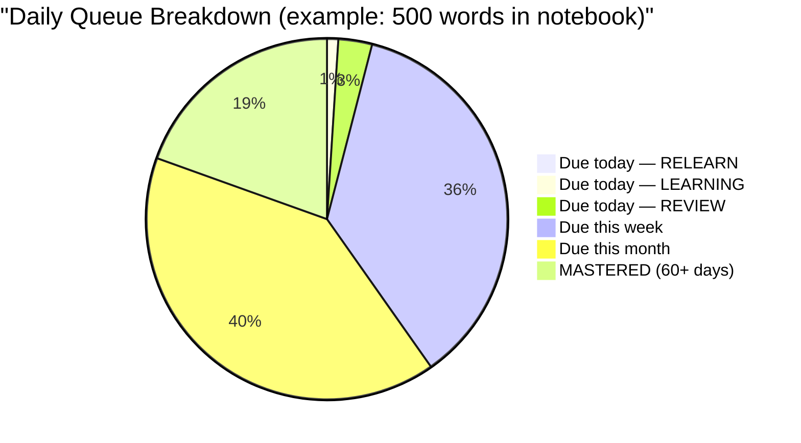

# Spaced Repetition System (SRS) — Concept Guide

> [!abstract] Summary
> How WordPower turns a growing word notebook into lasting knowledge.

Related: [[PROJECT#2.3 Spaced Repetition System (SRS)]] | [[PROJECT#2.2 Learning & Quiz Engine]]

---

## 1. The Problem: We Forget Fast

German psychologist ==Hermann Ebbinghaus== discovered in the 1880s that memory decays in a predictable curve — the **Forgetting Curve**. Without any review, we forget roughly:

- **50%** within 1 hour
- **70%** within 1 day
- **90%** within 1 week



> [!warning] What this means for WordPower
> If a user collects 100 words in their notebook and never reviews them, they'll remember fewer than 10 after a month.

## 2. The Solution: Review at the Right Moment

Ebbinghaus also discovered that each time you successfully recall something, the forgetting curve ==flattens== — you forget it slower the next time.



> [!tip] The key insight
> You don't need to review every day. You only need to review ==right before you would have forgotten==. Each successful review pushes the next review further into the future.
>
> This is spaced repetition: **increasing intervals between reviews, timed to catch you just before you forget.**

## 3. How Intervals Grow

Here's a simplified example of how review intervals grow for a single word:

| Review # | User recalls correctly? | Next review in... | Why                                    |
| -------- | ----------------------- | ----------------- | -------------------------------------- |
| 1        | Yes                     | 1 day             | First time — short interval to confirm |
| 2        | Yes                     | 3 days            | Starting to stick                      |
| 3        | Yes                     | 7 days            | Settling into memory                   |
| 4        | Yes                     | 16 days           | Getting solid                          |
| 5        | Yes                     | 35 days           | Well-learned                           |
| 6        | Yes                     | 75 days           | Nearly permanent                       |
| —        | No (forgot)             | 1 day             | Reset — needs relearning               |
|          |                         |                   |                                        |

> [!success] Result
> After 6 successful reviews spread over ~4 months, a word is essentially in long-term memory. Without SRS, you'd need dozens of random reviews to achieve the same result.

## 4. What Makes It "Spaced"

Compare three study strategies for learning 50 words:

| Strategy | Total reviews | Time spent | Words retained after 3 months |
|---|---|---|---|
| **Cramming** (review all 50 words every day for a week, then stop) | 350 | ~7 hours | ~10% |
| **Regular review** (review all 50 words once a week forever) | 600+ | ~12+ hours | ~60% |
| **Spaced repetition** (review each word only when it's about to be forgotten) | ~150 | ~3 hours | ==~90%== |

> [!important]
> SRS is dramatically more efficient because it **doesn't waste time on words you already know** and **focuses time on words you're about to forget**.

## 5. The Rating System

After each review (flashcard, quiz, spelling drill, etc.), the user rates how easy the recall was. This tells the algorithm how to adjust:

| Rating | What it means | What happens |
|---|---|---|
| **Again** | "I had no idea" | Interval resets to 1 day. The word needs relearning |
| **Hard** | "I got it, but barely" | Interval grows slowly. The word needs more practice |
| **Good** | "I remembered it" | Interval grows normally. On track |
| **Easy** | "Instant recall, no effort" | Interval grows fast. Less review time needed for this word |

> [!note]
> This means two users who collect the same word will have different review schedules — the algorithm adapts to each person's actual memory.

## 6. Word Lifecycle

Every word in the user's notebook moves through four stages:



| Status | Description |
|---|---|
| **NEW** | Word just collected, never reviewed. Waiting in the queue |
| **LEARNING** | First encounters. Short intervals (minutes to days). Building initial familiarity |
| **REVIEW** | Known but needs periodic refreshing. Intervals grow with each success |
| **MASTERED** | Consistently recalled over 60+ days. Rarely appears in reviews |
| **RELEARN** | Previously known but forgotten. Returns to LEARNING intervals for reinforcement |

## 7. The SM-2 Algorithm

> [!info] Background
> ==SM-2 (SuperMemo 2)== is the most widely used SRS algorithm. Created by **Piotr Wozniak** in 1987, it's what powers Anki and many other apps.

### How it works

Each word stores three numbers:

| Field | Starting value | Purpose |
|---|---|---|
| **Ease Factor (EF)** | 2.5 | Multiplier for interval growth. Higher = easier word for this user |
| **Interval** | 0 | Days until next review |
| **Repetitions** | 0 | Consecutive successful recalls |

### The calculation (step by step)

When the user reviews a word and gives a quality rating `q` (0–5 scale, where 0 = complete blackout and 5 = instant recall):

> [!example]- Step 1: Update the ease factor
>
> $$EF' = EF + \bigl(0.1 - (5 - q) \times (0.08 + (5 - q) \times 0.02)\bigr)$$
>
> - If $q = 5$ (easy): EF increases by 0.10 → future intervals grow faster
> - If $q = 3$ (correct but hard): EF stays roughly the same
> - If $q = 2$ (barely recalled): EF decreases → future intervals grow slower
> - EF never drops below 1.3 (floor)

> [!example]- Step 2: Decide the next interval
>
> **If failed to recall** ($q < 3$):
> $$interval = 1\ day,\quad repetitions = 0$$
>
> **If successful recall** ($q \geq 3$):
> $$interval = \begin{cases} 1\ day & \text{if } repetitions = 0 \\ 6\ days & \text{if } repetitions = 1 \\ interval_{prev} \times EF & \text{if } repetitions \geq 2 \end{cases}$$
> $$repetitions = repetitions + 1$$

### Worked example

> [!example] User collects "ubiquitous" and reviews it over time
>
> | Review | Rating | EF | Interval | Next review | Notes |
> |---|---|---|---|---|---|
> | — | — | 2.5 | 0 | Now | Word just added (NEW) |
> | 1 | Good (4) | 2.5 | 1 day | Tomorrow | First review, minimum interval |
> | 2 | Good (4) | 2.5 | 6 days | +6 days | Second review, fixed at 6 |
> | 3 | Good (4) | 2.5 | 15 days | +15 days | $6 \times 2.5 = 15$ |
> | 4 | Hard (3) | 2.36 | 35 days | +35 days | $15 \times 2.36 = 35.4$. EF decreased slightly |
> | 5 | Easy (5) | 2.46 | 86 days | +86 days | $35 \times 2.46 = 86.1$. Word is basically mastered |
> | 6 | Again (1) | 2.06 | 1 day | Tomorrow | Forgot it — reset interval, EF drops |
>
> Notice how one "Again" rating resets the interval to 1 day but ==doesn't reset the ease factor== to 2.5. The algorithm remembers that this word is harder for this user.

### Mapping WordPower ratings to SM-2 quality scores

SM-2 uses a 0–5 scale internally. WordPower's four-button UI maps to it:

| WordPower button | SM-2 quality ($q$) | Meaning |
|---|---|---|
| **Again** | 1 | Complete failure to recall |
| **Hard** | 3 | Correct but with serious difficulty |
| **Good** | 4 | Correct with some hesitation |
| **Easy** | 5 | Instant, effortless recall |

## 8. FSRS — The Modern Alternative

> [!info] Background
> ==FSRS (Free Spaced Repetition Scheduler)== was created by **Jarrett Ye** in 2022. Anki adopted it as an option in 2023.

| Aspect | SM-2 | FSRS |
|---|---|---|
| **Created** | 1987 | 2022 |
| **Memory model** | Simple multiplier | Mathematical model of memory (DSR model) |
| **Personalization** | Same formula for everyone | Machine learning adapts to each user's forgetting patterns |
| **Accuracy** | Good enough | ~30% fewer unnecessary reviews than SM-2 |
| **Complexity** | Simple to implement | Requires ML training on user data |
| **Cold start** | Works immediately | Needs ~100 reviews before personalization kicks in |

### How FSRS differs

FSRS models memory with three concepts:

| Concept | Symbol | Description |
|---|---|---|
| **Difficulty** | $D$ | How inherently hard this word is (like SM-2's EF, but learned from data) |
| **Stability** | $S$ | How long before the memory drops to 90% recall probability — the "half-life" of the memory |
| **Retrievability** | $R$ | The current probability that the user can recall the word right now (decays over time since last review) |

Instead of a fixed formula, FSRS uses a trained model that learns:
- *"This user forgets new words faster than average, but retains well after 3 reviews"*
- *"Words rated 'Hard' on first review are 2× more likely to be forgotten than 'Good' words"*

### Which should WordPower use?

> [!tip] Recommendation: Hybrid approach
> 1. **Start with SM-2** (Phase 3) — simple to implement, well-understood, works from day one with no training data
> 2. **Migrate to FSRS in Phase 5** — by Phase 5 ("Advanced Modes"), users will have accumulated 100+ reviews, giving FSRS enough data to train per-user models
> 3. SM-2 provides a solid experience from launch, and FSRS replaces it as a ==Phase 5 deliverable== without changing the user-facing quiz experience

## 9. The Daily Review Queue

Each day, the app calculates which words are "due" — their scheduled review date is today or earlier.



### Review order priority

1. **RELEARN** words first (recently forgotten — most urgent)
2. **LEARNING** words next (building initial familiarity)
3. **REVIEW** words last (reinforcement)

### Overdue words

> [!warning] A forgiving SRS is critical for the notebook vision
> If the user misses a day (or several), overdue words pile up. The SRS must handle this gracefully:
>
> - **Don't punish** the user with a massive backlog
> - **Prioritize** the most overdue words first
> - **Spread** catch-up reviews across several days instead of dumping them all at once
> - **Don't reset** intervals just because a review is late — the word might still be remembered
>
> Users who collect words casually shouldn't feel punished for missing a review day. This is the #1 reason people abandon apps like Anki (see [[COMPETITIVE_ANALYSIS#Why Users Abandon Vocabulary Apps]]).

### Catch-up algorithm

When the user returns after an absence, overdue words are handled by these rules:

#### Daily review cap

| Component | Cap | Purpose |
|---|---|---|
| **Total daily cap** | 30 reviews | Prevents overwhelming sessions |
| **Overdue allocation** | Up to 50% of daily cap (15) | Leaves room for normally-due words |
| **Normally-due allocation** | Remaining slots (15–30) | Ensures current learning isn't stalled by backlog |

If fewer than 15 words are overdue, the remaining slots go to normally-due words — the cap is a ceiling, not a fixed split.

#### Prioritization: most overdue first

Overdue words are sorted by **overdue ratio** (days overdue / scheduled interval), not by absolute days overdue. A word 10 days overdue on a 14-day interval is less urgent than a word 5 days overdue on a 3-day interval.

$$\text{overdue\_ratio} = \frac{\text{today} - \text{due\_date}}{\text{scheduled\_interval}}$$

Higher ratio = more urgent = reviewed first.

#### Interval handling: don't reset

A word that's overdue but recalled correctly should not restart from a 1-day interval. Instead, the actual elapsed time counts as an extended interval:

| Review outcome | Interval calculation |
|---|---|
| **Correct** | $interval_{next} = actual\_elapsed \times EF$ (the overdue wait itself served as a longer interval) |
| **Again** | $interval_{next} = 1\ day$ (normal reset — the word was truly forgotten) |

This rewards the user: if they remembered a word after 30 days despite a 15-day scheduled interval, the word is clearly well-learned.

#### Worked example

A user collects 200 words over 3 months, then takes a 2-week vacation. On return:

| State | Count |
|---|---|
| Overdue (due during vacation) | 45 words |
| Due today (normally scheduled) | 8 words |
| Not yet due | 147 words |

**Day 1 back:**

| Slot | Words | Source |
|---|---|---|
| 1–15 | Top 15 overdue (highest overdue ratio) | Overdue allocation |
| 16–23 | 8 normally-due words | Normal queue |
| 24–30 | 7 more overdue words | Remaining capacity |
| **Total** | **30** (22 overdue + 8 normal) | |

**Day 2:** 23 overdue remain. Same logic — 15 overdue + normally-due words fill the cap. By **Day 3**, the backlog is cleared and the user is back to a normal review cadence.

> [!tip] UX implications
> - Show a friendly message: *"Welcome back! You have 45 words to catch up on — we'll spread them across a few days."*
> - Show a progress bar: *"Catch-up: 22/45 reviewed"*
> - Never show the raw overdue count as a guilt-inducing number on the dashboard

## 10. How Quiz Types Feed Into SRS — Rating Inference Model

> [!important] Design principle: never ask the user to rate themselves
> The only quiz type that requires a self-rating is **Flashcards** (because only the user knows if they truly recalled the answer before flipping the card). For every other quiz type, the app ==auto-infers the rating== from the answer itself.

### Recognition vs Production

> [!warning] Not all correct answers are equal
> A correct answer on a **multiple choice** question (recognition — picking from options) is cognitively easier than a correct answer on a **spelling** quiz (production — generating from memory). If we treat both as the same SM-2 quality, we'll overestimate memory strength for recognition-based quizzes, and the user will fail when forced to produce the word later.

WordPower classifies each quiz type by its ==cognitive demand==:

| Cognitive Type | What it tests | Quiz Types |
|---|---|---|
| **Production** (hardest) | User generates the answer from memory with no semantic scaffolding | Sentence Scramble, Definition Reverse |
| **Assisted Production** | User generates the answer from memory but with semantic context (definition, blanked example sentence) | Spelling, Fill-in-the-Blank |
| **Recognition** (easier) | User identifies the answer from options | Multiple Choice, Matching, Synonym/Antonym Match, Odd One Out, Collocation Check, Listening |
| **Self-assessed** | User judges their own recall | Flashcards |
| **Gamified** | Tests fluency/speed, not core recall | Speed Recall, Word Ladder, Error Correction |

> [!note] Why split production into two tiers
> Spelling and FITB used to sit alongside Sentence Scramble in *pure* production. As of [[QUIZ_ENGINE#4.4 Spelling]] both now ship with semantic scaffolding — a definition and (when available) a blanked example sentence. Producing the word with that much context is genuinely easier than producing it cold, so it earns its own tier between production and recognition. Sentence Scramble and Definition Reverse stay in pure production.

### Rating Inference Rules

#### Production quizzes (Sentence Scramble, Definition Reverse)

| Outcome | SM-2 Quality ($q$) | Logic |
|---|---|---|
| Correct | 4 (Good) | Active recall succeeded |
| Correct but slow (> 15s) | 3 (Hard) | Knew it, but with significant effort |
| Wrong, then correct on retry | 3 (Hard) | Needed a second attempt |
| Wrong | 1 (Again) | Failed to produce |

#### Assisted Production quizzes (Spelling, Fill-in-the-Blank)

> [!note] Why a separate tier
> These quizzes show semantic scaffolding (definition, blanked example sentence) alongside the prompt. The user still has to produce the answer, but the scaffolding makes it materially easier than cold production. The hint count is the explicit cost mechanism — see [[QUIZ_ENGINE#4.4.1 Progressive Hints]] for the spelling-quiz hint UI.

| Outcome | SM-2 Quality ($q$) | Logic |
|---|---|---|
| Correct, no hints | 4 (Good) | Produced with semantic context but no letter help |
| Correct, no hints, slow (> 15s) | 3 (Hard) | Time downgrade applies as in pure production |
| Close misspelling (1 letter off), no hints | 3 (Hard) | Partial recall — nearly there |
| Correct, 1 hint | 3 (Hard) | Light scaffolding — capped at Hard |
| Correct, 2+ hints | 1 (Again) | Heavy scaffolding indicates the word isn't actually retained — treat as relearning |
| Wrong (any hint count) | 1 (Again) | Failed to produce despite help |

> [!warning] Hints are write-only — never an upgrade signal
> Pressing fewer hints than allowed does not earn Easy (5). Mirroring the time-threshold rule below: hint count can downgrade quality but not upgrade it. The default for unscaffolded correct stays at Good (4).

#### Recognition quizzes (Multiple Choice, Matching, Synonym/Antonym, Odd One Out, Collocation, Listening)

> [!note] Recognition correct maps to Hard (3), not Good (4)
> This is the key difference. Recognition is easier than production, so a correct answer gets a ==lower quality score==, which means the interval grows more slowly. The user will need to prove they know the word through a production quiz before intervals accelerate.

| Outcome | SM-2 Quality ($q$) | Logic |
|---|---|---|
| Correct | 3 (Hard) | Recognition succeeded — but weaker evidence than production |
| Correct but slow (> 15s) | 3 (Hard) | Already at the recognition floor |
| Wrong | 1 (Again) | Failed even to recognize |

#### Self-assessed (Flashcards only)

| User taps | SM-2 Quality ($q$) |
|---|---|
| Again | 1 |
| Hard | 3 |
| Good | 4 |
| Easy | 5 |

> [!tip] Simplification option
> Flashcards could also use a **2-button** UI (Got it / Didn't get it) mapped to Good (4) / Again (1). Fewer buttons = less friction. The 4-button version is more precise but could be offered as an advanced setting.

#### Gamified modes (Speed Recall, Word Ladder, Error Correction)

> [!warning] Asymmetric updates — protect real progress
> Gamified modes test speed and lateral thinking, not direct semantic recall. A failure in Speed Recall (swiped too slowly) shouldn't destroy a word's hard-earned 30-day interval.

| Outcome | SRS Effect | Logic |
|---|---|---|
| Correct | Micro-bump: treat as $q = 3$ | Small interval extension — bonus review credit |
| Wrong | ==Ignored entirely== | No SRS penalty — the game mode doesn't reflect true recall |

### Response Time Thresholds

> [!warning] Time is used only for downgrading, never for upgrading
> Mobile has too many confounders — keyboard latency, reading longer sentences, audio loading, distractions. Using fast response time to upgrade a score (e.g., "< 3s = Easy") introduces noise.

| Rule | Threshold | Effect |
|---|---|---|
| Slow correct (production) | > 15s | Downgrade from Good (4) → Hard (3) |
| Slow correct (recognition) | > 15s | Already at Hard (3) — no change |
| Fast correct | Any | ==No upgrade==. Stay at the quiz type's default |

> [!tip] Future enhancement
> Once enough data is collected, replace the hardcoded 15s threshold with a ==dynamic baseline== calculated from the user's own average response time per quiz type. What's "slow" for one user might be normal for another.

### Summary: Complete Rating Matrix

| Quiz Type | Phase | Cognitive Type | Correct | Slow Correct | Wrong |
|---|---|---|---|---|---|
| **Flashcards** | 3 | Self-assessed | User chooses | User chooses | User chooses |
| **Multiple Choice** | 3 | Recognition | 3 (Hard) | 3 (Hard) | 1 (Again) |
| **Spelling** | 3 | Assisted Production | 4 (Good) — no hints; downgraded by hint count (see Assisted Production rules) | 3 (Hard) | 1 (Again) |
| **Listening** | 3 | Recognition | 3 (Hard) | 3 (Hard) | 1 (Again) |
| **Matching** | 3 | Recognition | 3 (Hard) | 3 (Hard) | 1 (Again) |
| **Fill-in-the-Blank** | 3 | Assisted Production | 4 (Good) | 3 (Hard) | 1 (Again) |
| **Synonym/Antonym Match** | 4 | Recognition | 3 (Hard) | 3 (Hard) | 1 (Again) |
| **Odd One Out** | 4 | Recognition | 3 (Hard) | 3 (Hard) | 1 (Again) |
| **Collocation Check** | 5 | Recognition | 3 (Hard) | 3 (Hard) | 1 (Again) |
| **Error Correction** | 5 | Gamified | 3 (micro-bump) | 3 | Ignored |
| **Sentence Scramble** | 5 | Production | 4 (Good) | 3 (Hard) | 1 (Again) |
| **Speed Recall** | 6 | Gamified | 3 (micro-bump) | 3 | Ignored |
| **Definition Reverse** | 6 | Production | 4 (Good) | 3 (Hard) | 1 (Again) |
| **Word Ladder** | 6 | Gamified | 3 (micro-bump) | 3 | Ignored |

## 11. Review Telemetry — Preparing for FSRS

> [!important] Log raw data, not just inferred scores
> When we migrate from SM-2 to FSRS, the optimizer needs precise review history to train per-user models. If we only save the inferred SM-2 quality score (1, 3, 4, 5), we lose the context FSRS needs.

Every quiz interaction should log a raw telemetry event to Firestore:

```json
{
  "wordId": "ubiquitous",
  "userId": "user-123",
  "timestamp": "2026-05-15T14:30:00Z",
  "quizType": "SPELLING",
  "cognitiveType": "ASSISTED_PRODUCTION",
  "phase": 3,
  "outcome": "CORRECT",
  "durationMs": 4200,
  "hintsUsed": 0,
  "retryAttempt": false,
  "inferredQuality": 4,
  "spellingDistance": 0
}
```

Each individual hint press also emits its own event (`outcome: "HINT_USED"`) with the hint position and time-since-question-start, so the optimiser can later learn hint-timing patterns. Only the final count is stored on `QuizAnswer.hintsUsed`.

> [!note] Fields explained
>
> | Field | Purpose |
> |---|---|
> | `quizType` | Which quiz generated this review |
> | `cognitiveType` | `PRODUCTION`, `ASSISTED_PRODUCTION`, `RECOGNITION`, `SELF_ASSESSED`, or `GAMIFIED` |
> | `outcome` | `CORRECT`, `WRONG`, `CLOSE_MISSPELLING`, `HINT_USED`, `RETRY_CORRECT` |
> | `durationMs` | Raw response time — FSRS can learn its own thresholds from this |
> | `hintsUsed` | Integer count of letter-reveal hints pressed during the question (0 = none). Caps per [[QUIZ_ENGINE#4.4.1 Progressive Hints]] |
> | `inferredQuality` | The SM-2 quality we calculated — useful for comparison when FSRS takes over |
> | `spellingDistance` | Edit distance for spelling quizzes (0 = exact, 1 = one letter off) |

> [!tip] Why this matters for FSRS migration
> With this telemetry, FSRS can mathematically determine:
> - *"For this user, a Multiple Choice correct is worth 0.6× a Spelling correct"*
> - *"This user's 'slow' threshold is 8 seconds, not 15"*
> - *"Words this user gets wrong on Listening quizzes have a 70% chance of being forgotten within 3 days"*
>
> We get ==personalized, data-driven weights== instead of our hardcoded heuristics. The heuristics are a starting point; the telemetry makes them obsolete over time.

## 12. Key Terminology Glossary

> [!abstract]- Expand glossary
>
> | Term | Definition |
> |---|---|
> | **SRS** | Spaced Repetition System — an algorithm that schedules reviews at increasing intervals |
> | **SM-2** | SuperMemo 2 — the classic SRS algorithm from 1987, used by Anki |
> | **FSRS** | Free Spaced Repetition Scheduler — a modern ML-based alternative to SM-2 |
> | **Ease Factor (EF)** | A per-word multiplier (1.3–2.5+) that controls how fast intervals grow. Higher = easier for this user |
> | **Interval** | The number of days between reviews for a specific word |
> | **Repetitions** | How many times a word has been successfully recalled in a row |
> | **Forgetting Curve** | The predictable rate at which memory decays without review |
> | **Retrievability** | The probability (0–100%) that the user can recall a word right now |
> | **Stability** | How long a memory lasts before retrievability drops below a threshold |
> | **Lapse** | When a user forgets a previously learned word (rates "Again" on a REVIEW word) |
> | **Leech** | A word that keeps getting forgotten despite many reviews — may need a different learning approach |
> | **Recognition** | Identifying the correct answer from options (easier — e.g., multiple choice) |
> | **Production** | Generating the answer from memory (harder — e.g., spelling, fill-in-the-blank) |
> | **Telemetry** | Raw interaction data logged per quiz event, used to train FSRS and improve rating inference |

## 13. Further Reading

- [Wozniak, P. (1990). SM-2 Algorithm](https://super-memory.com/english/ol/sm2.htm) — The original SM-2 paper
- [Ye, J. (2023). FSRS Algorithm](https://github.com/open-spaced-repetition/fsrs4anki/wiki/The-Algorithm) — FSRS documentation and research
- [Ebbinghaus Forgetting Curve](https://en.wikipedia.org/wiki/Forgetting_curve) — The foundational research
- [Gwern — Spaced Repetition](https://gwern.net/spaced-repetition) — Comprehensive overview of the science
