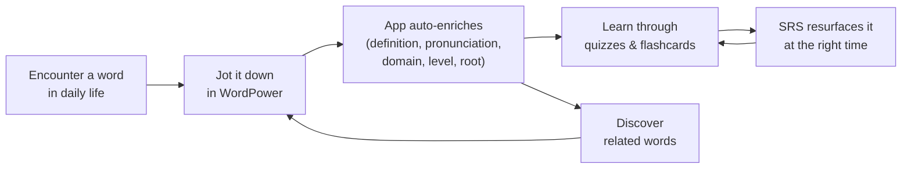
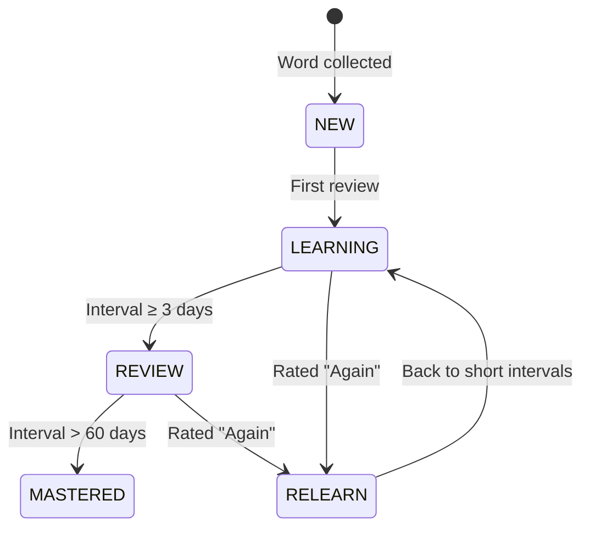
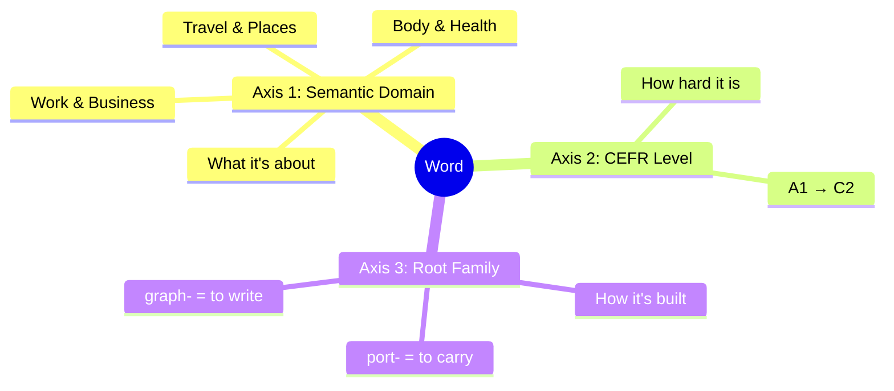
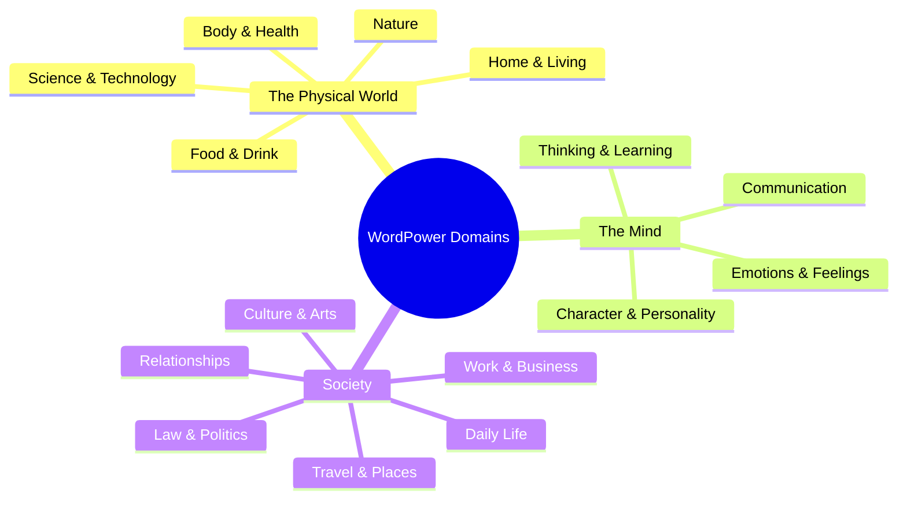
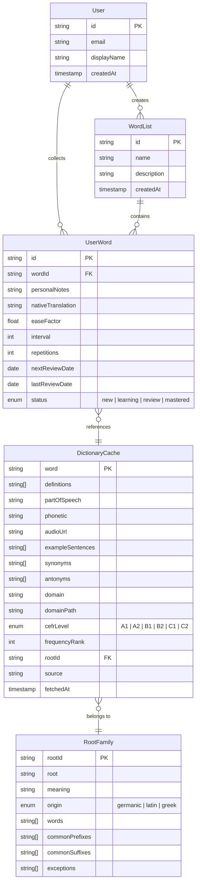
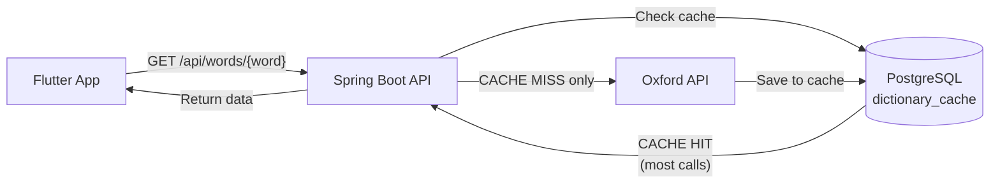
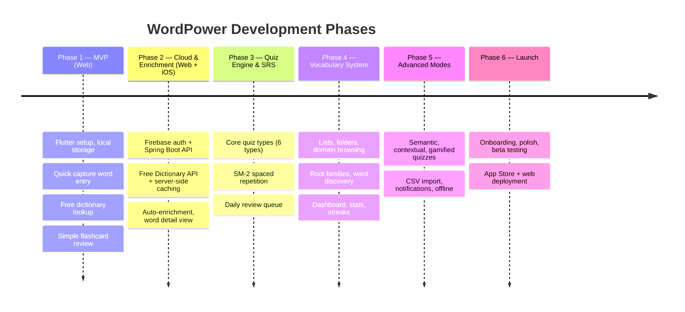

# WordPower (Working Title) — Project Document

> [!abstract] Vision
> A personal word notebook that turns everyday vocabulary discoveries into lasting knowledge — collect words from daily life, and let the app teach you their meaning, spelling, pronunciation, and related vocabulary through quizzes, flashcards, and spaced repetition.

| | |
|---|---|
| **Project Manager** | Mert Ertugrul |
| **Originally Conceived** | January 17, 2024 |
| **Platform** | Flutter (Web → iOS → Android) |

Related: [[SPACED_REPETITION]] | [[COMPETITIVE_ANALYSIS]]

---

## Table of Contents

1. [[#1. Vision]]
2. [[#2. Core Features]]
   - [[#2.1 Word Notebook]]
   - [[#2.2 Learning & Quiz Engine]]
   - [[#2.3 Spaced Repetition System (SRS)]]
   - [[#2.4 Pronunciation & Audio]]
   - [[#2.6 Word Domain & Level System]]
   - [[#2.7 User Accounts & Cloud Sync]]
3. [[#3. Target User]]
4. [[#4. Language Scope]]
5. [[#5. Platform Strategy]]
6. [[#6. Technical Stack]]
   - [[#Environments]]
7. [[#7. Key Screens]]
8. [[#8. Data Model (High-Level)]]
9. [[#9. Monetization]]
10. [[#10. Success Metrics]]
11. [[#11. Risks]]
12. [[#12. Milestones]]
    - [[#Phase 1 — MVP: "Jot & Flip"]]
    - [[#Phase 2 — Cloud & Enrichment: "Smart Notebook"]]
    - [[#Phase 3 — Quiz Engine & SRS: "Learn for Real"]]
    - [[#Phase 4 — Vocabulary System: "Organized Learning"]]
    - [[#Phase 5 — Advanced Modes: "Deep Practice"]]
    - [[#Phase 6 — Launch: "Ship It"]]

---

## 1. Vision

WordPower is a ==personal word notebook==. Users collect words they encounter in daily life — from conversations, books, articles, exams, or anywhere else — and jot them down like they would in a notebook. The app then enriches each word with its meaning, pronunciation, synonyms, CEFR level, and semantic domain. It also surfaces similar words at the same level or in the same category, helping users expand their vocabulary organically. Through quizzes, spelling drills, pronunciation listening, flashcards, and vocabulary exercises, the app turns a personal word collection into deep, lasting knowledge. Words resurface at scientifically-timed intervals so users spend time on what they actually need to review.



## 2. Core Features

### 2.1 Word Notebook

> [!tip] Core principle
> The notebook is the heart of the app. ==Quick Capture must be frictionless== — type a word, tap save, done. Everything else flows from this.

| Feature | Description |
|---|---|
| **Quick Capture** | Jot down a word as fast as possible — just type the word you encountered and save. No friction, like scribbling in a notebook |
| **Auto-Enrichment** | The app automatically fills in the definition, pronunciation (audio + phonetic), part of speech, example sentences, CEFR level, semantic domain, and root family via the Dictionary API |
| **Personal Notes** | Optionally add your own context — where you heard the word, your own definition, a native-language translation |
| **Bulk Import** | Import word lists from CSV or Excel files for users migrating from other tools |
| **Word Detail View** | Full word card showing everything the app discovered plus your personal notes |
| **Word Lists / Folders** | Organize your collected words into custom collections (e.g., "IELTS Prep", "Words from Breaking Bad", "Office vocabulary") |
| **Word Domains** | Every word is automatically tagged with a semantic domain and CEFR level (see [[#2.6 Word Domain & Level System]]) |

### 2.2 Learning & Quiz Engine

All quiz types draw from the user's personal word collection. New types are introduced across phases as the engine and data sources mature.

#### Core Quizzes (Phase 3 — Quiz Engine & SRS)

> [!note] Foundation
> These build the quiz engine architecture and [[SPACED_REPETITION|SRS]] integration.

| Quiz Type | How It Works |
|---|---|
| **Flashcards** | Show word → reveal definition (and vice versa). User self-rates: Easy / Good / Hard / Again |
| **Multiple Choice** | Given a word, pick the correct definition from 4 options (or given a definition, pick the word) |
| **Spelling** | Hear the word pronounced → type the correct spelling |
| **Listening** | Hear the word → select the correct definition or type the word |
| **Matching** | Match a set of words to their definitions by dragging/tapping |
| **Fill-in-the-Blank** | Complete a sentence with the correct word from the user's notebook |

#### Semantic Quizzes (Phase 5 — Advanced Modes)

> [!note] Data source
> Leverage WordNet synonyms/antonyms and domain groupings — ==no new data sources needed==.

| Quiz Type | How It Works |
|---|---|
| **Synonym/Antonym Match** | Provide a word and ask the user to pick its closest synonym or opposite from a list |
| **Odd One Out** | Present 4 words (3 related, 1 unrelated). User must identify the word that doesn't belong in the semantic group |

#### Contextual Quizzes (Phase 5 — Advanced Modes)

> [!warning] New data source required
> Collocation Check needs a collocation data source not in the current pipeline (Oxford Collocations Dictionary or collocations mined from Oxford API example sentences).

| Quiz Type | How It Works |
|---|---|
| **Collocation Check** | Ask the user which word typically "goes with" the target word (e.g., for "commit," the user picks "crime" or "mistake" over "homework") |
| **Error Correction** | Show a sentence where the target word is used incorrectly (wrong tense, wrong context, or misspelled). The user must fix it |
| **Sentence Scramble** | Provide a sentence using the target word, but with the words in random order. User must rearrange them correctly |

#### Gamified Modes (Phase 5 — Advanced Modes)

> [!note]
> Engagement and fluency layers built on top of the working quiz engine.

| Quiz Type | How It Works |
|---|---|
| **Speed Recall** | A "beat the clock" mode where the user identifies as many definitions as possible in 60 seconds |
| **Definition Reverse** | Provide a complex definition and have the user "build" the word from a scrambled set of letters |
| **Word Ladder** | User must change one letter at a time to get from a starting word to the target word (useful for vocabulary with similar roots) |

### 2.3 Spaced Repetition System (SRS)

> [!info] Deep dive
> See [[SPACED_REPETITION]] for a full concept guide covering the forgetting curve, SM-2 algorithm, FSRS, and how the review queue works.

- Algorithm based on ==SM-2== (SuperMemo 2) or a modern variant (==FSRS==)
- Each word has a familiarity score, interval, and next review date
- Daily review queue is generated automatically based on due words
- Performance in any quiz type feeds back into the SRS scheduling
- Dashboard shows: words due today, mastered count, learning streak



### 2.4 Pronunciation & Audio

- Text-to-speech (TTS) for word pronunciation
- Dictionary API audio where available (higher quality, native speaker)
- Phonetic transcription display (IPA)

### 2.6 Word Domain & Level System

Every word in WordPower lives on ==three axes==:



Users can explore vocabulary from any axis — by topic, by difficulty, or by word family. Learning one root unlocks 10+ words.

#### Axis 1: Semantic Domain Tree

> [!info] Inspiration
> Inspired by the ==Historical Thesaurus of the OED (HTOED)==, reorganized for modern learners.



#### Axis 2: CEFR Levels

| Level | Label | Example words |
|---|---|---|
| **A1** | Beginner | head, water, hotel, job |
| **A2** | Elementary | stomach, recipe, luggage, salary |
| **B1** | Intermediate | diagnosis, cuisine, commute, negotiate |
| **B2** | Upper Intermediate | ailment, palatable, vicinity, leverage |
| **C1** | Advanced | prognosis, epicurean, expatriate, fiduciary |
| **C2** | Mastery | visceral, voracious, itinerant, arbitrage |

#### Axis 3: Word Root Families

Words are grouped by their morphological root — the core unit of meaning that generates entire word families through prefixes and suffixes.

> [!example]- Root origins
>
> | Origin | Character | Example roots |
> |---|---|---|
> | **Germanic** (Old English) | Everyday, simple, emotional | hand-, break-, love-, stand-, light- |
> | **Latin** (via French) | Formal, academic, professional | port-, dict-, duct-, ject-, rupt-, scrib- |
> | **Greek** | Scientific, technical, medical | graph-, log-, phon-, bio-, psych-, chron- |

> [!example]- How a root family expands — `port-` (Latin: "to carry")
>
> ```
> Root: port- (Latin: "to carry")
> │
> ├── trans + port         = transport (carry across)
> ├── ex + port            = export (carry out)
> ├── im + port            = import (carry in)
> │   └── import + -ant    = important (carrying weight)
> ├── re + port            = report (carry back)
> ├── de + port            = deport (carry away)
> ├── sup + port           = support (carry from below)
> ├── port + -able         = portable (can be carried)
> ├── port + -er           = porter (one who carries)
> └── port + -folio        = portfolio (carry + leaf/page)
> ```

> [!example]- Prefix meanings (how they change the root)
>
> | Prefix | Meaning | With "port" | With "duct" | With "ject" |
> |---|---|---|---|---|
> | trans- | across | transport | transduct | — |
> | ex- | out | export | — | eject |
> | im-/in- | in | import | induct | inject |
> | re- | back/again | report | reduce | reject |
> | de- | away/down | deport | deduct | — |
> | pro- | forward | — | produce | project |
> | con- | together | — | conduct | — |
> | sub-/sup- | under/below | support | — | subject |

> [!example]- Suffix meanings (how they change word class)
>
> | Suffix | Creates | Example |
> |---|---|---|
> | -tion, -sion | noun (action/result) | act → ac**tion**, export → exporta**tion** |
> | -ment | noun (result/state) | enjoy → enjoy**ment**, govern → govern**ment** |
> | -ness | noun (quality) | happy → happi**ness**, dark → dark**ness** |
> | -able, -ible | adjective (can be) | break → break**able**, port → port**able** |
> | -ive | adjective (tending to) | act → act**ive**, product → product**ive** |
> | -ous, -ful | adjective (full of) | danger → danger**ous**, hope → hope**ful** |
> | -ly | adverb (in the manner of) | quick → quick**ly**, active → active**ly** |
> | -ize, -ify | verb (to make) | modern → modern**ize**, simple → simpl**ify** |
> | -er, -or, -ist | noun (person who) | teach → teach**er**, act → act**or**, art → art**ist** |

> [!warning]- Exceptions and traps (the app should highlight these)
>
> | Trap | Example | Why |
> |---|---|---|
> | **False roots** | "uncle" is not un- + cle; "island" is not is- + land | Not all letter patterns are morphemes |
> | **Meaning drift** | "awful" meant "full of awe" (positive), now means terrible | Meaning shifted over centuries |
> | **Irregular negation** | im-possible, un-able, ir-regular, dis-loyal, in-accurate | Prefix depends on Latin vs Germanic origin and first letter |
> | **Unpredictable suffixes** | "action" but "amazement" (not "amazion"); "happiness" but "boredom" (not "boreness") | Historical/phonological reasons |
> | **Dead metaphors** | "understand" ≠ "under" + "stand"; "breakfast" = "break" + "fast" (stop fasting) | Compound origins lose literal meaning |
> | **Ambiguous affixes** | "unlockable" = "able to unlock" or "not lockable"? | Structural ambiguity — context required |
> | **Register pairs** | begin (Germanic) vs commence (Latin) — same meaning, different formality | English has parallel vocabularies from different origins |

#### Data Sources — Three Tiers

> [!info]
> WordPower's word intelligence comes from three tiers: paid API, free open data, and copyrighted reference material studied to inform our design.

> [!example]- Tier 1 — Paid Integration (direct API calls)
>
> | Source | What it provides | Cost |
> |---|---|---|
> | **Oxford Dictionaries API** | Definitions, pronunciation audio, phonetics, examples, part of speech | ~£50/mo (cached) |

> [!info]- Dictionary API Comparison — Phase 1 vs Phase 2
>
> Oxford API is the long-term source (Phase 2+), but it requires a paid key and a backend to protect it. Phase 1 is web-only and local-only — no server. We evaluated free alternatives for Phase 1:
>
> | Criteria | Free Dictionary API | WordsAPI | Wiktionary (direct) | Datamuse |
> |---|---|---|---|---|
> | Definitions | Yes | Yes | Yes (hard to parse) | No |
> | Pronunciation audio | Yes | No | Yes (hard to parse) | No |
> | Phonetics (IPA) | Yes | Yes | Yes (hard to parse) | Partial |
> | Example sentences | Yes | No | Yes (hard to parse) | No |
> | API key required | No | Yes (RapidAPI) | No | No |
> | Rate limits | None | Limited free tier | None | 100K/day |
> | Dart packages on pub.dev | Yes | No | No | No |
>
> **Decision:** ==Free Dictionary API (dictionaryapi.dev)== for Phase 1.
>
> - Covers all MVP needs: definitions, POS, phonetics, audio URLs, examples
> - No API key, no rate limits, no cost
> - Wiktionary data served as clean JSON — reliable and community-maintained
> - Existing Dart packages (`free_dictionary_api_v2`) reduce integration work
> - Endpoint: `https://api.dictionaryapi.dev/api/v2/entries/en/{word}`
>
> **Why not stay on Free Dictionary API permanently?**
>
> | | Free Dictionary API | Oxford Dictionaries API |
> |---|---|---|
> | Data quality | Good (Wiktionary-sourced) | Best (professional lexicographers) |
> | Audio quality | Mixed (some words missing) | Consistent (native speaker recordings) |
> | Sense disambiguation | Basic | Detailed (per-sense definitions with examples) |
> | Register/frequency metadata | None | Yes (formal/informal, frequency bands) |
> | Uptime SLA | None (community project) | Commercial SLA |
> | CEFR level hints | None | Available in response metadata |
>
> Oxford's data quality justifies the ~£50/mo cost once we have a backend to cache responses (Phase 2). The ==server-side cache== (see [[#Dictionary Caching Architecture]]) means actual API call volume stays minimal regardless of user count.
>
> **Migration path:** `DictionaryService` is implemented behind an abstract interface from day one (WP-5). Swapping Free Dictionary for Oxford in Phase 2 is a single implementation class change — no frontend rewrites.

> [!example]- Tier 2 — Free/Open Data (shipped as static assets or database seed data)
>
> | Source | What it provides | License |
> |---|---|---|
> | **Open English WordNet (2025)** | 117K+ synonym sets (synsets), semantic hierarchy (is-a, part-of), antonyms, definitions. Primary source for synonyms, related words, and domain auto-tagging. | CC BY 4.0 |
> | **CEFR-J / Words-CEFR-Dataset** | Word → CEFR level mapping with POS, ~7,600 words. Primary source for level assignment. | Free for commercial use |
> | **Wordfreq** | Word frequency data across multiple corpora, 400K+ words. Powers "learn useful words first" and supplements CEFR leveling. | MIT |
> | **Roget's Thesaurus 1911** | 1,022 thematic categories with word clusters. Supplements WordNet with broader thematic groupings for quiz distractors and word discovery. | Public domain |

> [!example]- Tier 3 — Copyrighted Reference (studied, not copied)
>
> These are purchased/subscribed to, studied for methodology and structure, then used to inform our own original domain taxonomy and learning design. ==No data is extracted or redistributed.==
>
> | Source | What we learn from it | Access |
> |---|---|---|
> | **HTOED** (Historical Thesaurus of the OED) | How to structure a semantic taxonomy of English — the three-tier division (External World / Mind / Society), how categories relate hierarchically, how to handle words that belong in multiple domains | OED subscription (~£100/yr) |
> | **David Crystal — Words in Time and Place** | How semantic fields work in practice across 15 worked examples, how words within a field relate chronologically and thematically, what makes a good domain boundary | Book (~£15) |
> | **English Vocabulary Profile (full)** | How Cambridge assigns CEFR levels — what criteria distinguish B1 from B2, how polysemous words get different levels per sense, how collocations factor in | Cambridge site (free lookup, study methodology) |
> | **Oxford Learner's Dictionaries** | How Oxford organizes topic vocabulary for learners, which semantic groupings work best for language education, how to balance breadth vs depth per topic | Free online access |

#### How Levels Get Assigned Automatically

Words are auto-tagged when fetched from the Oxford API using these sources (in priority order):

1. **CEFR-J Dataset** — Direct word → level lookup in the 20MB SQLite database. Covers ~7,600 common words.
2. **Wordfreq ranking** — For words not in CEFR-J, frequency rank is mapped to a CEFR level (top 1,000 → A1-A2, top 3,000 → B1, top 6,000 → B2, top 10,000 → C1, beyond → C2). Methodology informed by studying the English Vocabulary Profile.
3. **Oxford API metadata** — Register and frequency info from the API response itself.
4. **Fallback** — Words not found in any source default to B2 (upper intermediate) and can be manually adjusted.

#### How Domains Get Assigned Automatically

1. **WordNet semantic hierarchy** — WordNet's is-a tree maps naturally to the domain tree (e.g., "fever" → hyponym of "illness" → Body & Health). Primary and most accurate method.
2. **Roget's category mapping** — The 1,022 categories are mapped to WordPower domains as a supplement for words where WordNet's hierarchy is less clear.
3. **Oxford API definition keywords** — Pattern matching on definitions (e.g., "a medical condition" → Body & Health)
4. **Pre-built override table** — Curated mapping for modern words not in WordNet or Roget's (technology, internet, etc.)
5. **User tagging** — Users can reassign or add domains to any word

#### Word Relationship Engine

Multiple sources are combined to power word connections:

| Feature | Primary source | Supplementary source |
|---|---|---|
| **Synonyms** | WordNet synsets (precise, curated) | Roget's clusters (broader groupings) |
| **Antonyms** | WordNet antonym links | Roget's adjacent opposite entries |
| **Related words / word discovery** | WordNet (hypernyms, hyponyms, meronyms) | Roget's thematic clusters |
| **Quiz distractors** | Roget's same-category words (close but wrong) | WordNet sibling synsets |
| **Word families** | WordNet derivational links | — |
| **Domain auto-tagging** | WordNet is-a hierarchy | Roget's category mapping |

> [!example]- Processing pipeline (one-time, at build)
>
> ```mermaid
> flowchart TD
>     A["Open English WordNet 2025<br/>(CC BY 4.0)"] --> D["Parse synsets,<br/>relationships, hierarchy"]
>     D --> E["Map hypernym chains<br/>to WordPower domains"]
>     D --> F["Extract synonym/antonym/<br/>related word lists"]
> 
>     B["Roget's 1911<br/>(public domain)"] --> G["Parse 1,022 entries"]
>     G --> H["Filter archaic words<br/>(cross-ref with Wordfreq)"]
>     H --> I["Map categories to<br/>WordPower domains"]
>     H --> J["Extract thematic clusters<br/>for quiz distractors"]
> 
>     C["CEFR-J + Wordfreq"] --> K["Build word → CEFR<br/>level lookup table"]
>     C --> L["Build frequency<br/>rank table"]
> 
>     E & F & I & J & K & L --> M[("Unified Dataset")]
>     M --> N["Static asset in app"]
>     M --> O["PostgreSQL<br/>dictionary tables"]
> ```

#### User Experience

> [!tip] Design principle
> The user's own collection is the centre of the app. Browsing and discovery ==always start from words the user has saved==.

| Path | Example |
|---|---|
| **Jot & enrich** | User hears "prognosis" at the doctor → jots it down → app auto-fills: Body & Health, C1, root: *gnos-* (to know), synonyms, pronunciation |
| **Browse your notebook** | Filter your collected words by domain, level, root family, or list |
| **Discover from your words** | User saved "transport" → app suggests: "You know the root *port-* (to carry). Want to add *export*, *import*, *portable* to your notebook?" |
| **Similar word suggestions** | User has 5 Body & Health words → app surfaces related words at the same CEFR level: "You might also encounter *ailment*, *symptom*, *diagnosis*" |
| **Combine axes** | "Show me my B1 Business words" → filters your collection: Work & Business × B1 |
| **Custom lists** | User creates "IELTS Prep" list → organizes collected words from any domain/level/family |
| **Level progress** | "You've collected 40 B2 words and mastered 28 — here are B2 words related to ones you already know" |

### 2.7 User Accounts & Cloud Sync

- User authentication via Firebase Auth (email/password, Google Sign-In, Apple Sign-In)
- Cloud database (PostgreSQL via Neon) accessed through Spring Boot API
- Real-time sync across devices
- Offline support with local cache — syncs when back online

## 3. Target User

> [!quote]
> English language learners who want a personalized vocabulary tool — not a fixed curriculum. Users who prefer to ==collect words they encounter in real life== (reading, conversations, exams) and actively practice them.

## 4. Language Scope

- **Target language:** English
- **Interface/translations:** Initially English UI; native-language translation field available per word for personal reference
- Future: expandable to other target languages if demand exists

## 5. Platform Strategy

> [!info] Approach
> Web first for fast iteration and validation, then iOS for the natural mobile use case, then Android if traction proves demand.

| Phase | Platform | Rationale |
|---|---|---|
| Phase 1 — MVP | Web | Zero friction — deploy, share a URL, iterate fast. No app store costs or review delays |
| Phase 2 — Cloud & Enrichment | Web + iOS | iOS brings the natural mobile use case (collect words on the go, quick reviews) |
| Phase 3–5 | Web + iOS | Single Flutter codebase targets both |
| Phase 6 — Launch | Web + iOS | App Store + web deployment |
| Post-launch | + Android | Added if the product proves successful |

## 6. Technical Stack

| Layer | Technology |
|---|---|
| **Frontend** | Flutter (Dart) |
| **State Management** | Riverpod |
| **Local Storage** | SQLite via drift (mirrors PostgreSQL schema for sync) |
| **Backend Testing** | Testcontainers (PostgreSQL) for component/integration tests |
| **Backend API** | Spring Boot (Java 21) |
| **Auth** | Firebase Auth (email/password, Google Sign-In, Apple Sign-In) |
| **Database** | PostgreSQL via Neon (serverless) |
| **Cloud** | Google Cloud Platform (Cloud Run) |
| **Dictionary API** | Free Dictionary API (Phase 1–5); Oxford Dictionaries API Lite (Phase 6+) with aggressive server-side caching in PostgreSQL |
| **Word Intelligence** | Open English WordNet 2025 (synonyms, hierarchy, domains) + Roget's 1911 (thematic clusters, quiz distractors) |
| **CEFR Leveling** | CEFR-J Dataset + Wordfreq (frequency-to-level mapping) |
| **Reference Material** | HTOED, David Crystal's *Words in Time and Place*, English Vocabulary Profile, Oxford Learner's Dictionaries — studied for taxonomy design and leveling methodology |
| **TTS** | Platform-native TTS + dictionary audio files |
| **CI/CD** | GitHub Actions |

### Environments

| Environment | Purpose | Backend (Cloud Run) | Database (Neon) | Firebase Project |
|---|---|---|---|---|
| **DEV** | Local development, feature branches | dev instance | dev branch/database | dev project |
| **TEST** | Integration testing, PR validation, staging | test instance | test branch/database | test project |
| **PROD** | Live users | prod instance | prod database | prod project |

## 7. Key Screens

> [!important]
> **Add Word** is the ==most important screen== — it must be the fastest, lowest-friction path in the app.

1. **Home / Dashboard** — Today's review count, streak, words collected this week, progress stats
2. **Add Word** — Quick-capture screen: type a word, tap save, app enriches it automatically. Minimal friction — ==this is the most important screen==
3. **My Words** — Browse, search, filter your collected words (by domain, level, root family, status, or list)
4. **Word Detail** — Full word card with auto-fetched info + personal notes, domain badge, CEFR level, root family, edit capability
5. **Discover** — Word suggestions based on your collection: same domain, same level, same root family. "Words you might encounter next"
6. **Quiz Session** — Active quiz with the selected quiz type (can filter by domain/level from your collection)
7. **Review Queue** — SRS-driven daily review session (mixed quiz types, drawn from your words)
8. **Import** — CSV/Excel upload and field mapping
9. **Profile / Settings** — Account, sync status, quiz preferences, target CEFR level, notifications

## 8. Data Model (High-Level)



## 9. Monetization

- **Model:** 7-day free trial → paid subscription
- **Pricing:** ==$4.99/month== or ==$29.99/year==
- **Free trial gives full access** — users experience Oxford-quality data before deciding
- **Break-even:** ~19 paying users at $4.99/mo (covers ~$78/mo infrastructure at launch; ~$15/mo during development without Oxford API)
- **App Store / Play Store cut:** 15% (Apple Small Business Program, Google reduced rate under $1M)

> [!example]- Monthly Cost Baseline (500 active users)
>
> | Expense | Cost |
> |---|---|
> | Oxford API Lite | ~$63 (£50) |
> | Apple Developer Program | $8.25 |
> | Google Play (amortized) | ~$2 |
> | Firebase Auth | $0 |
| Neon PostgreSQL | $0–19 |
| GCP Cloud Run | $0–10 |
> | **Total** | **~$73–78** |

### Dictionary Caching Architecture

> [!important]
> A shared, server-side cache ensures each English word is fetched from Oxford ==exactly once==, regardless of how many users look it up.



> [!example]- Flow detail
>
> 1. User types a word in the app
> 2. App calls the Spring Boot API (`GET /api/words/{word}`)
> 3. API checks `dictionary_cache` table in PostgreSQL
>    - **HIT** → return cached data immediately (no Oxford API call)
>    - **MISS** → call Oxford API → save response to `dictionary_cache` → return to user
> 4. All future lookups for that word by any user are served from PostgreSQL

> [!example]- `dictionary_cache` table row
>
> ```json
> {
>   "word": "ambiguous",
>   "definitions": ["..."],
>   "partOfSpeech": "adjective",
>   "phonetic": "/amˈbɪɡjʊəs/",
>   "audioUrl": "https://...",
>   "exampleSentences": ["..."],
>   "synonyms": ["..."],
>   "antonyms": ["..."],
>   "domain": "communication",
>   "domainPath": "The Mind > Communication",
>   "cefrLevel": "B2",
>   "frequencyRank": 4521,
>   "rogetCategory": 520,
>   "relatedWords": ["vague", "unclear", "equivocal", "enigmatic", "cryptic"],
>   "source": "oxford",
>   "fetchedAt": "2026-04-15T12:00:00Z"
> }
> ```

> [!success] Why this matters
> - 500 users looking up "ambiguous" = ==**1 API call**==, not 500
> - English has ~170,000 words in common use; after a few months the cache covers nearly every word users will ever search
> - Oxford API costs stay flat at the base plan even as user count grows to thousands
> - The Oxford API key never touches the client — it stays secure in the Spring Boot API on GCP

## 10. Success Metrics

| Metric | Type | Why it matters |
|---|---|---|
| **Words collected per user per week** | Engagement | ==The notebook habit is the core engagement loop== |
| **Collection-to-review ratio** | Engagement | Are users coming back to learn what they collected? |
| Daily active users returning for review sessions | Retention | Core usage pattern |
| Average words mastered per user per month | Learning | Outcome measure |
| Review completion rate | Learning | % of due words actually reviewed |
| Retention rate (7-day, 30-day) | Retention | Long-term stickiness |

## 11. Risks

| Risk | Mitigation |
|---|---|
| Oxford API rate limits or downtime | Aggressive PostgreSQL caching (1 call per word ever); manual entry as fallback |
| Users abandoning due to lack of motivation | Streaks, progress stats, achievement badges. See [[COMPETITIVE_ANALYSIS#Why Users Abandon Vocabulary Apps]] |
| Complex SRS logic introducing bugs | Unit test the scheduling algorithm thoroughly in isolation. See [[SPACED_REPETITION#7. The SM-2 Algorithm]] |
| Cloud sync conflicts | Last-write-wins for simple fields; conflict detection for complex state |

## 12. Milestones

> [!info] Approach
> Each phase delivers a **usable product end-to-end** (skateboard → car). Phase 1 already lets users collect AND learn — every phase after that makes both better.

### Phase 1 — MVP: "Jot & Flip"

> **Platform:** Web

The simplest usable product. A user can collect words and learn them today.

| Deliverable | Details |
|---|---|
| Flutter project setup | Project structure, CI/CD skeleton, linting |
| Quick Capture | Type a word, tap save — lowest friction possible |
| Free dictionary lookup | Basic definition via free API (no Oxford yet) |
| Simple flashcard review | Flip through collected words (word ↔ definition) |
| Local-only storage | No auth, no cloud — everything on device |

### Phase 2 — Cloud & Enrichment: "Smart Notebook"

> **Platform:** Web + iOS

Words get richer, data lives in the cloud. iOS enters as the natural mobile home.

| Deliverable | Details |
|---|---|
| Firebase Auth | Email/password, Google Sign-In, Apple Sign-In |
| Cloud sync | Real-time sync across devices via Spring Boot API |
| Auto-enrichment | Definition, pronunciation (audio + IPA), part of speech, example sentences via ==Free Dictionary API== (Oxford deferred to Phase 6 to avoid £600/yr during development) |
| Word Detail View | Full word card with all enriched data + personal notes |
| iOS deployment | App Store submission for iOS |

### Phase 3 — Quiz Engine & SRS: "Learn for Real"

Learning becomes structured and scientifically timed.

| Deliverable | Details |
|---|---|
| Quiz engine architecture | Pluggable quiz type system — adding new types is easy |
| Core quiz types | Flashcards (with SRS rating), multiple choice, spelling, listening, matching, fill-in-the-blank |
| SM-2 spaced repetition | Familiarity score, intervals, next review date per word |
| Daily review queue | Auto-generated from due words, mixed quiz types |

### Phase 4 — Vocabulary System: "Organized Learning"

The notebook becomes a real vocabulary system.

| Deliverable | Details |
|---|---|
| Word Lists / Folders | Custom collections (e.g., "IELTS Prep", "Words from Breaking Bad") |
| Domain browsing & filtering | Filter by semantic domain, CEFR level, status |
| Root families | Root → word family tree, prefix/suffix breakdowns |
| Word discovery | "You know *transport* — try *export*, *import*, *portable*" |
| Dashboard | Stats, streaks, words collected/mastered, level progress |

### Phase 5 — Advanced Modes: "Deep Practice"

Richer quiz types and power-user features.

| Deliverable | Details |
|---|---|
| Semantic quizzes | Synonym/antonym match, odd one out |
| Contextual quizzes | Collocation check, error correction, sentence scramble |
| Gamified modes | Speed recall, definition reverse, word ladder |
| FSRS migration | Replace SM-2 with FSRS for personalized scheduling — users have 100+ reviews by now (see [[SPACED_REPETITION#8. FSRS — The Modern Alternative]]) |
| CSV/Excel import | Bulk import with field mapping |
| Notifications | Review reminders, streak nudges |
| Offline support | Local cache with sync-when-online |

### Phase 6 — Launch: "Ship It"

> **Platform:** Web + iOS (Android added post-launch if successful)

Polish and publish.

| Deliverable | Details |
|---|---|
| Oxford API integration | Oxford Dictionaries API Lite (£50/mo) + server-side PostgreSQL caching (1 call per word ever). Replaces Free Dictionary API via the abstract `DictionaryService` interface — single class swap, no frontend changes |
| Onboarding flow | First-run experience explaining the collect → learn loop |
| UI polish | Animations, transitions, edge cases, accessibility |
| Beta testing | TestFlight (iOS) + web beta |
| Store submission | iOS App Store + web deployment |
| Analytics | Usage tracking, funnel analysis, crash reporting |


