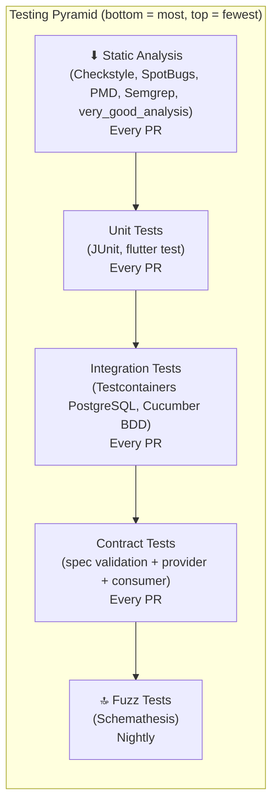
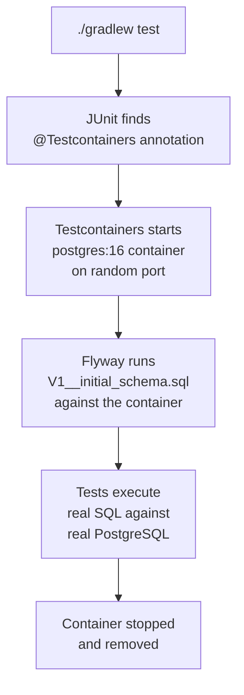
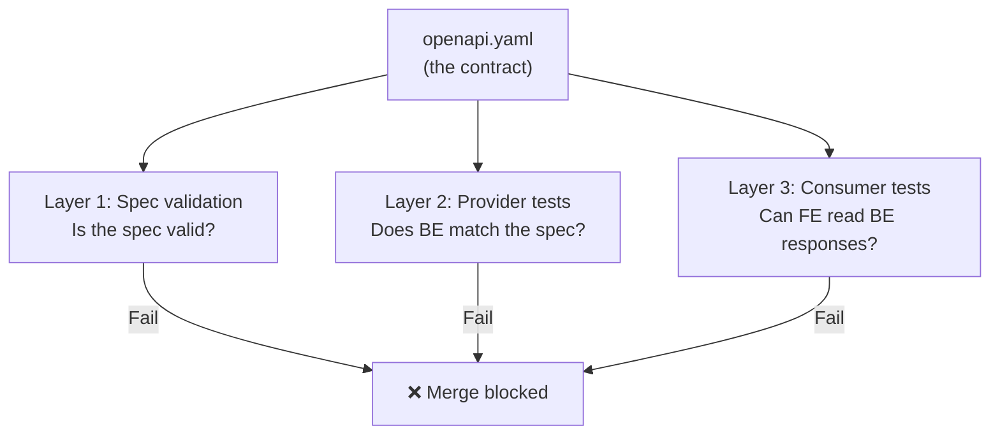
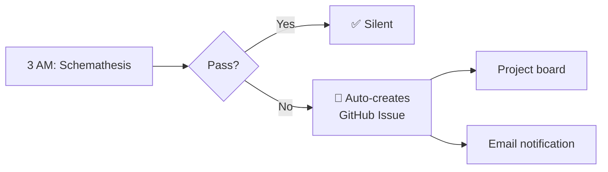

# Testing Strategy — WordPower

> [!abstract] Summary
> WordPower uses a layered testing strategy: unit tests for logic, integration tests for the full stack, contract tests for API correctness, and fuzz tests for edge cases. Each layer catches different bugs at different speeds.

Related: [[PROJECT#6. Technical Stack]] | [[LOCAL_FIRST_ARCHITECTURE]]

---

## Table of Contents

1. [[#1. Testing Pyramid]]
2. [[#2. Backend Testing]]
3. [[#3. Frontend Testing]]
4. [[#4. Contract Testing]]
5. [[#5. Fuzz Testing (Schemathesis)]]
6. [[#6. Static Analysis & Security]]
7. [[#7. What Runs When]]
8. [[#8. Coverage Targets]]
9. [[#9. Glossary]]

---

## 1. Testing Pyramid



| Layer | Speed | Catches | Runs |
|---|---|---|---|
| **Static analysis** | ~10 sec | Code style, common bugs, security patterns | Every PR |
| **Unit tests** | ~15 sec | Logic bugs in isolated functions | Every PR |
| **Integration tests** | ~60 sec | Full stack bugs (controller → service → DB) | Every PR |
| **Contract tests** | ~10 sec | API spec drift (FE/BE disagreement) | Every PR |
| **Fuzz tests** | ~3 min | Edge cases, crashes, weird input | Nightly |

---

## 2. Backend Testing

### Unit tests (JUnit 5)

Test business logic in isolation — no Spring context, no database.

```java
@Test
void sm2_goodRating_increasesInterval() {
    var result = SrsCalculator.calculate(easeFactor, interval, repetitions, Quality.GOOD);
    assertThat(result.interval()).isGreaterThan(interval);
}
```

**What to unit test:**
- SRS algorithm calculations
- CEFR level assignment logic
- Domain keyword matching
- DTO mapping / validation
- Any pure function

**What NOT to unit test (use integration tests instead):**
- Controller request routing
- Database queries
- Flyway migrations
- External API calls

### Integration tests (Testcontainers + Cucumber BDD)

Test the full stack against a real PostgreSQL database.

**Tool:** Testcontainers spins up a PostgreSQL Docker container. Cucumber BDD provides readable scenarios.

```gherkin
Feature: Word CRUD

  Scenario: Save a new word
    Given I am authenticated as "mert@example.com"
    When I save the word "ubiquitous"
    Then the response status is 201
    And the word is stored in the database
    And enrichment is triggered
```

**What integration tests cover:**
- Full request → controller → service → repository → PostgreSQL round trip
- Flyway migrations run cleanly
- JSONB serialization/deserialization from PostgreSQL
- Transaction behavior
- Auth filter rejects invalid tokens

**Why Testcontainers, not H2:**

WordPower uses PostgreSQL-specific features that H2 doesn't support:

| Feature | PostgreSQL | H2 |
|---|---|---|
| `JSONB` columns | ✅ Native | ❌ Not supported |
| `ON CONFLICT` upsert | ✅ | ⚠️ Different syntax |
| `GIN` indexes | ✅ | ❌ |
| Flyway migrations | ✅ Run as-is | ❌ Need separate files |

H2 would require separate migrations and give false confidence — tests pass on H2, app crashes on real PostgreSQL.

### How Testcontainers actually works

Testcontainers is a ==Java library==, not a CI plugin or Docker Compose setup. It's a dependency in `build.gradle`. Anywhere Gradle runs + Docker is available = Testcontainers works. The same `./gradlew check` runs identically on your laptop and in CI.

#### The lifecycle



#### Local vs CI — zero difference

| Aspect | Local (`./gradlew test`) | CI (GitHub Actions) |
|---|---|---|
| Docker source | Docker Desktop on your Mac | Pre-installed on runner |
| Image cache | Persists across runs | Persists within workflow |
| Container port | Random (avoids conflicts) | Random |
| Flyway migrations | Run against container | Same |
| Config needed | Docker Desktop running | Nothing — works out of the box |
| Test code | ==Identical== | ==Identical== |

No `services:` block in GitHub Actions. No `docker-compose.yml`. Testcontainers manages the container lifecycle inside the JVM process.

#### What the test code looks like

```java
@SpringBootTest
@Testcontainers
class WordRepositoryIntegrationTest {

    // Testcontainers manages this — starts before tests, stops after
    @Container
    static PostgreSQLContainer<?> postgres = new PostgreSQLContainer<>("postgres:16")
        .withDatabaseName("wordpower_test")
        .withUsername("test")
        .withPassword("test");

    // Tell Spring to use the container's dynamic port
    @DynamicPropertySource
    static void configureProperties(DynamicPropertyRegistry registry) {
        registry.add("spring.datasource.url", postgres::getJdbcUrl);
        registry.add("spring.datasource.username", postgres::getUsername);
        registry.add("spring.datasource.password", postgres::getPassword);
    }

    @Autowired
    WordRepository wordRepository;

    @Test
    void savesAndRetrievesWord() {
        var word = new UserWord("ubiquitous", "user-123");
        wordRepository.save(word);

        var found = wordRepository.findByWordAndUserId("ubiquitous", "user-123");
        assertThat(found).isPresent();
        assertThat(found.get().getWord()).isEqualTo("ubiquitous");
    }
}
```

**Step by step:**

| Step | What happens | Who does it |
|---|---|---|
| 1 | JUnit finds `@Testcontainers` annotation | JUnit |
| 2 | Finds `@Container` field → starts `postgres:16` Docker container | Testcontainers |
| 3 | Container picks a random available port (e.g., 54321) | Docker |
| 4 | `@DynamicPropertySource` injects `jdbc:postgresql://localhost:54321/wordpower_test` into Spring | Spring + Testcontainers |
| 5 | Spring Boot starts with the test datasource | Spring |
| 6 | Flyway runs migrations against the container | Flyway |
| 7 | Test methods execute real SQL against real PostgreSQL | Your test code |
| 8 | Test class finishes → container stopped and removed | Testcontainers |

#### Performance: the cold start

| Operation | Time | Happens when |
|---|---|---|
| Docker image pull (`postgres:16`) | 10–30 sec | First time only (cached after) |
| Container start | 3–5 sec | Every test run |
| Flyway migrations | 1–2 sec | Every test run |
| Actual tests | 1–10 sec | Every test run |

**First run:** ~40 sec. **Subsequent runs:** ~10 sec (image cached).

#### Optimization: one container for the entire test suite

Without optimization, each test class starts a new container. With a shared base class, ==one container serves all test classes==:

```java
public abstract class BaseIntegrationTest {

    static final PostgreSQLContainer<?> postgres;

    static {
        postgres = new PostgreSQLContainer<>("postgres:16")
            .withDatabaseName("wordpower_test");
        postgres.start();  // starts ONCE, reused by all subclasses
    }

    @DynamicPropertySource
    static void configure(DynamicPropertyRegistry registry) {
        registry.add("spring.datasource.url", postgres::getJdbcUrl);
        registry.add("spring.datasource.username", postgres::getUsername);
        registry.add("spring.datasource.password", postgres::getPassword);
    }
}

// All integration tests extend this — one container for the entire suite
class WordRepositoryTest extends BaseIntegrationTest { ... }
class WordServiceTest extends BaseIntegrationTest { ... }
class EnrichmentPipelineTest extends BaseIntegrationTest { ... }
```

One container start (~5 sec) serves 50+ test classes.

---

## 3. Frontend Testing

### Widget tests (flutter test)

Test individual widgets and screens in isolation.

```dart
testWidgets('Quick Capture saves word on Enter', (tester) async {
  await tester.pumpWidget(ProviderScope(child: QuickCaptureScreen()));
  await tester.enterText(find.byType(TextField), 'ubiquitous');
  await tester.testTextInput.receiveAction(TextInputAction.done);
  await tester.pump();

  expect(find.text('Saved!'), findsOneWidget);
});
```

**What to widget test:**
- Quick Capture: save, duplicate, empty validation
- Word list: rendering, search, delete
- Flashcard: flip animation, navigation, progress
- Dashboard: word count, empty state
- Word Detail View: all enrichment fields display

### State management tests

Test Riverpod providers and business logic without widgets.

```dart
test('WordNotifier adds word and triggers enrichment', () async {
  final container = ProviderContainer();
  final notifier = container.read(wordNotifierProvider.notifier);

  await notifier.addWord('ubiquitous');

  final words = container.read(wordListProvider);
  expect(words, hasLength(1));
  expect(words.first.word, equals('ubiquitous'));
});
```

---

## 4. Contract Testing

Contract testing ensures the **OpenAPI spec**, the **backend implementation**, and the **frontend client SDK** all agree. Three layers:

### Layer 1: Spec validation

**Tool:** Spectral (linting) + oasdiff (breaking change detection)

**What it checks:**
- Is `api/openapi.yaml` valid OpenAPI 3.0?
- Are all properties `camelCase`? Paths `kebab-case`?
- Do all error responses use the standard `ErrorResponse` schema?
- Do POST/PUT define 400? Do all endpoints define 401? Do `{id}` endpoints define 404?
- Did this PR introduce a breaking change (field removed, type changed)?

**Severity policy:**
- `error` → CI fails, merge blocked (correctness, consistency, error standards)
- `warn` → shown in PR, merge allowed (documentation)

**Runtime:** ~5 seconds

**Issue:** #115

### Layer 2: Provider-side tests

**Tool:** `@WebMvcTest` + `@MockBean` + OpenAPI response validator

**What it checks:** does the Spring Boot controller produce JSON responses that match the OpenAPI spec?

```java
@WebMvcTest(WordsApiController.class)
class WordCrudContractTest {

    @Autowired MockMvc mockMvc;
    @MockBean WordService wordService;  // no DB, no Docker

    @Test
    void createWord_responseMatchesContract() throws Exception {
        when(wordService.createWord(any(), any())).thenReturn(fakeWordDto());

        var result = mockMvc.perform(post("/api/words")
                .contentType(APPLICATION_JSON)
                .content("{\"word\": \"ubiquitous\"}"))
            .andExpect(status().isCreated())
            .andReturn();

        // Validates ENTIRE response against openapi.yaml
        validator.assertResponseMatchesSpec(result, "POST", "/api/words");
    }
}
```

**Key design decision:** uses `@WebMvcTest` with mocked services — ==no database, no Docker, no Testcontainers==. Contract tests verify response shape, not business logic. Integration tests (#89) cover the full stack.

| Concern | Contract test | Integration test |
|---|---|---|
| Response matches spec schema | ✅ | ❌ |
| All required fields present | ✅ | ❌ |
| Error responses match `ErrorResponse` | ✅ | ❌ |
| SQL queries correct | ❌ | ✅ |
| JSONB works | ❌ | ✅ |

**Runtime:** ~5 seconds

**Issue:** #113

### Layer 3: Consumer-side tests

**Tool:** `flutter test` with JSON fixtures

**What it checks:** can the generated Dart client SDK correctly deserialize real backend responses?

```dart
test('WordResponse deserializes correctly', () {
  final json = jsonDecode(File('test/fixtures/word_response.json').readAsStringSync());
  final word = WordResponse.fromJson(json);

  expect(word.id, equals(42));
  expect(word.definitions, hasLength(1));
  expect(word.synonyms, containsAll(['omnipresent', 'pervasive']));
  expect(word.cefrLevel, equals('C1'));
});

test('handles missing optional fields', () {
  fixture.remove('synonyms');
  final word = WordResponse.fromJson(fixture);
  expect(word.synonyms, isNull);
  expect(word.word, equals('ubiquitous'));  // required fields still work
});
```

**What it catches that Layer 2 doesn't:**
- Dart generator bug in deserialization code
- Date format mismatch between Java and Dart serializers
- Null handling differences between generators
- Field renamed in BE but Dart model not regenerated

**Runtime:** ~5 seconds

**Issue:** #114

### How the three layers work together



---

## 5. Fuzz Testing (Schemathesis)

**Tool:** Schemathesis — auto-generates hundreds of API inputs from the OpenAPI spec

**What it does:** reads `api/openapi.yaml`, generates valid and invalid inputs for every endpoint, fires them at a running API, checks for crashes and spec violations.

**What it catches that other tests don't:**

| Input | Would you write a test? | Schemathesis tests it? |
|---|---|---|
| `it's` (apostrophe) | Probably not | ✅ |
| `résumé` (accents) | Probably not | ✅ |
| `naïve` (diacritics) | Probably not | ✅ |
| 10,000-character word | No | ✅ |
| `'; DROP TABLE users--` | Maybe | ✅ |
| Empty string | Yes | ✅ |
| Null fields in every combination | No | ✅ |

**When it runs:** nightly at 3 AM UTC (too slow for every PR)

**Notification on failure:** auto-creates a GitHub Issue with `bug` label, failure details, and link to the run. Shows on the project board and triggers email notification — ==impossible to miss==.



**Runtime:** ~3 minutes (needs running server + Testcontainers PostgreSQL)

**Issue:** #133

---

## 6. Static Analysis & Security

Already in place from Phase 1:

### Backend

| Tool | What it checks | Issue |
|---|---|---|
| **Checkstyle** | Code style (Google style + Spring tweaks) | #21 ✅ |
| **SpotBugs** | Common bug patterns (null deref, resource leaks) | #22 ✅ |
| **PMD** | Code complexity, unused code, anti-patterns | #22 ✅ |
| **Semgrep** | Security patterns (injection, hardcoded secrets) | #23 ✅ |
| **Dependabot** | Vulnerable dependencies | #44 ✅ |
| **JaCoCo** | Code coverage (target 80% line / 70% branch) | #25 ✅ |

### Frontend

| Tool | What it checks | Issue |
|---|---|---|
| **very_good_analysis** | Strict Dart linting rules | #27 ✅ |
| **flutter analyze** | Dart static analysis | #3 ✅ |
| **dart format** | Code formatting | #3 ✅ |
| **Coverage reporting** | Code coverage (target 80%) | #28 ✅ |

---

## 7. What Runs When

### Every PR

```
┌─────────────────────────────────────────┐
│ frontend-ci           (~50 sec total)   │
│  ├── flutter analyze                    │
│  ├── dart format --set-exit-if-changed  │
│  ├── flutter test (unit + widget +      │
│  │    consumer contract fixtures)       │
│  └── coverage report                   │
├─────────────────────────────────────────┤
│ backend-ci            (~90 sec total)   │
│  ├── checkstyle + spotbugs + pmd       │
│  ├── unit tests                        │
│  ├── integration tests (Testcontainers) │
│  ├── provider contract tests (@WebMvc)  │
│  └── jacoco coverage report            │
├─────────────────────────────────────────┤
│ spec-validation       (~5 sec total)    │
│  ├── spectral lint openapi.yaml        │
│  └── oasdiff breaking change check     │
├─────────────────────────────────────────┤
│ semgrep               (~15 sec)         │
│  └── security pattern scan             │
└─────────────────────────────────────────┘

All run in PARALLEL → wall clock ~90 seconds
```

> [!tip] Smart skipping (WP-62)
> `dorny/paths-filter` skips irrelevant CI jobs. A PR that only changes frontend code won't run backend CI, and vice versa. Spec validation only runs when `api/` or `.spectral.yaml` changes.

### Nightly

```
┌─────────────────────────────────────────┐
│ schemathesis          (~3 min)          │
│  ├── start API + Testcontainers PG     │
│  ├── auto-generate inputs from spec    │
│  ├── fire at every endpoint            │
│  └── on failure → create GitHub Issue  │
└─────────────────────────────────────────┘
```

### Before release

- Full Schemathesis run with higher `--hypothesis-max-examples`
- Manual exploratory testing
- Beta tester feedback (Phase 6)

---

## 8. Coverage Targets

| Layer | Target | Enforced? |
|---|---|---|
| Backend line coverage | 80% | Report-only (not blocking) — #25 |
| Backend branch coverage | 70% | Report-only — #25 |
| Frontend line coverage | 80% | Report-only — #28 |

> [!info] Why report-only, not enforced
> Hard coverage gates incentivize writing meaningless tests to hit a number. Report-only shows the trend without blocking legitimate PRs that happen to touch uncovered code. If coverage drops significantly, it's visible in the PR and can be discussed.

---

## 9. Glossary

| Term | Definition |
|---|---|
| **Unit test** | Tests a single function or class in isolation, no external dependencies |
| **Integration test** | Tests the full stack (controller → service → DB) against a real database |
| **Contract test** | Verifies API responses match the OpenAPI spec — catches FE/BE disagreement |
| **Fuzz test** | Auto-generates random inputs to find crashes and edge cases |
| **Provider test** | Contract test on the backend — "does my API return what the spec says?" |
| **Consumer test** | Contract test on the frontend — "can my client deserialize what the API sends?" |
| **Testcontainers** | Library that spins up Docker containers (PostgreSQL, Redis, etc.) for integration tests |
| **@WebMvcTest** | Spring annotation that loads only the controller layer — fast, no DB needed |
| **Schemathesis** | Open-source tool that reads an OpenAPI spec and auto-generates API test cases |
| **Spectral** | OpenAPI spec linter — validates structure, naming conventions, and custom rules |
| **oasdiff** | Detects breaking changes between two versions of an OpenAPI spec |
| **JaCoCo** | Java code coverage tool — measures which lines/branches are executed by tests |
| **Cucumber BDD** | Behavior-driven testing framework — tests written as human-readable Gherkin scenarios |
| **WireMock** | HTTP mock server for simulating external APIs (Free Dictionary, Oxford) in tests |
| **Fixture** | A static JSON file representing an expected API response, used in consumer tests |
