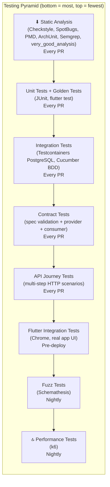
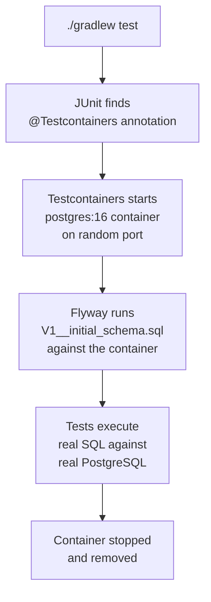
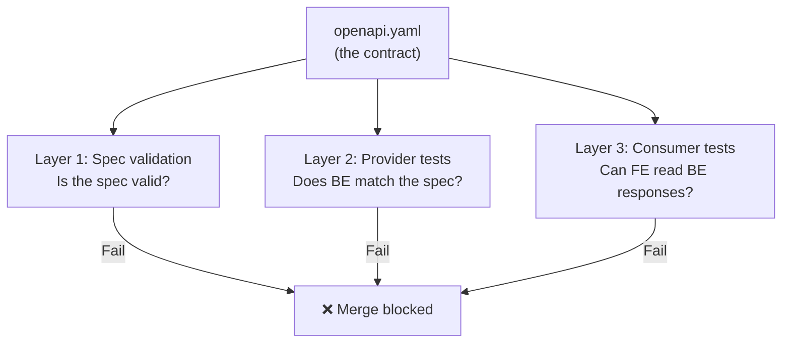
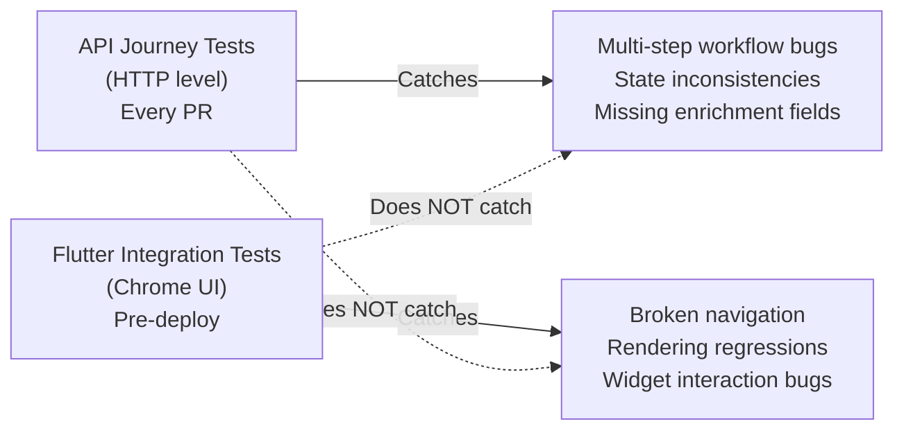
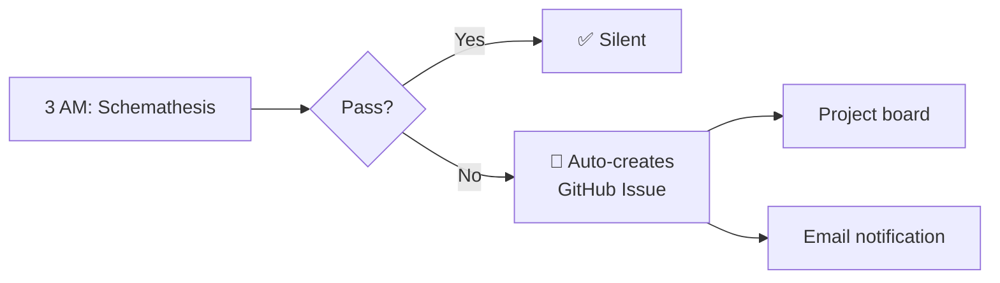
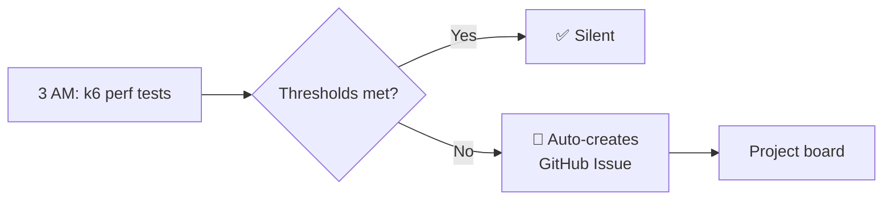

# Testing Strategy — WordPower

> [!abstract] Summary
> WordPower uses a layered testing strategy: unit tests for logic, integration tests for the full stack, contract tests for API correctness, end-to-end tests for critical user journeys, fuzz tests for edge cases, golden tests for visual regression, and performance tests for latency and throughput. Each layer catches different bugs at different speeds. A comprehensive static analysis and code quality toolchain — Checkstyle, PMD, SpotBugs, ArchUnit, Semgrep, very_good_analysis, Spectral — enforces standards on every PR, with JaCoCo and lcov tracking coverage via a per-package ratcheting strategy.

Related: [[PROJECT#6. Technical Stack]] | [[LOCAL_FIRST_ARCHITECTURE]]

---

## Table of Contents

1. [[#1. Testing Pyramid]]
2. [[#2. Backend Testing]]
3. [[#3. Frontend Testing]]
4. [[#4. Contract Testing]]
5. [[#5. End-to-End (E2E) Testing]]
6. [[#6. Fuzz Testing (Schemathesis)]]
7. [[#7. Performance Testing (k6)]]
8. [[#8. Static Analysis, Code Quality & Coverage Toolchain]]
9. [[#9. What Runs When]]
10. [[#10. Coverage Targets & Ratcheting]]
11. [[#11. Glossary]]

---

## 1. Testing Pyramid



| Layer | Speed | Catches | Runs |
|---|---|---|---|
| **Static analysis** | ~10 sec | Code style, common bugs, security patterns, architectural violations | Every PR |
| **Unit + golden tests** | ~15 sec | Logic bugs, visual regressions | Every PR |
| **Integration tests** | ~60 sec | Full stack bugs (controller → service → DB) | Every PR |
| **Contract tests** | ~10 sec | API spec drift (FE/BE disagreement) | Every PR |
| **API journey tests** | ~20 sec | Multi-step workflow bugs across endpoints | Every PR |
| **Flutter integration tests** | ~3 min | UI-level regressions on real app | Pre-deploy |
| **Fuzz tests** | ~3 min | Edge cases, crashes, weird input | Nightly |
| **Performance tests** | ~2 min | Latency regressions, throughput bottlenecks | Nightly |

---

## 2. Backend Testing

### Unit tests (JUnit 5)

Test business logic in isolation — no Spring context, no database.

```java
@Test
void sm2_goodRating_increasesInterval() {
    var result = SrsCalculator.calculate(easeFactor, interval, repetitions, Quality.GOOD);
    assertThat(result.interval()).isGreaterThan(interval);
}
```

**What to unit test:**
- SRS algorithm calculations
- CEFR level assignment logic
- Domain keyword matching
- DTO mapping / validation
- Any pure function

**What NOT to unit test (use integration tests instead):**
- Controller request routing
- Database queries
- Flyway migrations
- External API calls

### Integration tests (Testcontainers + Cucumber BDD)

Test the full stack against a real PostgreSQL database.

**Tool:** Testcontainers spins up a PostgreSQL Docker container. Cucumber BDD provides readable scenarios.

```gherkin
Feature: Word CRUD

  Scenario: Save a new word
    Given I am authenticated as "mert@example.com"
    When I save the word "ubiquitous"
    Then the response status is 201
    And the word is stored in the database
    And enrichment is triggered
```

**What integration tests cover:**
- Full request → controller → service → repository → PostgreSQL round trip
- Flyway migrations run cleanly
- JSONB serialization/deserialization from PostgreSQL
- Transaction behavior
- Auth filter rejects invalid tokens

**Why Testcontainers, not H2:**

WordPower uses PostgreSQL-specific features that H2 doesn't support:

| Feature | PostgreSQL | H2 |
|---|---|---|
| `JSONB` columns | ✅ Native | ❌ Not supported |
| `ON CONFLICT` upsert | ✅ | ⚠️ Different syntax |
| `GIN` indexes | ✅ | ❌ |
| Flyway migrations | ✅ Run as-is | ❌ Need separate files |

H2 would require separate migrations and give false confidence — tests pass on H2, app crashes on real PostgreSQL.

#### How Testcontainers actually works

Testcontainers is a ==Java library==, not a CI plugin or Docker Compose setup. It's a dependency in `build.gradle`. Anywhere Gradle runs + Docker is available = Testcontainers works. The same `./gradlew check` runs identically on your laptop and in CI.

##### The lifecycle



##### Local vs CI — zero difference

| Aspect | Local (`./gradlew test`) | CI (GitHub Actions) |
|---|---|---|
| Docker source | Docker Desktop on your Mac | Pre-installed on runner |
| Image cache | Persists across runs | Persists within workflow |
| Container port | Random (avoids conflicts) | Random |
| Flyway migrations | Run against container | Same |
| Config needed | Docker Desktop running | Nothing — works out of the box |
| Test code | ==Identical== | ==Identical== |

No `services:` block in GitHub Actions. No `docker-compose.yml`. Testcontainers manages the container lifecycle inside the JVM process.

##### What the test code looks like

```java
@SpringBootTest
@Testcontainers
class WordRepositoryIntegrationTest {

    // Testcontainers manages this — starts before tests, stops after
    @Container
    static PostgreSQLContainer<?> postgres = new PostgreSQLContainer<>("postgres:16")
        .withDatabaseName("wordpower_test")
        .withUsername("test")
        .withPassword("test");

    // Tell Spring to use the container's dynamic port
    @DynamicPropertySource
    static void configureProperties(DynamicPropertyRegistry registry) {
        registry.add("spring.datasource.url", postgres::getJdbcUrl);
        registry.add("spring.datasource.username", postgres::getUsername);
        registry.add("spring.datasource.password", postgres::getPassword);
    }

    @Autowired
    WordRepository wordRepository;

    @Test
    void savesAndRetrievesWord() {
        var word = new UserWord("ubiquitous", "user-123");
        wordRepository.save(word);

        var found = wordRepository.findByWordAndUserId("ubiquitous", "user-123");
        assertThat(found).isPresent();
        assertThat(found.get().getWord()).isEqualTo("ubiquitous");
    }
}
```

**Step by step:**

| Step | What happens | Who does it |
|---|---|---|
| 1 | JUnit finds `@Testcontainers` annotation | JUnit |
| 2 | Finds `@Container` field → starts `postgres:16` Docker container | Testcontainers |
| 3 | Container picks a random available port (e.g., 54321) | Docker |
| 4 | `@DynamicPropertySource` injects `jdbc:postgresql://localhost:54321/wordpower_test` into Spring | Spring + Testcontainers |
| 5 | Spring Boot starts with the test datasource | Spring |
| 6 | Flyway runs migrations against the container | Flyway |
| 7 | Test methods execute real SQL against real PostgreSQL | Your test code |
| 8 | Test class finishes → container stopped and removed | Testcontainers |

##### Performance: the cold start

| Operation | Time | Happens when |
|---|---|---|
| Docker image pull (`postgres:16`) | 10–30 sec | First time only (cached after) |
| Container start | 3–5 sec | Every test run |
| Flyway migrations | 1–2 sec | Every test run |
| Actual tests | 1–10 sec | Every test run |

**First run:** ~40 sec. **Subsequent runs:** ~10 sec (image cached).

##### Optimization: one container for the entire test suite

Without optimization, each test class starts a new container. With a shared base class, ==one container serves all test classes==:

```java
public abstract class BaseIntegrationTest {

    static final PostgreSQLContainer<?> postgres;

    static {
        postgres = new PostgreSQLContainer<>("postgres:16")
            .withDatabaseName("wordpower_test");
        postgres.start();  // starts ONCE, reused by all subclasses
    }

    @DynamicPropertySource
    static void configure(DynamicPropertyRegistry registry) {
        registry.add("spring.datasource.url", postgres::getJdbcUrl);
        registry.add("spring.datasource.username", postgres::getUsername);
        registry.add("spring.datasource.password", postgres::getPassword);
    }
}

// All integration tests extend this — one container for the entire suite
class WordRepositoryTest extends BaseIntegrationTest { ... }
class WordServiceTest extends BaseIntegrationTest { ... }
class EnrichmentPipelineTest extends BaseIntegrationTest { ... }
```

One container start (~5 sec) serves 50+ test classes.

---

## 3. Frontend Testing

### Widget tests (flutter test)

Test individual widgets and screens in isolation.

```dart
testWidgets('Quick Capture saves word on Enter', (tester) async {
  await tester.pumpWidget(ProviderScope(child: QuickCaptureScreen()));
  await tester.enterText(find.byType(TextField), 'ubiquitous');
  await tester.testTextInput.receiveAction(TextInputAction.done);
  await tester.pump();

  expect(find.text('Saved!'), findsOneWidget);
});
```

**What to widget test:**
- Quick Capture: save, duplicate, empty validation
- Word list: rendering, search, delete
- Flashcard: flip animation, navigation, progress
- Dashboard: word count, empty state
- Word Detail View: all enrichment fields display

### State management tests

Test Riverpod providers and business logic without widgets.

```dart
test('WordNotifier adds word and triggers enrichment', () async {
  final container = ProviderContainer();
  final notifier = container.read(wordNotifierProvider.notifier);

  await notifier.addWord('ubiquitous');

  final words = container.read(wordListProvider);
  expect(words, hasLength(1));
  expect(words.first.word, equals('ubiquitous'));
});
```

### Golden tests (visual regression)

Golden tests snapshot widget renders as PNG files and diff against them on every PR. They catch unintended visual changes — a padding tweak, a color shift, a font change — that no functional test would flag.

**How it works:**

1. First run: `flutter test --update-goldens` generates reference PNGs (committed to the repo)
2. Every subsequent `flutter test`: renders the widget again and pixel-diffs against the stored golden
3. If the diff exceeds the tolerance → test fails, PR shows the visual regression

```dart
testWidgets('FlashcardWidget front face matches golden', (tester) async {
  await tester.pumpWidget(
    MaterialApp(
      home: FlashcardWidget(
        word: WordModel.fake(word: 'ubiquitous', cefrLevel: 'C1'),
        isFront: true,
      ),
    ),
  );
  await tester.pumpAndSettle();

  await expectLater(
    find.byType(FlashcardWidget),
    matchesGoldenFile('goldens/flashcard_front.png'),
  );
});

testWidgets('WordDetailView matches golden', (tester) async {
  await tester.pumpWidget(
    MaterialApp(
      home: WordDetailView(word: WordModel.fake(word: 'ubiquitous')),
    ),
  );
  await tester.pumpAndSettle();

  await expectLater(
    find.byType(WordDetailView),
    matchesGoldenFile('goldens/word_detail_view.png'),
  );
});
```

**What to golden test:**

| Widget | Why |
|---|---|
| FlashcardWidget (front + back) | Core review experience — layout, typography, CEFR badge |
| WordDetailView | Most information-dense screen — definitions, synonyms, domains, notes |
| QuickCaptureScreen | First-run impression — input field, empty state |
| Dashboard | Word count cards, streak display, empty state |

**What NOT to golden test:**
- Widgets that depend on dynamic data (timestamps, random order) — they'll flake
- Animations mid-frame — test the start or end state only
- Platform-specific rendering — golden files are generated per platform; CI must match the platform used to generate them

**Updating goldens after intentional changes:**

When a visual change is intentional (e.g., redesigning the flashcard layout), update the reference files:

```bash
flutter test --update-goldens
```

Review the diff in the PR — the PNG changes will be visible in GitHub's image diff viewer. This makes visual changes **reviewable**, not just functional ones.

**CI setup:** golden tests run as part of the existing `flutter test` command — no additional CI configuration needed. The reference PNGs live in `test/goldens/` and are committed to the repo.

**Runtime:** ~seconds per golden (negligible addition to the existing widget test suite).

**Issue:** WordPower-app#147

---

## 4. Contract Testing

Contract testing ensures the **OpenAPI spec**, the **backend implementation**, and the **frontend client SDK** all agree. Three layers:

### Layer 1: Spec validation

**Tool:** Spectral (linting) + oasdiff (breaking change detection)

**What it checks:**
- Is `api/openapi.yaml` valid OpenAPI 3.0?
- Are all properties `camelCase`? Paths `kebab-case`?
- Do all error responses use the standard `ErrorResponse` schema?
- Do POST/PUT define 400? Do all endpoints define 401? Do `{id}` endpoints define 404?
- Did this PR introduce a breaking change (field removed, type changed)?

**Severity policy:**
- `error` → CI fails, merge blocked (correctness, consistency, error standards)
- `warn` → shown in PR, merge allowed (documentation)

**Runtime:** ~5 seconds

**Issue:** WordPower-app#115

### Layer 2: Provider-side tests

**Tool:** `@WebMvcTest` + `@MockBean` + OpenAPI response validator

**What it checks:** does the Spring Boot controller produce JSON responses that match the OpenAPI spec?

```java
@WebMvcTest(WordsApiController.class)
class WordCrudContractTest {

    @Autowired MockMvc mockMvc;
    @MockBean WordService wordService;  // no DB, no Docker

    @Test
    void createWord_responseMatchesContract() throws Exception {
        when(wordService.createWord(any(), any())).thenReturn(fakeWordDto());

        var result = mockMvc.perform(post("/api/words")
                .contentType(APPLICATION_JSON)
                .content("{\"word\": \"ubiquitous\"}"))
            .andExpect(status().isCreated())
            .andReturn();

        // Validates ENTIRE response against openapi.yaml
        validator.assertResponseMatchesSpec(result, "POST", "/api/words");
    }
}
```

**Key design decision:** uses `@WebMvcTest` with mocked services — ==no database, no Docker, no Testcontainers==. Contract tests verify response shape, not business logic. Integration tests (#89) cover the full stack.

| Concern | Contract test | Integration test |
|---|---|---|
| Response matches spec schema | ✅ | ❌ |
| All required fields present | ✅ | ❌ |
| Error responses match `ErrorResponse` | ✅ | ❌ |
| SQL queries correct | ❌ | ✅ |
| JSONB works | ❌ | ✅ |

**Runtime:** ~5 seconds

**Issue:** WordPower-app#113

### Layer 3: Consumer-side tests

**Tool:** `flutter test` with JSON fixtures

**What it checks:** can the generated Dart client SDK correctly deserialize real backend responses?

```dart
test('WordResponse deserializes correctly', () {
  final json = jsonDecode(File('test/fixtures/word_response.json').readAsStringSync());
  final word = WordResponse.fromJson(json);

  expect(word.id, equals(42));
  expect(word.definitions, hasLength(1));
  expect(word.synonyms, containsAll(['omnipresent', 'pervasive']));
  expect(word.cefrLevel, equals('C1'));
});

test('handles missing optional fields', () {
  fixture.remove('synonyms');
  final word = WordResponse.fromJson(fixture);
  expect(word.synonyms, isNull);
  expect(word.word, equals('ubiquitous'));  // required fields still work
});
```

**What it catches that Layer 2 doesn't:**
- Dart generator bug in deserialization code
- Date format mismatch between Java and Dart serializers
- Null handling differences between generators
- Field renamed in BE but Dart model not regenerated

**Runtime:** ~5 seconds

**Issue:** WordPower-app#114

### How the three layers work together



---

## 5. End-to-End (E2E) Testing

E2E tests verify **complete user journeys** across the full system — something no lower layer covers. Unit tests verify logic in isolation, integration tests verify single request round-trips, and contract tests verify response shapes. But none of them prove that "a user can add a word, see it enriched, and review it in a quiz" actually works end-to-end.

WordPower uses two E2E layers, each optimised for a different trade-off:

| Layer | What it tests | Speed | Stability | Runs |
|---|---|---|---|---|
| **API journey tests** | Multi-step HTTP workflows across endpoints | ~20 sec | High (no UI) | Every PR |
| **Flutter integration tests** | Real app UI on Chrome | ~3 min | Medium (browser, rendering) | Pre-deploy |

### Layer 1: API journey tests

**Tool:** JUnit 5 + RestAssured (or Spring's `TestRestTemplate`) against a running app with Testcontainers PostgreSQL

**What they are:** multi-step HTTP test scenarios that exercise a complete user workflow at the API level — no UI, no browser. Each test chains multiple API calls in sequence, asserting state changes across endpoints.

```java
@SpringBootTest(webEnvironment = RANDOM_PORT)
@Testcontainers
class WordLifecycleJourneyTest extends BaseIntegrationTest {

    @Autowired
    TestRestTemplate restTemplate;

    @Test
    void addWord_enriched_thenReviewInQuiz() {
        // Step 1: Add a word
        var createResponse = restTemplate.postForEntity(
            "/api/words",
            new CreateWordRequest("ubiquitous"),
            WordResponse.class);
        assertThat(createResponse.getStatusCode()).isEqualTo(HttpStatus.CREATED);
        var wordId = createResponse.getBody().getId();

        // Step 2: Verify enrichment populated
        var getResponse = restTemplate.getForEntity(
            "/api/words/{id}", WordResponse.class, wordId);
        assertThat(getResponse.getBody().getDefinitions()).isNotEmpty();
        assertThat(getResponse.getBody().getCefrLevel()).isNotNull();

        // Step 3: Start a quiz and verify the word appears
        var quizResponse = restTemplate.postForEntity(
            "/api/quiz/start", null, QuizSessionResponse.class);
        assertThat(quizResponse.getBody().getCards())
            .extracting("wordId")
            .contains(wordId);

        // Step 4: Submit an answer and verify SRS interval updated
        var answerId = quizResponse.getBody().getCards().get(0).getId();
        restTemplate.put("/api/quiz/answer/{id}",
            new AnswerRequest(Quality.GOOD), answerId);

        var updatedWord = restTemplate.getForEntity(
            "/api/words/{id}", WordResponse.class, wordId);
        assertThat(updatedWord.getBody().getSrsInterval()).isGreaterThan(0);
    }
}
```

**Example journeys to cover:**

| Journey | Steps | What it catches |
|---|---|---|
| Word lifecycle | Add → enrich → review → SRS update | Enrichment pipeline + SRS wiring |
| Duplicate handling | Add word → add same word again → verify 409 | Upsert / conflict logic |
| Bulk capture | Add 5 words rapidly → list all → verify count | Concurrency / race conditions |
| Search after enrich | Add word → wait for enrichment → search by domain → find it | Search index consistency |
| Delete cascade | Add word → add to notebook → delete word → verify notebook updated | Referential integrity |

**Why this layer exists (what lower layers miss):**

| Scenario | Unit test | Integration test | API journey test |
|---|---|---|---|
| Enrichment populates all fields after create | ❌ | ⚠️ Single-request | ✅ Multi-step |
| SRS interval updates correctly after quiz answer | ❌ | ⚠️ Tests calc only | ✅ Full flow |
| Duplicate word returns 409, not 500 | ❌ | ✅ | ✅ |
| Word appears in quiz after enrichment completes | ❌ | ❌ | ✅ |

**Infrastructure:** reuses the same Testcontainers PostgreSQL setup from integration tests (section 2). No additional Docker services needed. Runs as part of `./gradlew test` alongside integration tests.

**Runtime:** ~20 seconds (app startup is already amortized by the shared Testcontainers base class).

**Issue:** WordPower-app#144

### Layer 2: Flutter integration tests (Chrome)

**Tool:** `flutter test integration_test` running on Chrome via `chromedriver`

**What they are:** real app UI tests that drive the Flutter web app in a browser. These tests interact with actual widgets — tapping buttons, entering text, navigating screens — against a real running backend.

```dart
// integration_test/word_capture_test.dart
import 'package:flutter_test/flutter_test.dart';
import 'package:integration_test/integration_test.dart';
import 'package:wordpower/main.dart' as app;

void main() {
  IntegrationTestWidgetsFlutterBinding.ensureInitialized();

  testWidgets('Quick Capture → word appears in notebook', (tester) async {
    app.main();
    await tester.pumpAndSettle();

    // Navigate to Quick Capture
    await tester.tap(find.byIcon(Icons.add));
    await tester.pumpAndSettle();

    // Type a word and submit
    await tester.enterText(find.byType(TextField), 'ubiquitous');
    await tester.testTextInput.receiveAction(TextInputAction.done);
    await tester.pumpAndSettle();

    // Verify success feedback
    expect(find.text('Saved!'), findsOneWidget);

    // Navigate to notebook and verify word appears
    await tester.tap(find.byIcon(Icons.book));
    await tester.pumpAndSettle();
    expect(find.text('ubiquitous'), findsOneWidget);
  });

  testWidgets('Flashcard flip and rate', (tester) async {
    app.main();
    await tester.pumpAndSettle();

    // Navigate to flashcards
    await tester.tap(find.text('Review'));
    await tester.pumpAndSettle();

    // Tap card to flip
    await tester.tap(find.byType(FlashcardWidget));
    await tester.pumpAndSettle();

    // Verify definition is visible after flip
    expect(find.textContaining('present, appearing, or found everywhere'),
        findsOneWidget);

    // Rate as "Good"
    await tester.tap(find.text('Good'));
    await tester.pumpAndSettle();

    // Card should advance to next
    expect(find.textContaining('ubiquitous'), findsNothing);
  });
}
```

**Critical journeys (keep to 3–5):**

| Journey | What it proves |
|---|---|
| Quick Capture → word in notebook | Core capture flow works end-to-end through the UI |
| Flashcard flip → rate → next card | Review loop renders and advances correctly |
| Empty state → add first word → dashboard updates | First-run experience works |
| Search → tap result → Word Detail View | Navigation + data display pipeline |

**Why only Chrome:** WordPower is web-first. Chrome tests run on a standard GitHub Actions `ubuntu-latest` runner with `chromedriver` — no macOS runner, no iOS simulator, no Android emulator overhead. When iOS/Android ship later, platform-specific E2E can be added.

**CI setup:**

```yaml
# Runs as a pre-deploy gate — not on every PR
- name: Run Flutter integration tests (Chrome)
  working-directory: frontend
  run: |
    chromedriver --port=4444 &
    flutter drive \
      --driver=test_driver/integration_test.dart \
      --target=integration_test/all_tests.dart \
      -d chrome \
      --headless
```

**Runtime:** ~3 minutes (app compile + browser startup + test execution).

**Issue:** WordPower-app#145

### How the two E2E layers complement each other



| Concern | API journey test | Flutter integration test |
|---|---|---|
| Multi-step backend workflows | ✅ | ❌ (tests UI, not API logic) |
| UI renders correctly | ❌ | ✅ |
| Navigation between screens | ❌ | ✅ |
| Widget interactions (tap, swipe, type) | ❌ | ✅ |
| Fast, stable, runs on every PR | ✅ (~20 sec) | ❌ (~3 min, browser flakiness) |
| Catches regressions before merge | ✅ | ❌ (pre-deploy only) |
| Catches regressions before prod | ✅ | ✅ |

---

## 6. Fuzz Testing (Schemathesis)

Fuzz testing throws hundreds of auto-generated, unexpected inputs at the API — apostrophes, 10,000-character strings, null combinations — to find crashes and edge cases that no developer would think to write a test for.

**Tool:** Schemathesis — auto-generates hundreds of API inputs from the OpenAPI spec

**What it does:** reads `api/openapi.yaml`, generates valid and invalid inputs for every endpoint, fires them at a running API, checks for crashes and spec violations.

**What it catches that other tests don't:**

| Input | Would you write a test? | Schemathesis tests it? |
|---|---|---|
| `it's` (apostrophe) | Probably not | ✅ |
| `résumé` (accents) | Probably not | ✅ |
| `naïve` (diacritics) | Probably not | ✅ |
| 10,000-character word | No | ✅ |
| `'; DROP TABLE users--` | Maybe | ✅ |
| Empty string | Yes | ✅ |
| Null fields in every combination | No | ✅ |

**When it runs:** nightly at 3 AM UTC (too slow for every PR)

**Notification on failure:** auto-creates a GitHub Issue with `bug` label, failure details, and link to the run. Shows on the project board and triggers email notification — ==impossible to miss==.



**How auto-ticketing works:**

The nightly workflow uses `continue-on-error: true` so the job keeps running after a Schemathesis failure. A conditional step then checks the outcome and files a bug automatically:

```yaml
- name: Run Schemathesis
  id: fuzz
  run: |
    st run api/openapi.yaml \
      --base-url=http://localhost:8080 \
      --checks all \
      --cassette-path=fuzz-cassette.yaml \
      2>&1 | tee fuzz-output.txt
  continue-on-error: true

- name: Create issue on failure
  if: steps.fuzz.outcome == 'failure'
  env:
    GH_TOKEN: ${{ secrets.GITHUB_TOKEN }}
  run: |
    # Extract the last 200 lines of output (failure summary + details)
    FUZZ_SUMMARY=$(tail -200 fuzz-output.txt)

    gh issue create \
      --repo ${{ github.repository }} \
      --title "Schemathesis: fuzz failure ($(date +%Y-%m-%d))" \
      --label bug \
      --body "$(cat <<EOF
    ## Fuzz test failure

    **Date:** $(date +%Y-%m-%d)
    **Run:** ${{ github.server_url }}/${{ github.repository }}/actions/runs/${{ github.run_id }}

    ### Failure summary

    \`\`\`
    ${FUZZ_SUMMARY}
    \`\`\`

    ### Artifacts

    The full request/response cassette (YAML) is attached as a workflow artifact.
    Download from the [workflow run](${{ github.server_url }}/${{ github.repository }}/actions/runs/${{ github.run_id }}).

    ---
    *Auto-created by nightly fuzz workflow*
    EOF
    )"

- name: Upload cassette artifact
  if: steps.fuzz.outcome == 'failure'
  uses: actions/upload-artifact@v4
  with:
    name: fuzz-cassette-${{ github.run_id }}
    path: fuzz-cassette.yaml
    retention-days: 30
```

**How the detail flows into the issue:**

| Piece | Source | Where it ends up |
|---|---|---|
| Failing endpoints + status codes | Schemathesis stdout (`tee fuzz-output.txt`) | Issue body — inline code block |
| Failing payloads + full request/response pairs | `--cassette-path=fuzz-cassette.yaml` | Workflow artifact (downloadable) |
| Stack traces + server errors | Schemathesis stdout | Issue body — inline code block |
| Link to full CI logs | `${{ github.run_id }}` | Issue body — clickable link |

The `tee` command writes Schemathesis output to both the terminal (visible in CI logs) and `fuzz-output.txt` (captured for the issue). The `--cassette-path` flag records every HTTP request and response as a VCR-style YAML cassette — too large to embed in an issue body, so it's uploaded as a downloadable workflow artifact with 30-day retention.

**Runtime:** ~3 minutes (needs running server + Testcontainers PostgreSQL)

**Issue:** WordPower-app#133

---

## 7. Performance Testing (k6)

Performance tests verify that the API responds within acceptable latency and throughput thresholds under realistic load. No lower test layer covers this — unit tests don't measure time, integration tests run one request at a time, and E2E tests care about correctness, not speed.

> **Latency** is the time it takes to complete a single action (e.g., a car driving 100 km/h down a highway). 
> **Throughput** is how many actions are completed over time (e.g., 50 cars passing through a toll booth every minute).

**Tool:** [k6](https://k6.io/) — open-source, scriptable in JavaScript, designed for CI pipelines. Lightweight compared to JMeter/Gatling, with built-in threshold assertions that can fail a CI job.

### What to performance test

| Scenario | Why it matters | Target |
|---|---|---|
| **Bulk word capture** | User adds 5+ words rapidly via Quick Capture | p95 < 300ms per create, zero failures |
| **Word list with large vocabulary** | Notebook list/search with 2,000+ words | p95 < 500ms for paginated list |
| **Enrichment pipeline throughput** | Enrichment calls external dictionary APIs — must not bottleneck | 10 concurrent enrichments without timeout |
| **SRS scheduling query** | "What words are due for review?" across large vocabulary | p95 < 200ms |
| **Quiz session start** | Fetch due words + generate quiz cards | p95 < 400ms |

### How it works

k6 scripts define **virtual users (VUs)**, **duration**, and **thresholds**. If any threshold is breached, the run fails.

```javascript
// perf/scripts/word-crud.js
import http from 'k6/http';
import { check, sleep } from 'k6';

export const options = {
  stages: [
    { duration: '10s', target: 10 },  // ramp up to 10 VUs
    { duration: '30s', target: 10 },  // hold at 10 VUs
    { duration: '10s', target: 0 },   // ramp down
  ],
  thresholds: {
    http_req_duration: ['p(95)<300'],  // 95th percentile under 300ms
    http_req_failed: ['rate<0.01'],    // less than 1% failures
  },
};

const BASE_URL = __ENV.BASE_URL || 'http://localhost:8080';

export default function () {
  // Create a word
  const createRes = http.post(
    `${BASE_URL}/api/words`,
    JSON.stringify({ word: `testword-${__VU}-${__ITER}` }),
    { headers: { 'Content-Type': 'application/json', Authorization: `Bearer ${__ENV.TOKEN}` } }
  );
  check(createRes, { 'create status 201': (r) => r.status === 201 });

  // List words
  const listRes = http.get(`${BASE_URL}/api/words?page=0&size=20`, {
    headers: { Authorization: `Bearer ${__ENV.TOKEN}` },
  });
  check(listRes, {
    'list status 200': (r) => r.status === 200,
    'list returns array': (r) => JSON.parse(r.body).content.length > 0,
  });

  sleep(1);
}
```

### Test scenarios

#### Scenario 1: Sustained load (baseline)

Simulates normal usage — 10 concurrent users performing CRUD operations for 1 minute.

```javascript
export const options = {
  vus: 10,
  duration: '1m',
  thresholds: {
    http_req_duration: ['p(95)<300', 'p(99)<500'],
    http_req_failed: ['rate<0.01'],
  },
};
```

#### Scenario 2: Spike (bulk capture)

Simulates a user rapidly adding words — ramp to 20 VUs in 5 seconds, hold for 30 seconds. Catches connection pool exhaustion and queue saturation.

```javascript
export const options = {
  stages: [
    { duration: '5s', target: 20 },
    { duration: '30s', target: 20 },
    { duration: '5s', target: 0 },
  ],
  thresholds: {
    http_req_duration: ['p(95)<500'],
    http_req_failed: ['rate<0.02'],
  },
};
```

#### Scenario 3: Large vocabulary query

Seeds the database with 2,000 words, then measures list/search/SRS query performance. Catches missing indexes and N+1 queries.

```javascript
export function setup() {
  // Seed 2,000 words via API (runs once before VUs start)
  for (let i = 0; i < 2000; i++) {
    http.post(`${BASE_URL}/api/words`,
      JSON.stringify({ word: `perfword-${i}` }),
      { headers: { 'Content-Type': 'application/json', Authorization: `Bearer ${__ENV.TOKEN}` } }
    );
  }
}

export default function () {
  const listRes = http.get(`${BASE_URL}/api/words?page=0&size=20`, {
    headers: { Authorization: `Bearer ${__ENV.TOKEN}` },
  });
  check(listRes, { 'p95 under 500ms': (r) => r.timings.duration < 500 });
}
```

### Infrastructure

Performance tests run against the same Testcontainers PostgreSQL setup used by integration tests. The CI workflow:

1. Starts the Spring Boot app with Testcontainers PostgreSQL
2. Waits for health check (`/actuator/health`)
3. Runs k6 against `localhost`
4. k6 outputs a summary to GitHub Step Summary
5. If any threshold is breached → job fails → auto-creates a GitHub Issue (same pattern as Schemathesis)



**No separate infrastructure needed** — no dedicated load-testing environment, no external services. Same `ubuntu-latest` runner, same Testcontainers PostgreSQL.

### What performance tests catch that other tests don't

| Problem | Unit test | Integration test | Performance test |
|---|---|---|---|
| Missing database index (slow query) | ❌ | ❌ (one row) | ✅ (2,000 rows) |
| Connection pool exhaustion under load | ❌ | ❌ (one connection) | ✅ (concurrent VUs) |
| N+1 query on word list | ❌ | ⚠️ (not obvious with 1 row) | ✅ (latency spikes) |
| Enrichment pipeline timeout under concurrency | ❌ | ❌ (one request) | ✅ |
| Memory leak over sustained requests | ❌ | ❌ | ✅ (1-minute runs) |

**When it runs:** nightly at 3 AM UTC (alongside Schemathesis — runs in parallel)

**Runtime:** ~2 minutes (app startup + 1-minute test run + teardown)

**Issue:** WordPower-app#146

---

## 8. Static Analysis, Code Quality & Coverage Toolchain

### How static analysis works

Static analysis tools read your code **without executing it** and check it against a set of configured rules. <u> <i>"Static"</i> means the code is never run</u> — the tool inspects the code as written (or as compiled) and reports violations.

At a high level, every static analysis tool follows the same loop:

1. **Parse** — read source code (or compiled bytecode) and build an internal model
2. **Analyze** — walk the model and apply rules
3. **Report** — emit findings (file, line number, rule violated, severity)

The depth of the internal model determines what the tool can catch. The most common internal model is an **AST (Abstract Syntax Tree)** — understanding what it is makes the rest of this section click.

#### What is an AST?

An AST is a tree-shaped representation of your code's structure. The compiler (or analysis tool) parses your source text and converts it into a tree where each node represents a construct in the language — a class, a method, an if-statement, a variable, an operator.

Consider this Java line:

```java
int total = price + tax;
```

The raw text is a flat string of characters. The AST turns it into a tree:

```
VariableDeclaration
├── type: int
├── name: total
└── initializer: BinaryExpression
    ├── operator: +
    ├── left: Identifier("price")
    └── right: Identifier("tax")
```

Now a tool can ask structural questions that would be impossible (or fragile) with text matching:

- "Is `total` assigned but never read later?" → walk the tree, check if `total` appears in any subsequent expression node
- "Is this `+` concatenating strings in a loop?" → check the types of `left` and `right`, look for an ancestor loop node
- "Does this method have more than 10 if/else branches?" → count decision nodes under the method node (cyclomatic complexity)

> [!tip] Key insight
> Almost every static analysis tool builds an AST internally — even Checkstyle (via ANTLR). The **levels below** reflect how deeply each tool analyzes the tree, not whether the tree exists. 
> * Checkstyle builds an AST but only checks surface patterns (indentation, naming). 
> * PMD walks the same kind of tree but reasons about variable usage and code complexity. 
> * SpotBugs skips the source tree entirely and works on compiled bytecode, which lets it trace execution paths the AST alone can't reveal.

There are four levels of analysis depth, from shallow to deep:

#### Level 1: Text / token matching

The tool splits source code into tokens (keywords, identifiers, operators, whitespace) and checks structural patterns against them. It may build an AST internally but only uses it for shallow, surface-level checks.

- **Can catch:** formatting violations, naming conventions, import ordering, brace placement
- **Cannot catch:** logic bugs, null dereferences, unused variables across scopes
- **Analogy:** spell-checking and grammar-checking a document without understanding its meaning
- **WordPower tools at this level:** Checkstyle, dart format, Spectral

#### Level 2: AST (Abstract Syntax Tree) + rule engine

The tool parses source into a full syntax tree — a structured representation of the code's grammar — and walks the tree applying rules. It understands code structure (methods, classes, control flow blocks) but does not simulate execution.

- **Can catch:** cyclomatic complexity, unused variables within a method, empty catch blocks, missing switch defaults, anti-patterns
- **Cannot catch:** null dereferences across method calls, resource leaks that span multiple methods, concurrency bugs
- **Analogy:** understanding the sentence structure of a document, but not reasoning about what the sentences mean together
- **WordPower tools at this level:** PMD, Semgrep, very_good_analysis / flutter analyze

#### Level 3: Bytecode + data flow analysis

The tool reads compiled bytecode (not source) and builds a **control flow graph** — a map of every possible execution path through the code. It then simulates data flow along these paths to find bugs.

- **Can catch:** null pointer dereferences ("variable X is null at line 50 because of the branch at line 30"), resource leaks across method boundaries, concurrency issues, security vulnerabilities mapped to CWE categories
- **Cannot catch:** runtime-only issues (external API behavior, configuration errors, race conditions that depend on timing)
- **Analogy:** reasoning about what a document *means* by tracing the logical connections between its parts
- **WordPower tools at this level:** SpotBugs (+ FindSecBugs, sb-contrib plugins)

#### Level 4: Runtime instrumentation (coverage)

The tool instruments compiled bytecode to **record which lines and branches actually execute** during tests. It doesn't find bugs directly — it finds **untested code** where bugs could hide.

- **Can answer:** "was line 50 executed by any test?", "were both branches of the if-statement at line 30 tested?"
- **Cannot answer:** "is line 50 correct?"
- **Analogy:** highlighting which pages of a textbook a student actually read, without judging whether they understood them
- **WordPower tools at this level:** JaCoCo, lcov

#### Why WordPower uses multiple levels

Each level catches different things. A tool at one level is blind to findings at another:

```
Text/token →  Checkstyle catches "wrong indent"    → PMD, SpotBugs don't care
AST        →  PMD catches "empty catch block"      → Checkstyle can't see it
Bytecode   →  SpotBugs catches "null deref path"   → PMD can't trace across methods
Bytecode   →  ArchUnit catches "layer violation"    → SpotBugs doesn't check architecture
Instrumentation → JaCoCo catches "untested code"   → none of the above check this
```

The same principle applies to source-level vs bytecode-level security scanning. Semgrep (AST-level, reads source) and SpotBugs+FindSecBugs (bytecode-level, reads `.class` files) cover **disjoint vulnerability surfaces** — a finding that one misses, the other catches. This is why both exist in the pipeline rather than picking one.

---

All tools below are **hard-gated** in CI unless noted otherwise — a violation blocks the merge.

### Backend

#### Checkstyle 10.21.4 — Style enforcement (Level 1: token matching)

| Setting         | Value                                                |
| --------------- | ---------------------------------------------------- |
| **Config**      | `backend/config/checkstyle/checkstyle.xml`           |
| **Baseline**    | Google Java Style (modified)                         |
| **Indent**      | 4 spaces (Google default is 2)                       |
| **Line length** | 120 characters (Google default is 100)               |
| **Policy**      | `maxWarnings = 0` — warnings are treated as failures |
| **Issue**       | WordPower-app#21 ✅                                                |

Key rules enforced:
- Unused, wildcard, and redundant imports
- Naming conventions (types, methods, constants, packages)
- Brace style
- Empty catch blocks require a comment
- Missing switch default
- equals/hashCode consistency

Reports: `build/reports/checkstyle/` (HTML + XML).

#### PMD 7.23.0 — Code quality rules (Level 2: AST + rule engine)

| Setting | Value |
|---|---|
| **Config** | `backend/config/pmd/ruleset.xml` |
| **Rulesets** | `bestpractices`, `errorprone`, `codestyle` |
| **Policy** | `isIgnoreFailures = false` — findings fail the build |
| **Console output** | Enabled (violations visible in CI log) |
| **Issue** | WordPower-app#22 ✅ |

Notable exclusions (with rationale):

| Excluded rule | Why |
|---|---|
| `AbstractClassWithoutAbstractMethod` | Spring `@Configuration` classes are abstract by convention |
| `GuardLogStatement` | Await logging facade standardization |
| `UnitTestShouldIncludeAssert` | Spring `contextLoads` smoke tests are valid without asserts |
| `AvoidCatchingGenericException` | Necessary in some spots; code review catches misuse |
| `AtLeastOneConstructor` | Spring Boot main classes |
| `MethodArgumentCouldBeFinal`, `LocalVariableCouldBeFinal` | Stylistic noise; await final-by-default convention |
| `CommentDefaultAccessModifier` | JUnit 5 uses package-private by convention |
| `ShortVariable`, `LongVariable` | PMD's heuristics ignore naming context |
| `OnlyOneReturn` | Contested style preference; early returns improve readability |

Reports: `build/reports/pmd/` (HTML + XML).

#### SpotBugs 4.9.8 — Bug patterns & security (Level 3: bytecode + data flow)

| Setting | Value |
|---|---|
| **Config** | `backend/config/spotbugs/spotbugs-exclude.xml` |
| **Effort** | `MAX` (runs all analysis passes) |
| **Report level** | `MEDIUM` confidence (LOW filtered out — too noisy) |
| **Policy** | `ignoreFailures = false` — findings fail the build |
| **Plugins** | FindSecBugs 1.14.0 (CWE-mapped security), sb-contrib 7.7.4 (performance + design) |
| **Issue** | WordPower-app#22 ✅ |

**Defense-in-depth:** SpotBugs operates on compiled bytecode. Semgrep (below) operates on source code. Together they cover disjoint vulnerability surfaces — a finding that one misses, the other catches.

Documented false-positive suppressions:
- `FirebaseAuthenticationFilter` / `FirebaseAuthenticationToken` — defensive-copying false positives on Spring-managed singletons
- `SecurityConfig` — OCP_OVERLY_CONCRETE_PARAMETER on Firebase filter injection
- `WordsController` / `WordsService` — EI_EXPOSE_REP2 on constructor injection
- `com.wordpower.api.gen.*` — all findings excluded (generated code)

Reports: `build/reports/spotbugs/` (HTML + XML).

#### ArchUnit — Architectural boundary enforcement (Level 3: bytecode + structural analysis)

| Setting | Value |
|---|---|
| **Dependency** | `com.tngtech.archunit:archunit-junit5` (test only) |
| **Test class** | `ArchitectureTest.java` |
| **Policy** | **Hard** — violations fail `./gradlew check` |
| **Issue** | WordPower-app#202 |

**What it does:** ArchUnit reads compiled `.class` files and analyzes structural dependencies between packages, classes, and annotations. It enforces architectural rules as JUnit tests — if a controller imports a repository directly, the build breaks.

**Why it belongs in the pipeline:**

Architectural violations are easy to introduce and hard to spot in review. A developer adds one import and the layering breaks — no existing tool catches this:

| Violation | Checkstyle | PMD | SpotBugs | ArchUnit |
|---|---|---|---|---|
| Controller calls repository directly | ❌ | ❌ | ❌ | ✅ |
| Circular package dependency | ❌ | ❌ | ❌ | ✅ |
| Domain class imports Spring annotation | ❌ | ❌ | ❌ | ✅ |
| Service bypasses another service's API | ❌ | ❌ | ❌ | ✅ |

**Rules enforced:**

WordPower has clear layers — `auth`, `dictionary`, `word`, `user`. ArchUnit prevents bypass routes:

1. **Layer dependency** — controllers may only access services (not repositories directly)
2. **Service access** — services may access repositories and other services
3. **No circular package dependencies** — packages form a DAG, not a tangle

```java
@AnalyzeClasses(packages = "com.wordpower.api", importOptions = ImportOption.DoNotIncludeTests.class)
class ArchitectureTest {

    @ArchTest
    static final ArchRule controllers_should_only_access_services =
        classes().that().resideInAPackage("..web..")
            .should().onlyAccessClassesThat()
            .resideInAnyPackage("..application..", "..web..", "..dto..", "java..", "org.springframework..");

    @ArchTest
    static final ArchRule no_circular_dependencies =
        slices().matching("com.wordpower.api.(*)..")
            .should().beFreeOfCycles();
}
```

**How it differs from other bytecode tools:**

| Tool | Analyzes | Finds |
|---|---|---|
| SpotBugs | Bytecode execution paths + data flow | Bugs (null derefs, resource leaks, concurrency issues) |
| ArchUnit | Bytecode structural dependencies | Architectural violations (layer bypass, circular deps, naming) |

Both operate on compiled `.class` files but answer completely different questions. SpotBugs asks "will this code crash?", ArchUnit asks "does this code follow the intended architecture?"

**Runtime:** ~2 seconds (class scanning is fast — no execution path analysis needed).

#### Semgrep 1.159.0 — Source-level SAST (Level 2: AST pattern matching)

| Setting | Value |
|---|---|
| **Config** | `.github/workflows/semgrep.yml` |
| **Container** | `semgrep/semgrep:1.159.0` (pinned) |
| **Rulesets** | `p/security-audit`, `p/java`, `p/owasp-top-ten` |
| **Policy** | `--error` — any finding fails the job |
| **Schedule** | PR + push to `main` + weekly Monday 06:30 UTC |
| **Caching** | `~/.semgrep` cached per workflow file hash |
| **Issue** | WordPower-app#23 ✅ |

Skips Dependabot PRs (no access to secrets context). The weekly cron scan catches new rules against `main` between PRs. SARIF report uploaded as workflow artifact (downloadable from the Actions tab).

#### JaCoCo 0.8.12 — Code coverage (Level 4: runtime instrumentation)

| Setting | Value |
|---|---|
| **Config** | `backend/build.gradle.kts` (lines 200–345) |
| **Unit target** | 80% INSTRUCTION per package |
| **Component target** | 70% INSTRUCTION per package |
| **Mode** | **Report-only** (verification rules wired but disabled — one-line flip to enforce) |
| **Issue** | WordPower-app#25 ✅ |

Two separate reports:
- **Unit:** `build/reports/jacoco/unit/jacocoTestReport.xml` + HTML (covers `test` task)
- **Component:** `build/reports/jacoco/component/jacocoComponentTestReport.xml` + HTML (covers `componentTest` task — Cucumber BDD)

Exclusions from coverage measurement:
- `**/*$*` — synthetic classes, lambdas, inner classes
- `com/wordpower/api/gen/**` — generated OpenAPI stubs

Aggregate convenience task: `./gradlew coverage` runs both report tasks.

CI integration: a Python script (`WordPower-app/.github/scripts/jacoco_summary.py`) parses JaCoCo XML and renders a coverage summary in the GitHub Step Summary. Both HTML reports are uploaded as artifacts (30-day retention).

**Ratcheting plan:** per-package enforcement tracked on WP-25 issue (open checklist). As feature modules accumulate tests, coverage verification is flipped to `enabled = true` package-by-package — never all-at-once.

#### Dependabot — Dependency vulnerability scanning

| Setting | Value |
|---|---|
| **Config** | `.github/dependabot.yml` |
| **Ecosystems** | Gradle (backend), pub (frontend), GitHub Actions |
| **Issue** | WordPower-app#44 ✅ |

### Frontend

#### very_good_analysis 10.2.0 + flutter analyze — Lint rules (Level 2: AST + rule engine)

| Setting | Value |
|---|---|
| **Config** | `frontend/analysis_options.yaml` |
| **Baseline** | `very_good_analysis` (~140 lint rules) |
| **Strict mode** | `strict-casts: true`, `strict-inference: true`, `strict-raw-types: true` |
| **Error promotion** | `missing_return` and `missing_required_param` promoted to errors |
| **CI command** | `flutter analyze --no-fatal-infos` |

Project-specific overrides from the very_good_analysis baseline:

| Override | Reason |
|---|---|
| `prefer_relative_imports: true` | In-package imports read better as relative |
| `public_member_api_docs: false` | This is an app, not a library — doc comments on every public member is overkill |
| `lines_longer_than_80_chars: false` | Modern screens; 80-char limit causes unnecessary wrapping |
| `sort_pub_dependencies: false` | Dependencies grouped by purpose, not alphabetically |
| `specify_nonobvious_property_types: false` | Riverpod generics make explicit types excessively long |

Analysis exclusions (generated code): `*.g.dart`, `*.freezed.dart`, `*.config.dart`, `lib/api/generated/**`.

#### dart format — Formatting enforcement (Level 1: token matching)

CI runs `dart format --set-exit-if-changed .` — any formatting drift fails the build. No configuration needed; Dart's formatter is opinionated and deterministic.

#### Coverage (lcov) — 80% target (Level 4: runtime instrumentation)

| Setting | Value |
|---|---|
| **CI command** | `flutter test --coverage` |
| **Target** | 80% line coverage |
| **Mode** | **Report-only** (`::warning::` on below-target, never fails CI) |
| **Issue** | WordPower-app#28 ✅ |

Coverage processing pipeline:
1. `flutter test --coverage` produces `coverage/lcov.info`
2. `lcov --remove` strips generated code (`*.g.dart`, `*.freezed.dart`, `*.config.dart`, `*/api/generated/*`)
3. `genhtml` produces an HTML report (uploaded as artifact, 30-day retention)
4. Coverage summary parsed and rendered in GitHub Step Summary

**Ratcheting plan:** per-module enforcement tracked on WP-28 issue (open checklist). Same approach as backend — flip to enforced per-module as tests land.

### API

#### Spectral 6.11.1 — OpenAPI spec linting (Level 1: token matching)

| Setting | Value |
|---|---|
| **Config** | `api/.spectral.yaml` |
| **Extends** | `spectral:oas` (Stoplight's built-in OpenAPI rules) |
| **Policy** | `--fail-severity error` — spec errors block the merge |
| **CI workflow** | `.github/workflows/openapi-ci.yml` |

Catches:
- Invalid `$ref` references
- Malformed examples
- Missing operationIds
- Unused components
- Style violations

### Generated code exclusions

Every quality tool must exclude generated code — otherwise findings are noise that can't be fixed. Here's the exclusion map:

| Generator output | Checkstyle | PMD | SpotBugs | ArchUnit | JaCoCo | flutter analyze | lcov |
|---|---|---|---|---|---|---|---|
| OpenAPI Spring stubs (`com.wordpower.api.gen.*`) | ✅ excluded | ✅ excluded | ✅ excluded | ✅ excluded | ✅ excluded | — | — |
| OpenAPI Dart client (`lib/api/generated/`) | — | — | — | — | — | ✅ excluded | ✅ excluded |
| Drift ORM (`*.g.dart`) | — | — | — | — | — | ✅ excluded | ✅ excluded |
| Freezed (`*.freezed.dart`) | — | — | — | — | — | ✅ excluded | ✅ excluded |
| build_runner (`*.config.dart`) | — | — | — | — | — | ✅ excluded | ✅ excluded |
| Synthetic/lambda classes (`**/*$*`) | — | — | — | — | ✅ excluded | — | — |

### Quality gates summary

| Tool | Version | Gate | Threshold | Scope |
|---|---|---|---|---|
| Checkstyle | 10.21.4 | **Hard** (merge blocked) | Zero warnings | Backend |
| PMD | 7.23.0 | **Hard** (merge blocked) | Zero violations | Backend |
| SpotBugs + FindSecBugs | 4.9.8 + 1.14.0 | **Hard** (merge blocked) | Zero MEDIUM+ findings | Backend |
| ArchUnit | latest | **Hard** (merge blocked) | Zero violations | Backend |
| Semgrep | 1.159.0 | **Hard** (merge blocked) | Zero findings | Backend |
| JaCoCo (unit) | 0.8.12 | Report-only | 80% INSTRUCTION / package | Backend |
| JaCoCo (component) | 0.8.12 | Report-only | 70% INSTRUCTION / package | Backend |
| very_good_analysis | 10.2.0 | **Hard** (merge blocked) | Zero errors + warnings | Frontend |
| dart format | Dart SDK | **Hard** (merge blocked) | Zero formatting drift | Frontend |
| lcov coverage | — | Report-only | 80% line | Frontend |
| Spectral | 6.11.1 | **Hard** (merge blocked) | Zero errors | API spec |
| Dependabot | — | PR auto-created | Known CVEs | All |

---

## 9. What Runs When

### Every PR

```
┌─────────────────────────────────────────┐
│ frontend-ci           (~50 sec total)   │
│  ├── flutter analyze                    │
│  ├── dart format --set-exit-if-changed  │
│  ├── flutter test (unit + widget +      │
│  │    golden + consumer contract)       │
│  └── coverage report                    │
├─────────────────────────────────────────┤
│ backend-ci            (~90 sec total)   │
│  ├── checkstyle + spotbugs + pmd        │
│  ├── archunit (architectural rules)     │
│  ├── unit tests                         │
│  ├── integration tests (Testcontainers) │
│  ├── API journey tests (Testcontainers) │
│  ├── provider contract tests (@WebMvc)  │
│  └── jacoco coverage report             │
├─────────────────────────────────────────┤
│ spec-validation       (~5 sec total)    │
│  ├── spectral lint openapi.yaml         │
│  └── oasdiff breaking change check      │
├─────────────────────────────────────────┤
│ semgrep               (~15 sec)         │
│  └── security pattern scan              │
└─────────────────────────────────────────┘

All run in PARALLEL → wall clock ~90 seconds
```

> [!tip] Smart skipping (WP-62)
> `dorny/paths-filter` skips irrelevant CI jobs. A PR that only changes frontend code won't run backend CI, and vice versa. Spec validation only runs when `api/` or `.spectral.yaml` changes.

### Nightly

```
┌─────────────────────────────────────────┐
│ schemathesis          (~3 min)          │
│  ├── start API + Testcontainers PG     │
│  ├── auto-generate inputs from spec    │
│  ├── fire at every endpoint            │
│  └── on failure → create GitHub Issue  │
├─────────────────────────────────────────┤
│ k6-perf               (~2 min)         │
│  ├── start API + Testcontainers PG     │
│  ├── run k6 scenarios (sustained +     │
│  │    spike + large vocabulary)         │
│  ├── assert p95 latency thresholds     │
│  └── on failure → create GitHub Issue  │
└─────────────────────────────────────────┘

Both run in PARALLEL → wall clock ~3 minutes
```

### Pre-deploy

```
┌─────────────────────────────────────────┐
│ e2e-ui                  (~3 min)        │
│  ├── chromedriver + headless Chrome     │
│  ├── flutter drive (integration_test)   │
│  ├── 3–5 critical user journeys         │
│  └── deploy blocked on failure          │
└─────────────────────────────────────────┘
```

### Before release

- Full Schemathesis run with higher `--hypothesis-max-examples`
- Extended k6 run with higher VU count and longer duration
- Flutter integration tests on Chrome (same as pre-deploy, but manually verified)
- Manual exploratory testing
- Beta tester feedback (Phase 6)

---

## 10. Coverage Targets & Ratcheting

### Current targets

| Layer | Metric | Target | Mode | Issue |
|---|---|---|---|---|
| Backend unit | INSTRUCTION per package | 80% | Report-only | WordPower-app#25 |
| Backend component | INSTRUCTION per package | 70% | Report-only | WordPower-app#25 |
| Frontend | Line coverage | 80% | Report-only | WordPower-app#28 |

> [!info] Why report-only, not enforced
> Hard coverage gates incentivize writing meaningless tests to hit a number. Report-only shows the trend without blocking legitimate PRs that happen to touch uncovered code. If coverage drops significantly, it's visible in the PR and can be discussed.

### Ratcheting strategy

Coverage enforcement is **per-package** and **incremental**. As a feature module accumulates enough tests to consistently meet the target, its JaCoCo verification rule (or lcov threshold check) is flipped from report-only to enforced. This avoids two failure modes:

1. **Global gate too early** — blocks unrelated PRs that happen to touch uncovered legacy code
2. **Never enforced** — report-only forever, coverage silently declines

The ratchet only moves forward — once a package is enforced, it stays enforced.

#### Backend ratchet (tracked on WP-25)

JaCoCo verification rules in `build.gradle.kts` are pre-wired per package with `enabled = false`. Enforcement = flipping one boolean:

| Package                           | Unit (80%) | Component (70%) |
| --------------------------------- | ---------- | --------------- |
| `com.wordpower.api.domain.*`      | ⬜ Pending  | —               |
| `com.wordpower.api.application.*` | ⬜ Pending  | —               |
| `com.wordpower.api.web.*`         | —          | ⬜ Pending       |
| `com.wordpower.api.persistence.*` | —          | ⬜ Pending       |

#### Frontend ratchet (tracked on WP-28)

lcov threshold check per module — currently all report-only:

| Module | Line (80%) |
|---|---|
| `lib/data/database/` | ⬜ Pending |
| `lib/features/capture/` | ⬜ Pending |
| (extend per feature module as code lands) | |

### CI visibility

Both backends and frontend CI render coverage summaries in the **GitHub Step Summary** on every PR. HTML reports are uploaded as **workflow artifacts** (30-day retention) for drill-down inspection. When coverage drops below target, CI emits a `::warning::` annotation — visible in the PR checks but not blocking.

---

## 11. Glossary

| Term | Definition |
|---|---|
| **Unit test** | Tests a single function or class in isolation, no external dependencies |
| **Integration test** | Tests the full stack (controller → service → DB) against a real database |
| **Contract test** | Verifies API responses match the OpenAPI spec — catches FE/BE disagreement |
| **API journey test** | Multi-step HTTP test that chains multiple API calls to verify a complete user workflow (e.g., add word → enrich → quiz) |
| **Flutter integration test** | UI-level E2E test that drives the real Flutter app in a browser (Chrome) or on a device |
| **Fuzz test** | Auto-generates random inputs to find crashes and edge cases |
| **Provider test** | Contract test on the backend — "does my API return what the spec says?" |
| **Consumer test** | Contract test on the frontend — "can my client deserialize what the API sends?" |
| **ArchUnit** | Java library that enforces architectural rules (layer dependencies, package cycles, naming) as JUnit tests by analyzing compiled bytecode |
| **Testcontainers** | Library that spins up Docker containers (PostgreSQL, Redis, etc.) for integration tests |
| **@WebMvcTest** | Spring annotation that loads only the controller layer — fast, no DB needed |
| **Schemathesis** | Open-source tool that reads an OpenAPI spec and auto-generates API test cases |
| **Spectral** | OpenAPI spec linter — validates structure, naming conventions, and custom rules |
| **oasdiff** | Detects breaking changes between two versions of an OpenAPI spec |
| **JaCoCo** | Java code coverage tool — measures which lines/branches are executed by tests |
| **Cucumber BDD** | Behavior-driven testing framework — tests written as human-readable Gherkin scenarios |
| **WireMock** | HTTP mock server for simulating external APIs (Free Dictionary, Oxford) in tests |
| **Fixture** | A static JSON file representing an expected API response, used in consumer tests |
| **Golden test** | A visual regression test that compares a widget's rendered PNG against a stored reference image — catches unintended UI changes |
| **k6** | Open-source load testing tool — scripts define virtual users, duration, and latency/error thresholds |
| **Virtual user (VU)** | A simulated concurrent user in k6 — each VU runs the test script independently in a loop |
